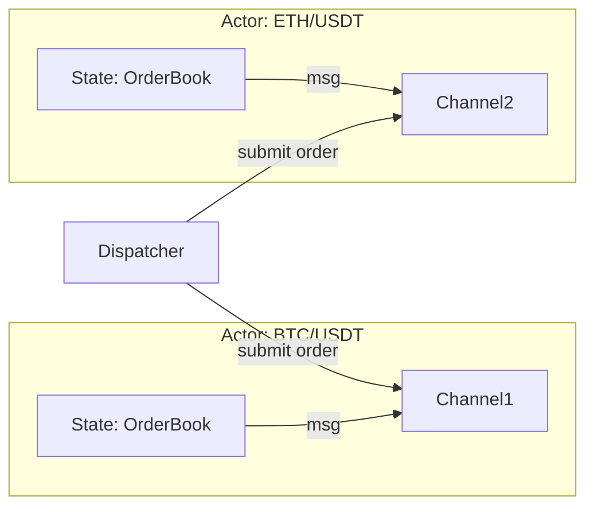
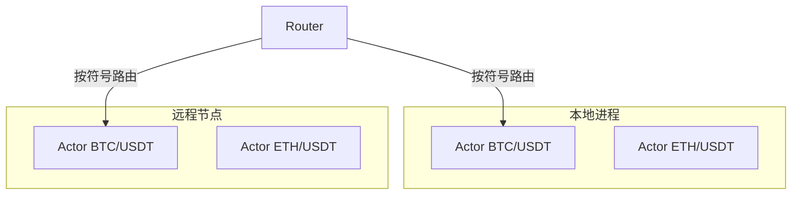
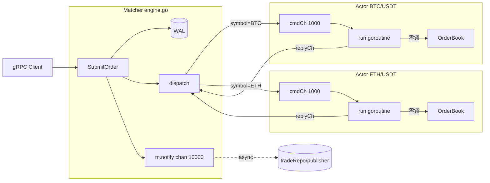
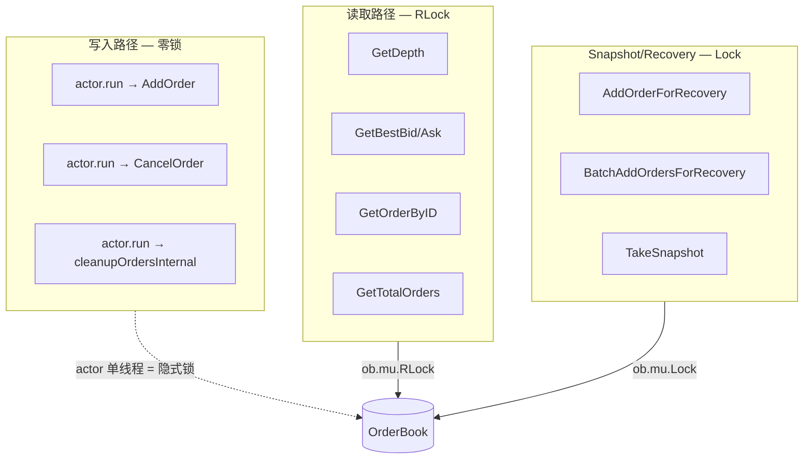

# Actor 并发模型撮合引擎

## 核心概念

### 什么是 Actor 模型？

Actor 模型是一种并发编程范式，其中每个 Actor 是一个独立的计算单元，拥有自己的状态，只能通过消息传递与其他 Actor 通信。这与传统的共享内存并发模型形成鲜明对比。



### 项目中的实现

**代码位置**: `internal/matching/engine/actor.go` 和 `internal/matching/engine/engine.go`

```go
// internal/matching/engine/actor.go
type actor struct {
    symbol   string                    // 交易对标识
    cmdCh    chan command              // 订单命令通道 (buffer: 1000)
    cancelCh chan cancelCommand        // 取消命令通道 (buffer: 1000)
    book     *book.OrderBook           // 私有状态 - 无需锁保护
    cancel   context.CancelFunc        // 取消函数
    exited   atomic.Bool               // 退出标志
}
```

---

## 为什么这样设计？

### 1. 消除全局锁

传统的撮合引擎通常使用一个全局锁来保护订单簿，这在高并发下会成为瓶颈：

```go
// ❌ 传统方式 - 全局锁瓶颈
type BadMatcher struct {
    mu    sync.Mutex
    books map[string]*OrderBook  // 所有订单簿共享一把锁
}

func (m *BadMatcher) SubmitOrder(...) {
    m.mu.Lock()
    defer m.mu.Unlock()
    // 任何交易对的操作都要抢这一把锁
}
```

我们的设计：**每个交易对独立 Actor，完全消除跨符号争用**：

```go
// ✅ Actor 模式 - 无锁操作
func (m *Matcher) dispatch(ctx context.Context, symbol string, cmd command) (*MatchResult, error) {
    act := m.getOrCreateActor(symbol)  // 仅在创建时短暂加锁
    select {
    case act.cmdCh <- cmd:  // 发送命令到 actor 的 channel
        // 非阻塞发送，actor 内部顺序处理
    case <-ctx.Done():
        return nil, ctx.Err()
    }
}
```

### 2. 单线程顺序处理

Actor 的 `run()` 方法是纯顺序执行的，这带来了天然的正确性保证：

```go
// internal/matching/engine/actor.go
func (a *actor) run(ctx context.Context) {
    for {
        select {
        case <-ctx.Done():
            return
        case cmd, ok := <-a.cmdCh:
            if !ok { return }
            a.handleCommand(cmd)  // 完全顺序执行，无竞态条件
        case cmd, ok := <-a.cancelCh:
            if !ok { return }
            a.handleCancelCommand(cmd)
        }
    }
}
```

**关键洞察**：对于撮合引擎来说，价格-时间优先（FIFO）匹配是核心需求。顺序执行天然保证了这个语义，不需要额外的锁或 CAS 操作。

### 3. 延迟初始化

```go
// internal/matching/engine/engine.go
func (m *Matcher) getOrCreateActor(symbol string) *actor {
    m.actorsMu.Lock()
    defer m.actorsMu.Unlock()
    
    if act, ok := m.actors[symbol]; ok {
        return act
    }
    
    // 只有首次访问时才创建 goroutine
    actCtx, actCancel := context.WithCancel(m.ctx)
    act := &actor{
        symbol:   symbol,
        cmdCh:    make(chan command, 1000),  // 缓冲 1000 个订单
        cancelCh: make(chan cancelCommand, 1000),
        book:     book.NewOrderBook(symbol),
        cancel:   actCancel,
    }
    
    m.actors[symbol] = act
    go act.run(actCtx)  // 启动 goroutine
    
    return act
}
```

---

## 优点总结

| 特性 | 传统全局锁 | Actor 模型 |
|------|-----------|-----------|
| **并发度** | 受限（单一锁） | 线性扩展（每符号独立） |
| **正确性** | 需要小心加锁 | 天然顺序保证 |
| **延迟** | 锁竞争开销 | O(1) channel 发送 |
| **可观测性** | 难以追踪 | 每符号独立 metrics |
| **故障隔离** | 单点故障 | 单符号崩溃不影响其他 |

### P99 < 1ms 如何实现？

```go
// 1. Channel 发送是 O(1) 操作
// 2. Actor 内部纯内存操作
// 3. 无锁竞争等待
// 4. 批量处理潜力（可扩展为批处理）

// 测试验证: TestMatcher_ConcurrentSameSymbol
func TestMatcher_ConcurrentSameSymbol(t *testing.T) {
    // 100 个 goroutine 同时提交到同一符号
    // 结果：正确序列化，无数据竞争
}
```

---

## 考虑过其他方案吗？

### 1. Go Routine Pool（不采用）

```go
// ❌ goroutine pool 方案
pool := workerpool.New(100)  // 固定 100 个 worker
pool.Submit(func() { handleOrder(order) })
```

**问题**：
- 仍需锁保护共享状态
- Worker 数量难以动态调整
- 无法保证 FIFO 顺序

### 2. 读写锁保护订单簿（不采用）

```go
// ❌ RWMutex 方案
func (m *Matcher) SubmitOrder(...) {
    m.mu.RLock()  // 读者之间不互斥，但写者阻塞所有读者
    // ...
}
```

**问题**：
- 大量读取操作（GET depth）会阻塞写入
- 撮合操作需要写锁，长时间持锁
- 高并发下读写锁性能退化严重

### 3. 消息队列（不采用）

Kafka/RabbitMQ 等外部队列：
- **优点**：分布式扩展
- **缺点**：额外延迟（网络往返），增加系统复杂度
- **决策**：同进程内 channel 已足够高效，无需外部依赖

### 4. 最终选择：Per-Symbol Actor + Channel

**理由**：
- 同进程内 channel 延迟极低（纳秒级）
- 每个符号完全独立，水平扩展到任意数量
- 天然顺序语义，无需额外同步
- 实现简洁，无外部依赖

---

## 运行时表现

### 正常情况

```
Client A ──> SubmitOrder(BTC/USDT, buy) ──> Actor(BTC/USDT) 处理
Client B ──> SubmitOrder(ETH/USDT, buy) ──> Actor(ETH/USDT) 处理
           (并行，无锁竞争)
```

### 峰值压力

```go
// Channel 容量 1000 作为背压机制
cmdCh := make(chan command, 1000)  // 缓冲区吸收突发流量

// 如果 channel 满了，dispatch 超时
select {
case act.cmdCh <- cmd:
    // 正常情况
default:
    return nil, fmt.Errorf("matching engine busy")
}
```

### 崩溃恢复

```go
// Panic 恢复机制
func (a *actor) handleCommand(cmd command) {
    defer func() {
        if r := recover(); r != nil {
            logger.Error("actor recovered from panic",
                logger.S("symbol", a.symbol),
                logger.Any("panic", r),
            )
            // 不影响其他交易对
        }
    }()
    // ... 正常处理逻辑
}
```

**关键设计**：一个交易对崩溃不会影响其他交易对，实现故障隔离。

---

## 面试高频问题

### Q1: Actor 模型和 Channel 有什么优势？

**回答要点**：
1. **内存安全**：Actor 私有状态不会被外部直接访问
2. **无死锁**：`send` 到 channel 要么成功要么阻塞，不会死锁
3. **位置透明**：本地 channel 和分布式 actor 本质相同，易于扩展
4. **可组合性**：简单 actor 可以组合成复杂系统

### Q2: 如何处理 Actor 的负载不均衡？

**场景**：BTC/USDT 交易量很大，其他交易对交易量小

**解决方案**：
1. **动态 worker pool**（可选扩展）：为热门交易对分配多个 actor
2. **批处理**：累积多个订单一起处理，减少上下文切换
3. **优先级队列**：区分市价单和限价单的处理优先级

### Q3: Actor 数量很多时会有什么问题？

**问题**：
- Goroutine 栈开销（虽然 Go 1.4+ 栈是动态的）
- Channel 缓冲区内存占用
- Actor 查找的锁竞争（`actorsMu`）

**优化**：
```go
// 使用 sync.Map 替代 Mutex + map
actors sync.Map  // 无锁读取

// 或分片锁
shards := make([]*actorShard, 64)
type actorShard struct {
    mu     sync.Mutex
    actors map[string]*actor
}
```

### Q4: 如何保证消息不丢失？

**项目实现**：
```go
// 1. 使用 buffered channel，有一定缓冲能力
cmdCh := make(chan command, 1000)

// 2. WAL（Write-Ahead Log）在消息处理前持久化
func (m *Matcher) SubmitOrder(...) {
    if m.walManager != nil {
        w.Append(entry)  // 先写 WAL
    }
    result, err := m.dispatch(...)  // 再执行
}

// 3. Actor 处理失败时返回错误，客户端可重试
```

---

## 扩展思考

### 如果要支持跨进程/跨机器分布？



**方案**：
1. 符号路由层（一致性哈希）
2. 远程 actor 代理（gRPC）
3. 分布式协调（选举领导者）
4. 跨节点消息顺序保证（需要 Paxos/Raft）

**挑战**：
- 网络延迟（100ns → 1ms+）
- 网络分区处理
- 分布式事务


---

# Actor 模型与 OrderBook 设计解析

## 一、整体架构:两者的协作关系

项目把"并发安全"和"撮合算法"分成了两层:

- **撮合层** ([internal/matching/book/orderbook.go](internal/matching/book/orderbook.go)):纯数据结构 + 撮合算法,持有 `bids`/`asks` 跳表、买单/卖单切片、`priceLevels` 价格层表。
- **调度层** ([internal/matching/engine/actor.go](internal/matching/engine/actor.go) + [engine.go](internal/matching/engine/engine.go)):每个交易对 (`symbol`) 一个 actor goroutine,独占一个 `*book.OrderBook`,所有写操作都串行经过 channel 流入。

入口调用链:
```
gRPC SubmitOrder
  → Matcher.SubmitOrder (WAL 写入)
    → Matcher.dispatch
      → act.cmdCh <- cmd        (异步入队,容量 1000)
        → actor.run() 协程里 handleCommand
          → book.AddOrder (零锁)
            → cmd.replyCh <- result
      ← gRPC handler 从 replyCh 拿结果
```

关键设计 ([engine.go:436-512](internal/matching/engine/engine.go)):
```go
func (m *Matcher) SubmitOrder(...) {
    // 1. 先写 WAL(崩溃可恢复)
    // 2. dispatch 到对应 symbol 的 actor
    // 3. actor 内部 AddOrder + 写回复 channel
    // 4. 撮合结果塞进 m.notify (容量 10000)异步持久化/广播
}
```

### 协作流程图



BTC 和 ETH 完全独立 goroutine、零争用 —— 这是跨 symbol 高吞吐的关键。

## 二、Actor 模型细节

### 数据结构 ([actor.go:30-37](internal/matching/engine/actor.go))

```go
type actor struct {
    symbol   string
    cmdCh    chan command       // 下单,buffer=1000
    cancelCh chan cancelCommand // 撤单,buffer=1000
    book     *book.OrderBook    // 私有状态
    cancel   context.CancelFunc
    exited   atomic.Bool
}
```

### 运行循环 ([actor.go:39-56](internal/matching/engine/actor.go))

- 单一 `for-select` 循环,每次只处理一个 `command` 或 `cancelCommand`
- 两个 channel 分开是设计选择:撤单优先级通常高于下单,独立通道避免互相阻塞
- 入口用 `recover()` 包裹,单 symbol panic 不会炸进程

### 生命周期 ([engine.go:365-396](internal/matching/engine/engine.go))

- **延迟创建**:`getOrCreateActor` 在首次下单时才 `go act.run()`,冷门 symbol 不占 goroutine
- **优雅退出**:`Shutdown()` 取消所有 actor context → 等待 `exitedChans` 全部 close → 才 `close(m.notify)`

### 为什么这个模型能"高性能"

1. **跨 symbol 零争用**:BTC/USDT 与 ETH/USDT 完全在两个 goroutine 上跑,只争抢一次 `actorsMu`(只在创建/查找 actor 时)
2. **同 symbol 串行化天然契合价格-时间优先 (FIFO)**:`run()` 是单线程循环,先到的 `command` 先处理,语义直接对应撮合的"时间优先"
3. **背压可控**:channel buffer = 1000,超出时 `dispatch` 通过 `ctx.Done()` 返回 timeout,网关层能感知到撮合引擎拥堵
4. **Latency 基线 ~µs 级**:同进程 channel 投递纳秒级,无 syscall、无锁;瓶颈只在 `AddOrder` 算法本身和 channel 排队

## 三、OrderBook 的锁策略(关键)

### 锁分布图



### 写入路径:零锁

`AddOrder` ([orderbook.go:135-295](internal/matching/book/orderbook.go)) 和 `CancelOrder` ([orderbook.go:456-505](internal/matching/book/orderbook.go)) **完全没有 `Lock/Unlock` 调用**。这是有意的,因为它们的调用方是 actor 单 goroutine,不存在并发写。

### 读取路径:RLock

对外暴露的查询方法用 `RLock`,因为 gRPC handler 会在外部 goroutine 里调用:

```go
// orderbook.go:416-453, 508-552
func (ob *OrderBook) GetDepth(depth int) (...)        { ob.mu.RLock(); ... }
func (ob *OrderBook) GetOrderByID(orderID string)      { ob.mu.RLock(); ... }
func (ob *OrderBook) GetBestBid() decimal.Decimal     { ob.mu.RLock(); ... }
func (ob *OrderBook) GetBestAsk() decimal.Decimal     { ob.mu.RLock(); ... }
func (ob *OrderBook) GetTotalOrders() (...)           { ob.mu.RLock(); ... }
```

写入路径里仍然调用了 `cleanupOrdersInternal`、`addToBookInternal` 等 "Internal" 后缀方法,这些**靠 actor 单线程语义来保证安全**(注释里写的是 "调用前需持有锁",但实现里实际上 actor 已经充当了那把锁)。

### Snapshot/Recovery 路径:显式 Lock

`AddOrderForRecovery` / `BatchAddOrdersForRecovery` ([orderbook.go:557-625](internal/matching/book/orderbook.go)) 显式 `ob.mu.Lock()`,因为恢复流程绕开了 actor,直接在外部 goroutine 里操作 book。

### 跳表 ([skiplist.go](internal/matching/book/skiplist.go)) 内部还有独立锁

- 每个 `SkipList[float64]` 内部有 `sync.Mutex`
- 但 actor 模型下,跳表也只在 actor 单线程里被读写
- 这层锁**实际是"防御性"冗余**:在 actor 模式下没必要,但代码保留了,以防未来有人绕过 actor 直接操作 book
- 这是个轻微的设计冗余,可以作为后续优化点

### 安全边界总结

| 调用方                                    | 是否加锁 | 原因                    |
| ----------------------------------------- | -------- | ----------------------- |
| `actor.run` → `book.AddOrder/CancelOrder` | 否       | actor 单 goroutine 独占 |
| gRPC 查询 → `GetDepth/GetBestBid/...`     | RLock    | 外部 goroutine 并发读   |
| Snapshot/Recovery 流程                    | Lock     | 绕过 actor,需要独占     |
| SkipList 内部                             | 内部 Mu  | 防御性,在 actor 下冗余  |

这种"谁独占谁不加锁、谁并发谁加锁"的设计,把锁的覆盖范围缩到最小,既安全又低开销。

### 安全性的核心论证

**为什么"写入零锁"是安全的?** 关键在于 `actor.run` 是一个单线程的 `for-select` 循环:

```go
func (a *actor) run(ctx context.Context) {
    for {
        select {
        case <-ctx.Done(): return
        case cmd := <-a.cmdCh:
            a.handleCommand(cmd)   // 单线程串行处理
        case cmd := <-a.cancelCh:
            a.handleCancelCommand(cmd)
        }
    }
}
```

- `cmdCh` 同一时刻只有一个 goroutine 在消费 → 不存在并发写
- `book` 字段没有暴露任何"绕过 actor"的写方法(只有 `AddOrderForRecovery` 用于启动恢复)
- 读路径走 RLock,即使 actor 正在写也不会撕裂(`sync.RWMutex` 语义保证)
- **FIFO 撮合天然成立**:先进 `cmdCh` 的订单先撮合,直接对应价格-时间优先

并发测试 `TestMatcher_ConcurrentSameSymbol`(100 个 goroutine 抢同一个 symbol)验证了这一点 —— 所有买单价相同 → 按提交顺序成交,卖单被精确耗尽。

## 四、性能数据(已有 benchmark)

[internal/matching/book/latency_benchmark_test.go](internal/matching/book/latency_benchmark_test.go) 提供了多组基线:

- `BenchmarkAddOrder_ColdStart` / `HotStart`:单线程 `AddOrder` 延迟
- `BenchmarkConcurrent_*` 模式 (numGoroutines × ordersPerGoroutine) 测吞吐

`TestMatcher_ConcurrentSameSymbol` 用 100 个 goroutine 同 symbol 并发下单,验证了 actor 模型下价格-时间顺序仍然正确(撮合后剩余卖单为 0,所有买单按 FIFO 成交)。

## 五、与其他并发模式对比

| 维度             | 本项目 (Per-Symbol Actor) | 全局 RWMutex | 全局 Mutex | 无锁队列 (Disruptor) |
| ---------------- | ------------------------- | ------------ | ---------- | -------------------- |
| 跨 symbol 吞吐   | **线性扩展**              | 受限         | 受限       | 线性                 |
| 同 symbol 正确性 | **天然 FIFO**             | 需手动锁     | 需手动锁   | 需 CAS               |
| 实现的复杂度     | 中                        | 低           | 最低       | 高                   |
| 单 symbol 吞吐   | 单线程上限                | 多线程争用   | 多线程争用 | 接近硬件极限         |
| 故障隔离         | **单 symbol 不影响其他**  | 单点故障     | 单点故障   | 单点故障             |
| 调试难度         | **高(异步 channel)**      | 中           | 低         | 极高                 |
| 持久化集成       | WAL/Snapshot 自然挂载     | 需手动协调   | 需手动协调 | 需额外设计           |

### 选 actor 的具体理由

1. **撮合算法本身是串行语义**:同一 symbol 内必须 FIFO,与其用锁强制串行,不如直接单线程跑
2. **跨 symbol 才是真实瓶颈点**:真实交易所通常几百个交易对,跨 symbol 争用才是性能墙,actor 模型天然解决
3. **故障隔离价值高**:某个交易对出 bug(如除零、panic)不会让整盘停摆
4. **WAL/Snapshot 容易嵌入**:在 `SubmitOrder` 入口写 WAL、`TakeSnapshot` 异步落盘,与 actor 无缝衔接

### Actor 模型的代价

1. **调试不直观**:同一个订单的链路跨了 N 个 goroutine,要靠 trace 来关联
2. **背压是隐式的**:channel buffer 满时表现为 timeout,需要监控 `cmdCh` 长度
3. **同 symbol 没法利用多核**:单个热门交易对(BTC/USDT)仍是单线程撮合,这与高端交易所用 SPSC ring + 批量撮合的方案有差距
4. **Actor 内 panic 需要 supervisor**:目前实现是 `recover + log`,actor 死了之后该 symbol 就停摆;未来需要重启机制

## 六、改进方向(参考,不展开)

- **同 symbol 多 actor**:按价格区间或订单 ID 哈希分片,内部再用一致性协议合并,提升单 symbol 吞吐
- **批量撮合**:actor 循环里 `drain` 多个 command 后一次性处理,摊薄每笔订单的开销
- **SPSC ring + CPU pinning**:极低延迟场景下替代 buffered channel
- **去掉 SkipList 内部锁**:既然 actor 单线程,锁冗余;`sync.RWMutex` 在 `OrderBook` 的写入路径也可以一起去掉

## 七、一句话总结

> **本项目用 per-symbol actor + 零锁 orderbook,把"并发安全"问题转化成了"消息序列化"问题**:单 goroutine 独占 book + 写路径无锁,换取天然的 FIFO 撮合语义、跨 symbol 线性扩展和故障隔离;代价是同 symbol 吞吐被锁在单线程上限,且调试链路变长。

## 涉及的关键文件

- [internal/matching/engine/actor.go](internal/matching/engine/actor.go) — actor 结构与运行循环
- [internal/matching/engine/engine.go](internal/matching/engine/engine.go) — actor 注册、dispatch、生命周期
- [internal/matching/book/orderbook.go](internal/matching/book/orderbook.go) — 撮合算法 + 锁分布
- [internal/matching/book/skiplist.go](internal/matching/book/skiplist.go) — 价格索引跳表
- [openspec/changes/matching-per-symbol-actor/design.md](openspec/changes/matching-per-symbol-actor/design.md) — 原始设计文档
- [docs/interview/01-actor-concurrency-model.md](docs/interview/01-actor-concurrency-model.md) — 已有面试材料

---

如果你想进一步深入,推荐三个方向:

1. **追原始决策**:读 [openspec/changes/matching-per-symbol-actor/design.md](openspec/changes/matching-per-symbol-actor/design.md),那是这次重构的完整 ADR,包含被否决的方案和原因
2. **跑 benchmark 看数据**:`go test -bench=BenchmarkAddOrder -benchmem ./internal/matching/book/...` 拿真实数字
3. **看 WAL/Snapshot 怎么嵌入**:在 `SubmitOrder` 入口写 WAL、`TakeSnapshot` 异步落盘,与 actor 无缝衔接 —— 这块是 plan 没展开的另一条主线,需要的话我再单独分析


