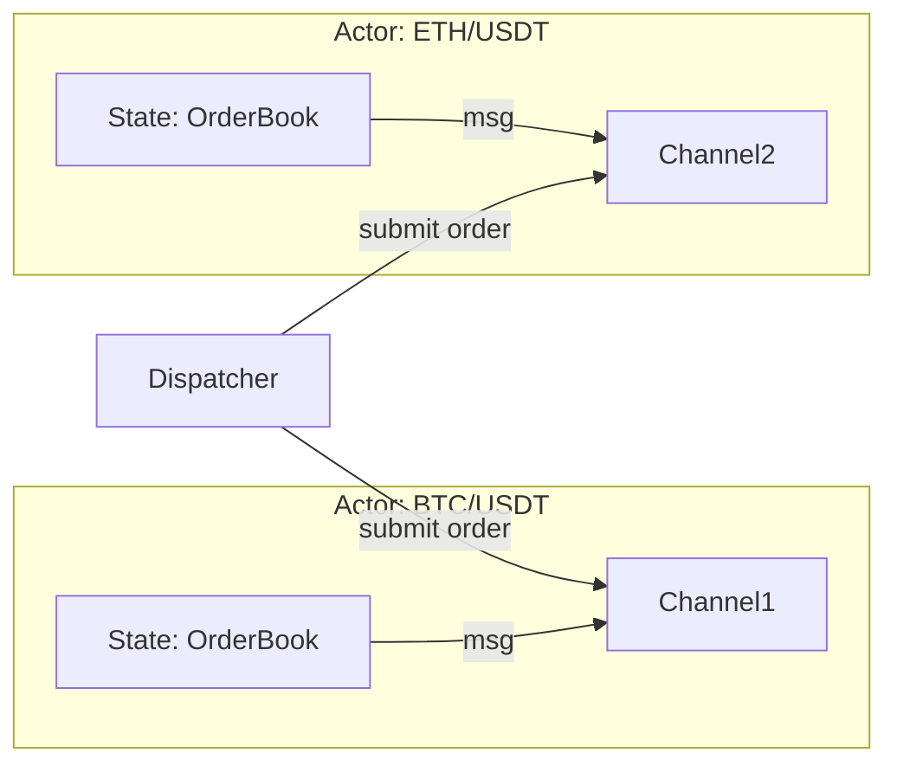
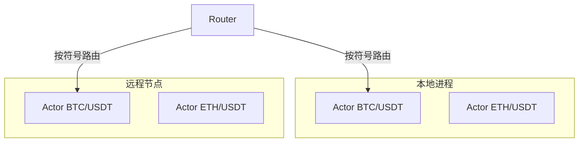

# Actor 并发模型撮合引擎

## 核心概念

### 什么是 Actor 模型？

Actor 模型是一种并发编程范式，其中每个 Actor 是一个独立的计算单元，拥有自己的状态，只能通过消息传递与其他 Actor 通信。这与传统的共享内存并发模型形成鲜明对比。



### 项目中的实现

**代码位置**: `internal/matching/engine/actor.go` 和 `internal/matching/engine/engine.go`

```go
// internal/matching/engine/actor.go
type actor struct {
    symbol   string                    // 交易对标识
    cmdCh    chan command              // 订单命令通道 (buffer: 1000)
    cancelCh chan cancelCommand        // 取消命令通道 (buffer: 1000)
    book     *book.OrderBook           // 私有状态 - 无需锁保护
    cancel   context.CancelFunc        // 取消函数
    exited   atomic.Bool               // 退出标志
}
```

---

## 为什么这样设计？

### 1. 消除全局锁

传统的撮合引擎通常使用一个全局锁来保护订单簿，这在高并发下会成为瓶颈：

```go
// ❌ 传统方式 - 全局锁瓶颈
type BadMatcher struct {
    mu    sync.Mutex
    books map[string]*OrderBook  // 所有订单簿共享一把锁
}

func (m *BadMatcher) SubmitOrder(...) {
    m.mu.Lock()
    defer m.mu.Unlock()
    // 任何交易对的操作都要抢这一把锁
}
```

我们的设计：**每个交易对独立 Actor，完全消除跨符号争用**：

```go
// ✅ Actor 模式 - 无锁操作
func (m *Matcher) dispatch(ctx context.Context, symbol string, cmd command) (*MatchResult, error) {
    act := m.getOrCreateActor(symbol)  // 仅在创建时短暂加锁
    select {
    case act.cmdCh <- cmd:  // 发送命令到 actor 的 channel
        // 非阻塞发送，actor 内部顺序处理
    case <-ctx.Done():
        return nil, ctx.Err()
    }
}
```

### 2. 单线程顺序处理

Actor 的 `run()` 方法是纯顺序执行的，这带来了天然的正确性保证：

```go
// internal/matching/engine/actor.go
func (a *actor) run(ctx context.Context) {
    for {
        select {
        case <-ctx.Done():
            return
        case cmd, ok := <-a.cmdCh:
            if !ok { return }
            a.handleCommand(cmd)  // 完全顺序执行，无竞态条件
        case cmd, ok := <-a.cancelCh:
            if !ok { return }
            a.handleCancelCommand(cmd)
        }
    }
}
```

**关键洞察**：对于撮合引擎来说，价格-时间优先（FIFO）匹配是核心需求。顺序执行天然保证了这个语义，不需要额外的锁或 CAS 操作。

### 3. 延迟初始化

```go
// internal/matching/engine/engine.go
func (m *Matcher) getOrCreateActor(symbol string) *actor {
    m.actorsMu.Lock()
    defer m.actorsMu.Unlock()
    
    if act, ok := m.actors[symbol]; ok {
        return act
    }
    
    // 只有首次访问时才创建 goroutine
    actCtx, actCancel := context.WithCancel(m.ctx)
    act := &actor{
        symbol:   symbol,
        cmdCh:    make(chan command, 1000),  // 缓冲 1000 个订单
        cancelCh: make(chan cancelCommand, 1000),
        book:     book.NewOrderBook(symbol),
        cancel:   actCancel,
    }
    
    m.actors[symbol] = act
    go act.run(actCtx)  // 启动 goroutine
    
    return act
}
```

---

## 优点总结

| 特性 | 传统全局锁 | Actor 模型 |
|------|-----------|-----------|
| **并发度** | 受限（单一锁） | 线性扩展（每符号独立） |
| **正确性** | 需要小心加锁 | 天然顺序保证 |
| **延迟** | 锁竞争开销 | O(1) channel 发送 |
| **可观测性** | 难以追踪 | 每符号独立 metrics |
| **故障隔离** | 单点故障 | 单符号崩溃不影响其他 |

### P99 < 1ms 如何实现？

```go
// 1. Channel 发送是 O(1) 操作
// 2. Actor 内部纯内存操作
// 3. 无锁竞争等待
// 4. 批量处理潜力（可扩展为批处理）

// 测试验证: TestMatcher_ConcurrentSameSymbol
func TestMatcher_ConcurrentSameSymbol(t *testing.T) {
    // 100 个 goroutine 同时提交到同一符号
    // 结果：正确序列化，无数据竞争
}
```

---

## 考虑过其他方案吗？

### 1. Go Routine Pool（不采用）

```go
// ❌ goroutine pool 方案
pool := workerpool.New(100)  // 固定 100 个 worker
pool.Submit(func() { handleOrder(order) })
```

**问题**：
- 仍需锁保护共享状态
- Worker 数量难以动态调整
- 无法保证 FIFO 顺序

### 2. 读写锁保护订单簿（不采用）

```go
// ❌ RWMutex 方案
func (m *Matcher) SubmitOrder(...) {
    m.mu.RLock()  // 读者之间不互斥，但写者阻塞所有读者
    // ...
}
```

**问题**：
- 大量读取操作（GET depth）会阻塞写入
- 撮合操作需要写锁，长时间持锁
- 高并发下读写锁性能退化严重

### 3. 消息队列（不采用）

Kafka/RabbitMQ 等外部队列：
- **优点**：分布式扩展
- **缺点**：额外延迟（网络往返），增加系统复杂度
- **决策**：同进程内 channel 已足够高效，无需外部依赖

### 4. 最终选择：Per-Symbol Actor + Channel

**理由**：
- 同进程内 channel 延迟极低（纳秒级）
- 每个符号完全独立，水平扩展到任意数量
- 天然顺序语义，无需额外同步
- 实现简洁，无外部依赖

---

## 运行时表现

### 正常情况

```
Client A ──> SubmitOrder(BTC/USDT, buy) ──> Actor(BTC/USDT) 处理
Client B ──> SubmitOrder(ETH/USDT, buy) ──> Actor(ETH/USDT) 处理
           (并行，无锁竞争)
```

### 峰值压力

```go
// Channel 容量 1000 作为背压机制
cmdCh := make(chan command, 1000)  // 缓冲区吸收突发流量

// 如果 channel 满了，dispatch 超时
select {
case act.cmdCh <- cmd:
    // 正常情况
default:
    return nil, fmt.Errorf("matching engine busy")
}
```

### 崩溃恢复

```go
// Panic 恢复机制
func (a *actor) handleCommand(cmd command) {
    defer func() {
        if r := recover(); r != nil {
            logger.Error("actor recovered from panic",
                logger.S("symbol", a.symbol),
                logger.Any("panic", r),
            )
            // 不影响其他交易对
        }
    }()
    // ... 正常处理逻辑
}
```

**关键设计**：一个交易对崩溃不会影响其他交易对，实现故障隔离。

---

## 面试高频问题

### Q1: Actor 模型和 Channel 有什么优势？

**回答要点**：
1. **内存安全**：Actor 私有状态不会被外部直接访问
2. **无死锁**：`send` 到 channel 要么成功要么阻塞，不会死锁
3. **位置透明**：本地 channel 和分布式 actor 本质相同，易于扩展
4. **可组合性**：简单 actor 可以组合成复杂系统

### Q2: 如何处理 Actor 的负载不均衡？

**场景**：BTC/USDT 交易量很大，其他交易对交易量小

**解决方案**：
1. **动态 worker pool**（可选扩展）：为热门交易对分配多个 actor
2. **批处理**：累积多个订单一起处理，减少上下文切换
3. **优先级队列**：区分市价单和限价单的处理优先级

### Q3: Actor 数量很多时会有什么问题？

**问题**：
- Goroutine 栈开销（虽然 Go 1.4+ 栈是动态的）
- Channel 缓冲区内存占用
- Actor 查找的锁竞争（`actorsMu`）

**优化**：
```go
// 使用 sync.Map 替代 Mutex + map
actors sync.Map  // 无锁读取

// 或分片锁
shards := make([]*actorShard, 64)
type actorShard struct {
    mu     sync.Mutex
    actors map[string]*actor
}
```

### Q4: 如何保证消息不丢失？

**项目实现**：
```go
// 1. 使用 buffered channel，有一定缓冲能力
cmdCh := make(chan command, 1000)

// 2. WAL（Write-Ahead Log）在消息处理前持久化
func (m *Matcher) SubmitOrder(...) {
    if m.walManager != nil {
        w.Append(entry)  // 先写 WAL
    }
    result, err := m.dispatch(...)  // 再执行
}

// 3. Actor 处理失败时返回错误，客户端可重试
```

---

## 扩展思考

### 如果要支持跨进程/跨机器分布？



**方案**：
1. 符号路由层（一致性哈希）
2. 远程 actor 代理（gRPC）
3. 分布式协调（选举领导者）
4. 跨节点消息顺序保证（需要 Paxos/Raft）

**挑战**：
- 网络延迟（100ns → 1ms+）
- 网络分区处理
- 分布式事务
