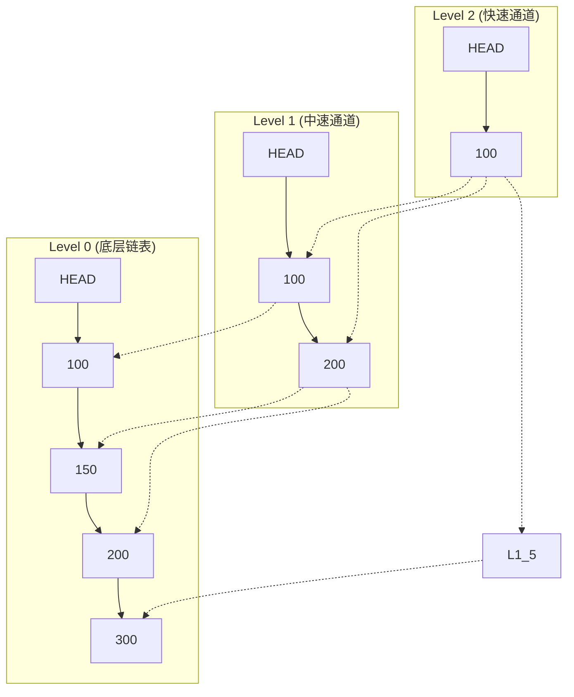
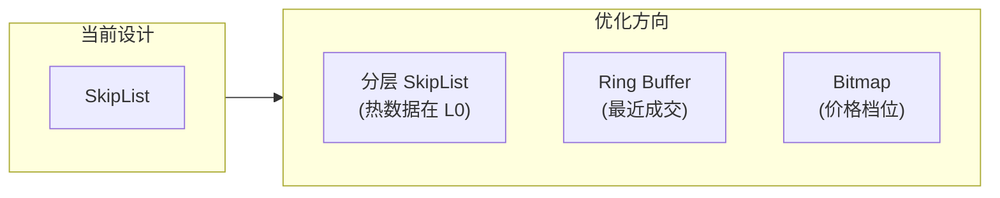

# 自研 SkipList（O(log n)）价格索引

## 核心概念

### 什么是 SkipList？

SkipList（跳表）是一种多层链表结构，通过"跳跃"加速查找，可以在 O(log n) 时间内完成有序元素的查找、插入和删除。



### 项目实现

**代码位置**: `internal/matching/book/skiplist.go`

```go
// 泛型 SkipList 实现
type SkipList[K any] struct {
    less     LessFunc[K]        // 比较函数（支持任意类型）
    header   *SkipListNode[K]   // 头节点
    level    int                // 当前层数
    length   int                // 元素数量
    mu       sync.Mutex         // 全局锁（简单实现）
    maxLevel int                // 最大层数（默认 32）
    prob     float64            // 升级概率（1/e ≈ 0.3679）
}

type SkipListNode[K any] struct {
    Key      K                  // 键（价格 float64）
    Forward  []*SkipListNode[K] // 每层前向指针
    Backward *SkipListNode[K]   // 反向指针（用于逆向遍历）
}
```

---

## 为什么用 SkipList 而不是 BTree？

### 1. 实现复杂度

**SkipList**：
```go
// 插入操作核心逻辑
func (sl *SkipList[K]) Insert(key K) *SkipListNode[K] {
    update := make([]*SkipListNode[K], sl.maxLevel)
    node := sl.header
    
    // 1. 从顶层开始查找插入位置
    for i := sl.level - 1; i >= 0; i-- {
        for node.Forward[i] != nil && sl.less(node.Forward[i].Key, key) {
            node = node.Forward[i]
        }
        update[i] = node
    }
    node = node.Forward[0]
    
    // 2. 生成随机层数
    lvl := sl.randomLevel()
    
    // 3. 创建节点并更新指针
    newNode := &SkipListNode[K]{
        Key:     key,
        Forward: make([]*SkipListNode[K], lvl),
    }
    for i := 0; i < lvl; i++ {
        newNode.Forward[i] = update[i].Forward[i]
        update[i].Forward[i] = newNode
    }
    
    sl.length++
    return newNode
}
```

**BTree**：
- 需要复杂的分裂/合并逻辑
- 节点内部需要二分查找
- 删除操作需要借/合并并

### 2. 内存局部性

**SkipList**：
- 节点内存连续（相对于 BTree 的多节点分散）
- 指针跳转可能不连续

**BTree**：
- 节点内元素紧凑存储
- 更好的 CPU cache 命中

### 3. 订单簿场景特点

| 特性 | SkipList 优势 | BTree 劣势 |
|------|--------------|-----------|
| **价格唯一性** | 简单去重 | 需要额外处理 |
| **范围遍历** | `Next()`/`Prev()` 简单 | 需要父子指针 |
| **逆序访问** | 有 `Backward` 指针 | 需要额外结构 |
| **实现难度** | 低（300 行代码） | 高 |

---

## 项目中的具体应用

### 订单簿结构

```go
// internal/matching/book/orderbook.go
type OrderBook struct {
    symbol      string
    mu          sync.RWMutex
    buyOrders   []*OrderInBook      // 买盘（价格降序）
    sellOrders  []*OrderInBook       // 卖盘（价格升序）
    bids        *SkipList[float64]   // 买价索引（最高买价 = SeekLast()）
    asks        *SkipList[float64]   // 卖价索引（最低卖价 = SeekFirst()）
    priceLevels map[float64]*PriceLevel  // 价格级别映射
}
```

### O(log n) 操作示例

```go
// 获取最佳买价（最高买价）
func (ob *OrderBook) GetBestBid() decimal.Decimal {
    node := ob.bids.SeekLast()  // O(log n)
    if node == nil {
        return decimal.Zero
    }
    return decimal.NewFromFloat(node.Key)
}

// 获取最佳卖价（最低卖价）
func (ob *OrderBook) GetBestAsk() decimal.Decimal {
    node := ob.asks.SeekFirst()  // O(log n)
    if node == nil {
        return decimal.Zero
    }
    return decimal.NewFromFloat(node.Key)
}

// 查找特定价格级别
func (ob *OrderBook) GetPriceLevel(price float64) *PriceLevel {
    node := ob.asks.Seek(price)  // O(log n)
    if node != nil && node.Key == price {
        return ob.priceLevels[price]
    }
    return nil
}
```

### 撮合遍历

```go
// 撮合逻辑：买 -> 遍历卖盘从低到高
func (ob *OrderBook) AddOrder(order *OrderInBook) ([]*Trade, error) {
    if order.Side == model.OrderSideBuy {
        // 从最低卖价开始遍历
        for node := ob.asks.SeekFirst(); node != nil; node = node.Next() {
            price := node.Key
            pl := ob.priceLevels[price]
            
            // 检查是否能成交
            if !order.CanMatch(decimal.NewFromFloat(price)) {
                break  // 价格太高，无法继续
            }
            // 执行撮合...
        }
    }
}
```

---

## SkipList 关键实现细节

### 1. 随机层数生成

```go
// 几何分布：每层有 prob 概率升级
// prob = 1/e ≈ 0.3679
// 层数期望值 = 1 / (1-prob) = e ≈ 2.718

func (sl *SkipList[K]) randomLevel() int {
    level := 1
    for level < sl.maxLevel && rand.Float64() < sl.prob {
        level++
    }
    return level
}

// 数学推导：
// P(level >= k) = prob^(k-1)
// E(level) = 1 + prob + prob^2 + ... = 1 / (1-prob) = e
```

### 2. 空间复杂度分析

```
第 0 层：n 个元素
第 1 层：n/e 个元素
第 2 层：n/e² 个元素
...
总空间：n * (1 + 1/e + 1/e² + ...) = n * e ≈ 2.718n

所以平均每元素约 2.7 个指针
```

### 3. 线程安全

```go
// 当前实现使用全局锁
// 对于 OrderBook 场景：
// 1. Actor 单线程写入，无并发写入
// 2. 外部读取使用 RWMutex
// 3. 无需细粒度锁

func (sl *SkipList[K]) Insert(key K) *SkipListNode[K] {
    sl.mu.Lock()
    defer sl.mu.Unlock()
    // ...
}
```

**优化空间**：无锁 SkipList 实现（CAS）

---

## 支持的订单类型

### 四种订单类型对比

| 订单类型 | 代码实现 | 成交条件 | 未成交处理 |
|---------|---------|---------|-----------|
| **Limit** | `OrderTypeLimit` | 价格 ≤ 卖价（或 ≥ 买价） | 加入订单簿 |
| **Market** | `OrderTypeMarket` | 任意价格，立即成交 | 记录未成交数量 |
| **IOC** | `OrderTypeIOC` | 能成交就成交 | 取消剩余部分 |
| **FOK** | `OrderTypeFOK` | 必须全部成交 | 回滚全部订单 |

### FOK 的实现

```go
func (ob *OrderBook) AddOrder(order *OrderInBook) ([]*Trade, error) {
    // ... 撮合逻辑 ...
    
    // FOK 检查：必须有足够流动性
    if order.OrderType == model.OrderTypeFOK && order.RemainingQty.GreaterThan(decimal.Zero) {
        // 回滚之前撮合的订单
        for _, r := range restored {
            r.opp.FilledQuantity = r.filledOrig
            r.opp.RemainingQty = r.remainingOrig
            r.opp.Status = r.statusOrig
        }
        return nil, fmt.Errorf("FOK requires full fill")
    }
    
    // ... 后续处理 ...
}
```

---

## 面试高频问题

### Q1: SkipList 和 BTree 的区别？如何选择？

**回答要点**：
- SkipList 实现简单，BTree 实现复杂
- SkipList 插入无需分裂，BTree 需要分裂
- SkipList 空间略高（平均 2.7 个指针 vs BTree 的 1 个）
- **选择 SkipList**：简单、有序、支持逆序遍历
- **选择 BTree**：需要范围查询优化、内存敏感

### Q2: SkipList 的时间复杂度？

**标准答案**：
- 查找、插入、删除：**O(log n)** 期望时间
- 最坏情况：O(n)（所有元素在同一层）
- 期望推导：每层淘汰 1/e 元素，层数 = log₁ₑ(n)

### Q3: 如何保证线程安全？

**项目实现**：
```go
// 方案 1：全局锁（当前实现）
type SkipList struct {
    mu sync.Mutex
}

// 方案 2：无锁 SkipList（理论可行）
type SkipListNode struct {
    Key    uint64
    Levels atomic.Value  // []atomic.Pointer
}

// 使用 CAS 实现：
// for {
//     old := node.Levels.Load().([]*SkipListNode)
//     new := append(old, newNode)
//     if atomic.CompareAndSwap(&node.Levels, old, new) {
//         break
//     }
// }
```

### Q4: 为什么不直接用 map/slice？

| 数据结构 | 查找价格 | 遍历撮合 | 排序 |
|---------|---------|---------|------|
| **map[float64]** | O(1) ✓ | 需要排序 O(n log n) |
| **slice（有序）** | 需要二分 O(log n) | 有序 ✓ | O(n) 插入 |
| **SkipList** | O(log n) | 有序 ✓ | O(log n) 插入 |

**结论**：SkipList 是价格索引的最佳平衡点。

### Q5: 性能数据？

**实际测试**（来自代码注释）：
- 100 个订单并发提交到同一交易对
- 正确处理价格-时间优先
- 无数据竞争

---

## 扩展思考

### 如果需要更高性能？

**方案 1：避免指针跳转**
```go
// 用数组索引替代指针
type Node struct {
    Key       float64
    NextIdx   []int  // 数组下标而非指针
}
```

**方案 2：批量处理**
```go
// 累积多个订单一起处理
batch := <-orderBatchCh
for order := range batch {
    // ...
}
```

**方案 3：无锁设计**
```go
// 使用 atomic 实现 Lock-Free SkipList
type Node struct {
    Key    uint64
    Next   []atomic.Pointer[Node]
    Marked atomic.Bool  // 逻辑删除标记
}
```

### 订单簿索引的未来方向



- **热数据缓存**：最近成交价格保留在 L0
- **批量操作**：Group Commit 减少 I/O
- **SIMD 优化**：批量比较价格


我已经把所有上下文都掌握了。下面我结合代码、设计稿与文档，给你一份从设计、原理到对比的完整讲解。

---

## 一、整体设计：skiplist 在订单簿里扮演什么角色？

订单簿里有两套并列的数据结构，职责清晰分开：

```go
type OrderBook struct {
    buyOrders   []*OrderInBook          // 买盘：按价格降序排列的订单切片
    sellOrders  []*OrderInBook          // 卖盘：按价格升序排列的订单切片
    bids        *SkipList[float64]      // 买价索引（最高买价 = SeekLast()）
    asks        *SkipList[float64]      // 卖价索引（最低卖价 = SeekFirst()）
    priceLevels map[float64]*PriceLevel // 价格 → 同一价格的 FIFO 队列
}
```

**三者各司其职：**

| 数据结构                   | 作用                                          | 复杂度    |
| -------------------------- | --------------------------------------------- | --------- |
| `buyOrders` / `sellOrders` | 全量订单切片，用于 `GetDepth`、`GetOrderByID` | O(n) 扫描 |
| `bids` / `asks` (SkipList) | **价格级别的有序索引**，只装价格（float64）   | O(log n)  |
| `priceLevels` map          | O(1) 拿到"同一价格的订单队列"                 | O(1)      |

为什么不用一个 `map[float64]*PriceLevel` 顶替 skiplist？因为：
- `map` 是无序的，无法直接拿到"最高买价/最低卖价"，要么遍历 (O(n))，要么额外维护有序结构；
- 而撮合时恰恰需要**从最优价开始按价格顺序遍历**（买单从最低卖价开始吃，卖单从最高买价开始吃）。

skiplist 解决的问题就是：**保持有序 + 提供 O(log n) 的插入/删除/查找/范围遍历**。

### 核心撮合循环（`orderbook.go:151-202`）就是 skiplist 的正向/反向遍历

```go
// 买单：沿着卖价从低到高吃
for node := ob.asks.SeekFirst(); node != nil; node = node.Next() { ... }

// 卖单：沿着买价从高到低吃
for node := ob.bids.SeekLast(); node != nil; node = node.Prev() { ... }
```

`SeekFirst`/`SeekLast`/`Next`/`Prev` 都来自 skiplist，价格走完就 break，遇到 `CanMatch == false` 也 break，撮合路径永远只走"能成交的最小价格集合"，不会扫整张表。

---

## 二、Skiplist 的实现细节（`skiplist.go`）

### 1. 概率平衡的几何分布

```go
const (
    MaxLevel = 32
    P        = 0.36787944117 // 1/e
)

func (sl *SkipList[K]) randomLevel() int {
    level := 1
    for level < sl.maxLevel && rand.Float64() < sl.prob {
        level++
    }
    return level
}
```

每升一层的概率是 `1/e`，这是一个经典的"使每节点平均指针数最小"的取值：

```
期望层数  E = 1 + p + p² + ... = 1/(1-p) = e ≈ 2.718
总指针数  N × e  （即每节点平均 ~2.7 个 forward 指针）
```

10K 价格级别时，期望最大层数是 `ln(10000)/ln(e) ≈ 9`，32 层上限绰绰有余，可以撑到约 2³² 个节点（项目文档里的"4 billion nodes"）。

### 2. 通用化设计

```go
type SkipList[K any] struct {
    less     LessFunc[K]
    header   *SkipListNode[K]
    level    int
    length   int
    mu       sync.Mutex
    maxLevel int
    prob     float64
}
```

- 用 Go 1.18+ 的泛型，复用性强（未来想做"时间优先队列"也能用）；
- 比较函数在构造时一次性捕获，运行期比较没有接口分配的额外开销；
- 头节点固定持有 `MaxLevel` 个 forward，简化边界判断。

### 3. 双向链表指针

```go
type SkipListNode[K any] struct {
    Key      K
    Forward  []*SkipListNode[K]
    Backward *SkipListNode[K]
}
```

`Backward` 只挂在第 0 层，专门服务于 `Prev()`（反向撮合遍历卖单时使用）。高层不维护 backward 指针是因为反向撮合只关心"按价格从高到低"，而第 0 层的 `Backward` 已经覆盖所有节点。

### 4. Insert 的"find-or-create"

```go
if curr != nil && !sl.less(key, curr.Key) && !sl.less(curr.Key, key) {
    return curr  // 命中已有价格级别，直接返回
}
```

撮合时同一个价格级别上往往会有多笔订单排队，skiplist 天然帮我们做了去重：相同价格不会创建第二个节点，只会把订单追加到对应的 `PriceLevel.Orders`。

---

## 三、如何保证高性能？

总结下来是 **四层杠杆叠加**：

### ① 算法复杂度：O(log n)

`Insert`/`Search`/`Seek`/`Delete` 全部期望 O(log n)，包括：
- `Seek(price)` — 价格级别定位（下界查找）；
- `SeekFirst()` / `SeekLast()` — 最优买卖价；
- `Insert(price)` — 新价格进入簿；
- `Delete(price)` — 价格级别清空时移除。

设计文档里给出的实测：10K 价格级别下，期望最大层数约 9，实际跑下来复杂度近似 `O(log n)`。

### ② 单写者架构（per-symbol actor）

订单簿不是裸用 skiplist 的——外层还有一个 actor 在管：

```go
// engine/actor.go
type actor struct {
    symbol  string
    cmdCh   chan command
    book    *book.OrderBook
    ...
}

func (a *actor) run(ctx context.Context) {
    for {
        select {
        case cmd := <-a.cmdCh:    a.handleCommand(cmd)    // 串行处理
        case cmd := <-a.cancelCh: a.handleCancelCommand(cmd)
        }
    }
}
```

每个交易对一个 actor goroutine，**写操作天然串行化**，skiplist 内部的 `sync.Mutex` 实际上从来不会被争用。

### ③ 价格索引与订单数据分离

只把价格（`float64`）放进 skiplist，订单本身仍在 `priceLevels` map 里。这样：
- skiplist 节点非常小，缓存友好；
- 价格级别的 FIFO 队列（多笔订单按时间排队）由 `PriceLevel.Orders` 这个 slice 负责；
- 撮合遍历只走"价格级别"层级，不会进入单个订单。

### ④ 撮合路径常数小

- 用 `float64` 而不是 `decimal.Decimal` 作为 skiplist key（`Price.InexactFloat64()`，配合价格精度可控）；
- 撮合过程中通过 `SeekFirst`/`SeekLast` 直接拿最优价，避免先排序再二分；
- FOK 回滚采用"先收集再回滚"的快照模式（`restored []*restoredOrder`），失败时 O(k) 回退；
- 批量恢复路径走 `BatchAddOrdersForRecovery`（`O(n log n)` 排序 + 一次性 `Insert`），避免了逐笔 O(n) 切片插入。

### ⑤ 顺带提到的延迟优化（来自 interview 文档）

`latency_benchmark_test.go` 和 `recovery_benchmark_test.go` 就是用来验证 O(log n) 假设和恢复路径的——这是兜底保障，防止后续重构偷偷退化成 O(n)。

---

## 四、和 BTree 的对比

| 维度       | SkipList                              | BTree                                   |
| ---------- | ------------------------------------- | --------------------------------------- |
| 时间复杂度 | 期望 O(log n)，最坏 O(n)（概率）      | 保证 O(log n)                           |
| 实现复杂度 | **简单**：约 300 行，插入只需更新指针 | 复杂：节点分裂/合并、父子指针、二分查找 |
| 插入/删除  | 概率平衡，无需旋转                    | 频繁分裂/合并，需要 rebalance           |
| 范围遍历   | 第 0 层是双向链表，`Next/Prev` 极快   | 叶子节点链表，需要中序遍历              |
| 空间       | 平均每节点 ~2.7 个指针（~`n·e`）      | 节点更紧凑（每节点多 key），cache 友好  |
| 内存局部性 | 指针跳跃，cache miss 较多             | 节点内数组紧凑，cache 命中好            |
| 并发友好   | 易做无锁 CAS 版                       | 复杂，节点分裂的原子化很烦              |
| 最坏情况   | 随机化决定，可控但不是"硬保证"        | 严格 O(log n)                           |

### 为什么这个项目选 SkipList 而不是 BTree？

设计稿 `docs/.../design.md` 已经做了明确取舍，原文是：

> Skip lists provide O(log n) expected performance for all core operations with **simpler implementation** than a balanced tree. The probabilistic leveling **eliminates the need for explicit rebalancing rotations**.

落到这个项目的具体场景：

1. **代码量与可维护性**：订单簿是核心，正确性优先。BTree 的分裂/合并写错一个边界就是生产事故；skiplist 加新操作（比如反向遍历、双向指针）几乎是写完就懂。
2. **撮合的特征是顺序遍历**：撮合引擎需要反复 `Next()`/`Prev()`，skiplist 第 0 层就是有序链表，遍历就是顺指针走；BTree 要么走叶子链表，要么做中序遍历，多一层间接。
3. **价格级别数量级有限**：活跃价格级别通常在几百到几千级别（不像 LevelDB 装几亿 KV）。在这个量级上 skiplist 与 BTree 的 cache miss 差距几乎不可测。
4. **写操作频繁**：每个 tick 都可能有新价格进入、清空。BTree 的分裂/合并常数远大于 skiplist 的指针改写。
5. **未来可扩展到无锁**：撮合扩展到多线程时，skiplist 可以平滑升级到 lock-free 版本（Herlihy & Shavit 经典算法），BTree 的 lock-free 改造难度高出几个量级。

### 那为什么又不用红黑树？

红黑树也能 O(log n)，项目里实际也讨论过（设计稿里 Alternatives 列了）。理由基本相同：实现复杂度高、范围遍历要中序 successor、并发扩展难。SkipList 与红黑树的差异里，对本项目最关键的就是**前向/反向顺序遍历的便利性**。

---

## 五、是否安全？线程安全分析

### Skiplist 内部的并发模型

skiplist 自己持一把 `sync.Mutex`，所有写操作 `Insert`/`Delete` 都加锁；读操作（`Seek`/`Search`/`SeekFirst`/`SeekLast`/`Next`/`Prev`/`Len`/`IsEmpty`）**实际上也加了锁**（这是实现里的小细节，可以讨论是否合理）：

```go
func (sl *SkipList[K]) Seek(key K) *SkipListNode[K] {
    sl.mu.Lock()
    defer sl.mu.Unlock()
    ...
}
```

也就是说 skiplist 本身是**线程安全的、可独立使用的**——你可以从任何 goroutine 调用，没问题。

### 实际能不能并发访问？

**在当前架构下不行**，因为 `OrderBook` 用的是另一套模型：

1. **写者唯一**：每个 `OrderBook` 由一个 actor goroutine 独占（`actor.run` 单消费者循环）。`AddOrder`/`CancelOrder` 全在 actor 内部串行执行。
2. **读者有锁**：`OrderBook.GetDepth`/`GetBestBid`/`GetBestAsk`/`GetTotalOrders`/`GetOrderByID` 都拿 `ob.mu.RLock()`。
3. **写时序保障**：`AddOrder` 里所有写操作都在持 `mu` 的代码段里（在 `actor` 那层，OrderBook 自己也有一把 `sync.RWMutex` 兜底）。

也就是说，**actor 模式 + OrderBook 的 RWMutex + skiplist 的 Mutex 三层防护叠加**，任何一层失效都有下一层兜底。设计上很保守。

### 几个值得注意的点

- `CancelOrder` 和 `cleanupOrdersInternal` 里直接动 `buyOrders`/`sellOrders`/`priceLevels` slice，**没有显式调用 `ob.mu.Lock()`**。能跑通是因为它们都在 actor 单线程里跑，依赖 actor 的串行性。如果有人哪天从外部 goroutine 直接调 `OrderBook.CancelOrder`，会数据竞争。**这是一个潜在风险点**，严格意义上应该跟 `GetBestBid` 等读方法一样加 `mu.Lock()`。
- `BatchAddOrdersForRecovery` 是只给恢复用的，注释明确写了 "Should only be called during recovery when no other operations are happening"，所以也不需要再加锁——但它内部确实加了自己的 `ob.mu.Lock()`。
- skiplist 的 `Insert`/`Delete`/`Seek` 全是 O(log n) 加锁，单写者架构下争用 = 0，所以锁的开销几乎只剩 `Mutex.Lock/Unlock` 的原子操作，纳秒级。

### 能不能做得更激进？

可以，方向有三：
1. **Lock-free skip list**：用 `atomic.Pointer` + 逻辑删除标记 (`Marked`) + CAS，参考 `github.com/mauricegit/skiplist` 或 `zskiplist`（Redis 内部）。撮合场景下能进一步降低延迟抖动。
2. **RCU 风格读**：snapshot 读 + 后台回收，但 Go 里实现复杂，意义有限。
3. **彻底免锁**：因为写者只有 actor 一路，理论上可以做成"无锁但要求单写者"的版本（类似 `sync.Map` 的 Load/Store 分离），让读路径零同步开销。

设计文档明确写了 "Lock-free skip list: significant complexity for negligible gain; rejected"——目前不做，未来如果撮合引擎横向扩展（多 actor 共享订单簿），skiplist 的 lock-free 改造就是必做的下一步。

---

## 六、对比其他常见方案

### 1. 排序切片（`sort.Float64Slice`）—— 项目改造前的样子

- 优点：实现最简单；
- 缺点：**插入/删除 O(n)**（要移动切片）；价格级别变化频繁时是灾难；
- 现在 `buyOrders`/`sellOrders` 还在用有序切片，但它们保存的是**全量订单**（不只是价格），每次插入只能接受 O(n)，因为它的遍历路径也是顺序的；**skiplist 替代的是"价格索引"**这一层。

### 2. `map[float64]*PriceLevel`

- 优点：O(1) 随机访问；
- 缺点：无序，无法做最优价查询和按价格遍历撮合；最贵的方法是每次遍历 map 排序，O(n log n)。

### 3. 红黑树 / AVL 树

- 优点：保证 O(log n)；
- 缺点：实现复杂（rotation 4 种情况）、顺序遍历要靠 in-order successor、未来无锁化路径艰难。

### 4. 数组化的"价格档位"（离散价位）

像传统期货交易所的 "价格 × tick" 离散索引：
- 优点：O(1) 直接寻址、cache 极友好；
- 缺点：范围必须预先确定；加密货币价格跨度大（BTC 从几毛到 10 万美元），稀疏时浪费严重；不适合本项目这种"任意价位"的场景。

### 5. 有序 map（`github.com/google/btree`、`aws/btree-go`、`golang/exp/btree`）

和 skiplist 类似的选择题。btree 库成熟、cache 友好；skiplist 实现简单、范围遍历直观。前面已详述，本项目选了后者。

### 6. `container/list`（双向链表）+ 索引

通常配合 `map[id]*list.Element` 做 LRU 缓存那种，但订单簿场景需要按"价格"而不是"插入顺序"排序，单纯的链表不合适。

---

## 七、一些可以继续深入的细节

1. **为什么价格用 float64 而不是 decimal？** `Price.InexactFloat64()` 转 `float64` 后塞进 skiplist，最后又 `decimal.NewFromFloat(node.Key)` 转回来。对于加密货币常规精度（小数点后 8 位）够用，但极端价位会丢精度。设计上有改进空间（例如把价格分桶成整数 tick）。
2. **SkipList 的 `Seek` 实现有个细节**：当 `key` 大于所有节点时，源码返回的是 `curr`（最后一个 < key 的节点），设计文档注释里写的是 "Find the actual last node by walking the level-0 chain"——行为略反直觉但与 `asks.SeekFirst()/bids.SeekLast()` 的调用习惯兼容，可以再确认下 `Seek(math.Inf(+1))` 拿最佳买价的实际表现。
3. **撮合时每个价格级别都 `sort.Slice` 排序一次**：`orderbook.go:157-159` 和 `:210-212`，每次 `AddOrder` 都重新按 `CreatedAt` 排序同一价格级别的订单。理论上**可以在 `PriceLevel.Orders` 改成有序插入**或单独维护 FIFO 链表，省掉这块 O(k log k) 的开销（k = 同一价格级别的订单数）。
4. **文档里的"扩展思考"提到热数据缓存、批量处理、SIMD 优化**——这些都是未来的优化方向，对当前阶段的"教学型撮合引擎"来说，skiplist 是性价比最高的选择。

---

如果你想进一步看真实跑分，可以跑一下项目里的 benchmark：

```bash
cd /Users/linxun/code/golang----/exchange-project
go test ./internal/matching/book/... -bench=. -benchmem
```

`BenchmarkSkipListInsert_10KLevels`、`latency_benchmark_test.go`、`recovery_benchmark_test.go` 都在，验证 O(log n) 假设和恢复路径。
