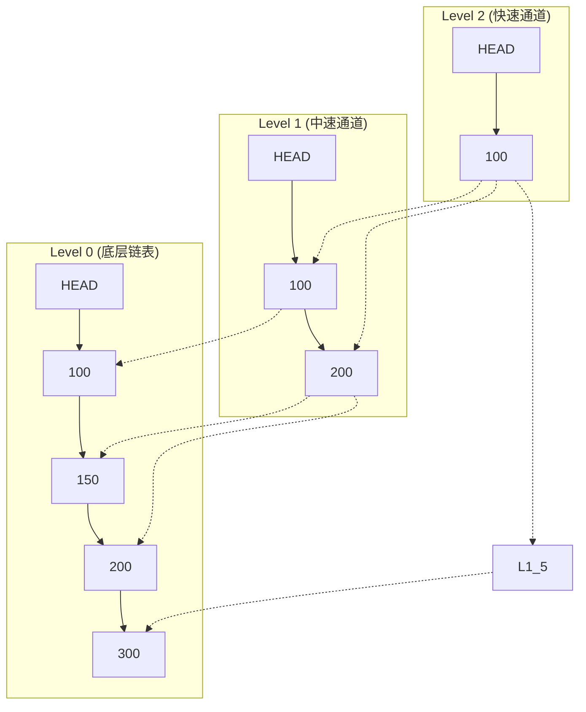
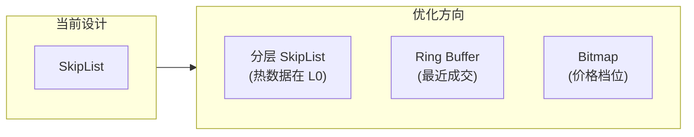

# 自研 SkipList（O(log n)）价格索引

## 核心概念

### 什么是 SkipList？

SkipList（跳表）是一种多层链表结构，通过"跳跃"加速查找，可以在 O(log n) 时间内完成有序元素的查找、插入和删除。



### 项目实现

**代码位置**: `internal/matching/book/skiplist.go`

```go
// 泛型 SkipList 实现
type SkipList[K any] struct {
    less     LessFunc[K]        // 比较函数（支持任意类型）
    header   *SkipListNode[K]   // 头节点
    level    int                // 当前层数
    length   int                // 元素数量
    mu       sync.Mutex         // 全局锁（简单实现）
    maxLevel int                // 最大层数（默认 32）
    prob     float64            // 升级概率（1/e ≈ 0.3679）
}

type SkipListNode[K any] struct {
    Key      K                  // 键（价格 float64）
    Forward  []*SkipListNode[K] // 每层前向指针
    Backward *SkipListNode[K]   // 反向指针（用于逆向遍历）
}
```

---

## 为什么用 SkipList 而不是 BTree？

### 1. 实现复杂度

**SkipList**：
```go
// 插入操作核心逻辑
func (sl *SkipList[K]) Insert(key K) *SkipListNode[K] {
    update := make([]*SkipListNode[K], sl.maxLevel)
    node := sl.header
    
    // 1. 从顶层开始查找插入位置
    for i := sl.level - 1; i >= 0; i-- {
        for node.Forward[i] != nil && sl.less(node.Forward[i].Key, key) {
            node = node.Forward[i]
        }
        update[i] = node
    }
    node = node.Forward[0]
    
    // 2. 生成随机层数
    lvl := sl.randomLevel()
    
    // 3. 创建节点并更新指针
    newNode := &SkipListNode[K]{
        Key:     key,
        Forward: make([]*SkipListNode[K], lvl),
    }
    for i := 0; i < lvl; i++ {
        newNode.Forward[i] = update[i].Forward[i]
        update[i].Forward[i] = newNode
    }
    
    sl.length++
    return newNode
}
```

**BTree**：
- 需要复杂的分裂/合并逻辑
- 节点内部需要二分查找
- 删除操作需要借/合并并

### 2. 内存局部性

**SkipList**：
- 节点内存连续（相对于 BTree 的多节点分散）
- 指针跳转可能不连续

**BTree**：
- 节点内元素紧凑存储
- 更好的 CPU cache 命中

### 3. 订单簿场景特点

| 特性 | SkipList 优势 | BTree 劣势 |
|------|--------------|-----------|
| **价格唯一性** | 简单去重 | 需要额外处理 |
| **范围遍历** | `Next()`/`Prev()` 简单 | 需要父子指针 |
| **逆序访问** | 有 `Backward` 指针 | 需要额外结构 |
| **实现难度** | 低（300 行代码） | 高 |

---

## 项目中的具体应用

### 订单簿结构

```go
// internal/matching/book/orderbook.go
type OrderBook struct {
    symbol      string
    mu          sync.RWMutex
    buyOrders   []*OrderInBook      // 买盘（价格降序）
    sellOrders  []*OrderInBook       // 卖盘（价格升序）
    bids        *SkipList[float64]   // 买价索引（最高买价 = SeekLast()）
    asks        *SkipList[float64]   // 卖价索引（最低卖价 = SeekFirst()）
    priceLevels map[float64]*PriceLevel  // 价格级别映射
}
```

### O(log n) 操作示例

```go
// 获取最佳买价（最高买价）
func (ob *OrderBook) GetBestBid() decimal.Decimal {
    node := ob.bids.SeekLast()  // O(log n)
    if node == nil {
        return decimal.Zero
    }
    return decimal.NewFromFloat(node.Key)
}

// 获取最佳卖价（最低卖价）
func (ob *OrderBook) GetBestAsk() decimal.Decimal {
    node := ob.asks.SeekFirst()  // O(log n)
    if node == nil {
        return decimal.Zero
    }
    return decimal.NewFromFloat(node.Key)
}

// 查找特定价格级别
func (ob *OrderBook) GetPriceLevel(price float64) *PriceLevel {
    node := ob.asks.Seek(price)  // O(log n)
    if node != nil && node.Key == price {
        return ob.priceLevels[price]
    }
    return nil
}
```

### 撮合遍历

```go
// 撮合逻辑：买 -> 遍历卖盘从低到高
func (ob *OrderBook) AddOrder(order *OrderInBook) ([]*Trade, error) {
    if order.Side == model.OrderSideBuy {
        // 从最低卖价开始遍历
        for node := ob.asks.SeekFirst(); node != nil; node = node.Next() {
            price := node.Key
            pl := ob.priceLevels[price]
            
            // 检查是否能成交
            if !order.CanMatch(decimal.NewFromFloat(price)) {
                break  // 价格太高，无法继续
            }
            // 执行撮合...
        }
    }
}
```

---

## SkipList 关键实现细节

### 1. 随机层数生成

```go
// 几何分布：每层有 prob 概率升级
// prob = 1/e ≈ 0.3679
// 层数期望值 = 1 / (1-prob) = e ≈ 2.718

func (sl *SkipList[K]) randomLevel() int {
    level := 1
    for level < sl.maxLevel && rand.Float64() < sl.prob {
        level++
    }
    return level
}

// 数学推导：
// P(level >= k) = prob^(k-1)
// E(level) = 1 + prob + prob^2 + ... = 1 / (1-prob) = e
```

### 2. 空间复杂度分析

```
第 0 层：n 个元素
第 1 层：n/e 个元素
第 2 层：n/e² 个元素
...
总空间：n * (1 + 1/e + 1/e² + ...) = n * e ≈ 2.718n

所以平均每元素约 2.7 个指针
```

### 3. 线程安全

```go
// 当前实现使用全局锁
// 对于 OrderBook 场景：
// 1. Actor 单线程写入，无并发写入
// 2. 外部读取使用 RWMutex
// 3. 无需细粒度锁

func (sl *SkipList[K]) Insert(key K) *SkipListNode[K] {
    sl.mu.Lock()
    defer sl.mu.Unlock()
    // ...
}
```

**优化空间**：无锁 SkipList 实现（CAS）

---

## 支持的订单类型

### 四种订单类型对比

| 订单类型 | 代码实现 | 成交条件 | 未成交处理 |
|---------|---------|---------|-----------|
| **Limit** | `OrderTypeLimit` | 价格 ≤ 卖价（或 ≥ 买价） | 加入订单簿 |
| **Market** | `OrderTypeMarket` | 任意价格，立即成交 | 记录未成交数量 |
| **IOC** | `OrderTypeIOC` | 能成交就成交 | 取消剩余部分 |
| **FOK** | `OrderTypeFOK` | 必须全部成交 | 回滚全部订单 |

### FOK 的实现

```go
func (ob *OrderBook) AddOrder(order *OrderInBook) ([]*Trade, error) {
    // ... 撮合逻辑 ...
    
    // FOK 检查：必须有足够流动性
    if order.OrderType == model.OrderTypeFOK && order.RemainingQty.GreaterThan(decimal.Zero) {
        // 回滚之前撮合的订单
        for _, r := range restored {
            r.opp.FilledQuantity = r.filledOrig
            r.opp.RemainingQty = r.remainingOrig
            r.opp.Status = r.statusOrig
        }
        return nil, fmt.Errorf("FOK requires full fill")
    }
    
    // ... 后续处理 ...
}
```

---

## 面试高频问题

### Q1: SkipList 和 BTree 的区别？如何选择？

**回答要点**：
- SkipList 实现简单，BTree 实现复杂
- SkipList 插入无需分裂，BTree 需要分裂
- SkipList 空间略高（平均 2.7 个指针 vs BTree 的 1 个）
- **选择 SkipList**：简单、有序、支持逆序遍历
- **选择 BTree**：需要范围查询优化、内存敏感

### Q2: SkipList 的时间复杂度？

**标准答案**：
- 查找、插入、删除：**O(log n)** 期望时间
- 最坏情况：O(n)（所有元素在同一层）
- 期望推导：每层淘汰 1/e 元素，层数 = log₁ₑ(n)

### Q3: 如何保证线程安全？

**项目实现**：
```go
// 方案 1：全局锁（当前实现）
type SkipList struct {
    mu sync.Mutex
}

// 方案 2：无锁 SkipList（理论可行）
type SkipListNode struct {
    Key    uint64
    Levels atomic.Value  // []atomic.Pointer
}

// 使用 CAS 实现：
// for {
//     old := node.Levels.Load().([]*SkipListNode)
//     new := append(old, newNode)
//     if atomic.CompareAndSwap(&node.Levels, old, new) {
//         break
//     }
// }
```

### Q4: 为什么不直接用 map/slice？

| 数据结构 | 查找价格 | 遍历撮合 | 排序 |
|---------|---------|---------|------|
| **map[float64]** | O(1) ✓ | 需要排序 O(n log n) |
| **slice（有序）** | 需要二分 O(log n) | 有序 ✓ | O(n) 插入 |
| **SkipList** | O(log n) | 有序 ✓ | O(log n) 插入 |

**结论**：SkipList 是价格索引的最佳平衡点。

### Q5: 性能数据？

**实际测试**（来自代码注释）：
- 100 个订单并发提交到同一交易对
- 正确处理价格-时间优先
- 无数据竞争

---

## 扩展思考

### 如果需要更高性能？

**方案 1：避免指针跳转**
```go
// 用数组索引替代指针
type Node struct {
    Key       float64
    NextIdx   []int  // 数组下标而非指针
}
```

**方案 2：批量处理**
```go
// 累积多个订单一起处理
batch := <-orderBatchCh
for order := range batch {
    // ...
}
```

**方案 3：无锁设计**
```go
// 使用 atomic 实现 Lock-Free SkipList
type Node struct {
    Key    uint64
    Next   []atomic.Pointer[Node]
    Marked atomic.Bool  // 逻辑删除标记
}
```

### 订单簿索引的未来方向



- **热数据缓存**：最近成交价格保留在 L0
- **批量操作**：Group Commit 减少 I/O
- **SIMD 优化**：批量比较价格
