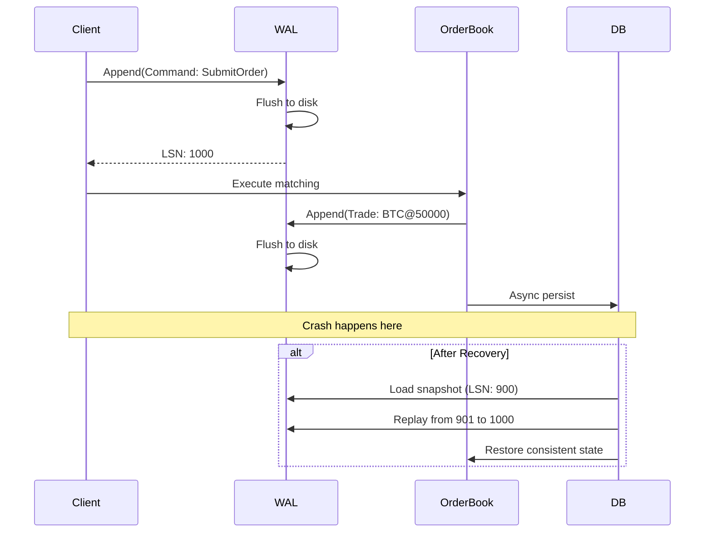

# WAL + 快照机制实现进程崩溃零数据丢失

## 核心概念

### 什么是 WAL（Write-Ahead Log）？

WAL 是一种日志技术，核心思想是：**先写日志，再执行操作**。即使系统崩溃，也可以通过重放日志恢复到一致状态。



### 项目中的实现

**代码位置**: `internal/matching/wal/wal.go`

```go
type WAL struct {
    mu     sync.Mutex
    symbol string
    path   string
    file   *os.File
    writer *bufio.Writer
    lsn    atomic.Uint64  // Log Sequence Number
    closed atomic.Bool
}
```

---

## 为什么需要 WAL + 快照？

### 1. 问题背景

撮合引擎是内存密集型应用：
- 订单簿状态完全在内存
- 撮合操作需要极低延迟（< 1ms）
- 不能每次操作都同步写盘

**问题**：如果只依赖内存，进程崩溃会丢失：
- 未持久化的订单
- 撮合结果
- 用户余额变更

### 2. 解决方案对比

| 方案 | 优点 | 缺点 | 适用场景 |
|------|------|------|---------|
| **每次操作写盘** | 简单可靠 | 延迟太高（10ms+） | 银行系统 |
| **仅 WAL** | 恢复快 | 恢复时间长 | 日志系统 |
| **仅快照** | 恢复快 | 可能丢失数据 | 开发环境 |
| **WAL + 快照** | 最佳平衡 | 实现复杂 | 生产系统 ✓ |

### 3. 核心设计理念

```
恢复时间 = 快照加载时间 + (日志量 × 单条重放时间)

策略：
1. 定期做快照（减少日志量）
2. 快照间做 WAL（保证不丢数据）
3. 恢复时加载最新快照 + 重放增量 WAL
```

---

## WAL 详细实现

### 1. 三种日志类型

```go
const (
    EntryTypeCommand EntryType = iota  // 订单提交命令
    EntryTypeCancel                      // 订单取消命令
    EntryTypeTrade                       // 成交记录
)

type Entry struct {
    LSN     uint64
    Type    EntryType
    Payload interface{}  // 具体负载
}
```

### 2. 二进制帧格式

```go
// 每条记录格式：
// [8-byte LSN][1-byte Type][4-byte Length][Payload]

func (w *WAL) Append(entry *Entry) (uint64, error) {
    lsn := w.lsn.Add(1)
    entry.LSN = lsn
    
    var buf bytes.Buffer
    enc := gob.NewEncoder(&buf)
    enc.Encode(entry.Payload)
    payloadBytes := buf.Bytes()
    
    // 组装帧
    record := make([]byte, 13+len(payloadBytes))
    binary.BigEndian.PutUint64(record[0:8], lsn)        // LSN
    record[8] = byte(entry.Type)                         // Type
    binary.BigEndian.PutUint32(record[9:13], uint32(len(payloadBytes)))  // Length
    copy(record[13:], payloadBytes)                      // Payload
    
    // 关键：同步写入
    if _, err := w.writer.Write(record); err != nil {
        return 0, err
    }
    if err := w.writer.Flush(); err != nil {  // 强制刷盘
        return lsn, err
    }
    
    return lsn, nil
}
```

### 3. 写入时机

```go
// internal/matching/engine/engine.go

// 订单提交前写 WAL
func (m *Matcher) SubmitOrder(...) {
    // 1. 写 WAL（日志先于操作）
    if m.walManager != nil {
        if w, err := m.walManager.GetWAL(symbol); err == nil {
            entry := &wal.Entry{
                Type: wal.EntryTypeCommand,
                Payload: wal.CommandPayload{
                    OrderID:   orderID,
                    UserID:    userID,
                    Side:      string(side),
                    OrderType: string(orderType),
                    Price:     price.String(),
                    Quantity:  quantity.String(),
                },
            }
            w.Append(entry)
        }
    }
    
    // 2. 执行撮合（命令已持久化）
    result, err := m.dispatch(ctx, symbol, cmd)
    
    // 3. 写成交 WAL
    if m.walManager != nil {
        for _, t := range result.Trades {
            entry := &wal.Entry{
                Type: wal.EntryTypeTrade,
                Payload: wal.TradePayload{...},
            }
            w.Append(entry)
        }
    }
}
```

---

## 快照详细实现

### 1. 快照数据结构

```go
// internal/matching/snapshot/snapshot.go

type OrderState struct {
    ID             int64
    OrderID        string
    UserID         int64
    Symbol         string
    Side           model.OrderSide
    OrderType      model.OrderType
    Price          string  // decimal 转 string 保持精度
    Quantity       string
    FilledQuantity string
    RemainingQty   string
    Status         model.OrderStatus
    CreatedAt      int64
}

type Snapshot struct {
    Symbol    string
    EndingLSN uint64  // 快照对应的 WAL 位置
    Bids      []OrderState
    Asks      []OrderState
}
```

### 2. 原子快照保存

```go
func Save(snap *Snapshot, dir string) error {
    filename := fmt.Sprintf("%s-%d.snap", safeSymbol, snap.EndingLSN)
    tmpPath := filepath.Join(dir, filename+".tmp")
    finalPath := filepath.Join(dir, filename)
    
    // 1. 写入临时文件
    file, err := os.Create(tmpPath)
    enc := gob.NewEncoder(file)
    if err := enc.Encode(snap); err != nil {
        file.Close()
        os.Remove(tmpPath)
        return err
    }
    file.Close()
    
    // 2. 原子重命名（目录 fsync 确保可见）
    if err := os.Rename(tmpPath, finalPath); err != nil {
        os.Remove(tmpPath)
        return err
    }
    
    // 3. 更新 latest 符号链接
    linkPath := filepath.Join(dir, safeSymbol+".latest")
    os.Remove(linkPath)
    os.Symlink(absTarget, linkPath)
    
    return nil
}
```

**为什么用符号链接？**
```
# 文件结构
BTC_USDT.latest -> BTC_USDT-5000.snap

# 读取时直接找 .latest，快速定位最新快照
# 重命名/切换时只改符号链接，原子操作
```

### 3. 快照触发机制

```go
func (m *Matcher) checkAndTriggerSnapshot(symbol string, tradeCount int) {
    trigger := m.getSnapshotTrigger(symbol)
    
    trigger.mu.Lock()
    trigger.tradesSinceLastSnapshot += tradeCount
    shouldTrigger := false
    
    // 条件 1：交易数量阈值
    if trigger.tradesSinceLastSnapshot >= m.snapshotConfig.MaxTradesPerSnapshot {
        shouldTrigger = true
    }
    
    // 条件 2：时间间隔阈值
    if time.Since(trigger.lastSnapshotTime) >= m.snapshotConfig.SnapshotInterval {
        shouldTrigger = true
    }
    trigger.mu.Unlock()
    
    if shouldTrigger {
        go m.TakeSnapshot(symbol, m.snapshotDir)
    }
}
```

---

## 崩溃恢复流程

### 完整恢复算法

```go
// internal/matching/engine/engine.go

func (m *Matcher) Recover(cfg RecoveryConfig) error {
    // Step 1: 扫描所有需要恢复的符号
    symbols := make(map[string]struct{})
    
    // 扫描 .latest 符号链接
    entries, _ := os.ReadDir(cfg.SnapshotDir)
    for _, entry := range entries {
        if strings.HasSuffix(entry.Name(), ".latest") {
            symbol := strings.TrimSuffix(entry.Name(), ".latest")
            symbols[symbol] = struct{}{}
        }
    }
    
    // Step 2: 对每个符号恢复
    for symbol := range symbols {
        // 2a. 加载快照
        snap, err := snapshot.Load(symbol, cfg.SnapshotDir)
        startLSN := uint64(0)
        if err == nil {
            startLSN = snap.EndingLSN
        }
        
        // 2b. 创建 Actor
        act := m.getOrCreateActor(symbol)
        
        // 2c. 恢复快照状态
        if snap != nil {
            snapshot.Restore(snap, act.book)
        }
        
        // 2d. 重放 WAL
        w, _ := wal.NewWAL(symbol, cfg.WALDir)
        w.Replay(startLSN, func(entry *wal.Entry) error {
            switch entry.Type {
            case wal.EntryTypeCommand:
                cmd := reconstructCommand(entry.Payload)
                act.cmdCh <- cmd
            case wal.EntryTypeCancel:
                cmd := reconstructCancel(entry.Payload)
                act.cancelCh <- cmd
            case wal.EntryTypeTrade:
                // 成交记录在重放命令时已处理
            }
            return nil
        })
    }
    
    return nil
}
```

### 恢复时间分析

```
假设：
- 快照间隔：1000 笔交易
- 每笔交易平均：2 条 WAL（Command + Trade）
- WAL 重放速度：10,000 条/秒

场景：
1. 5000 笔交易后崩溃
   - 最新快照：第 4000 笔
   - 需要重放：1000 × 2 = 2000 条
   - 恢复时间：2000 / 10000 = 0.2 秒

2. 100,000 笔交易后崩溃
   - 最新快照：第 99,000 笔
   - 需要重放：1000 × 2 = 2000 条（因为每 1000 笔做一次快照）
   - 恢复时间：2000 / 10000 = 0.2 秒
```

---

## 零数据丢失保证

### 1. 写顺序保证

```
提交订单 → 写 WAL(flush) → 撮合 → 写 Trade WAL(flush)
                    ↑
              这步确保：即使撮合时崩溃，
              WAL 已有记录，重启后可重放
```

### 2. 原子性保证

| 阶段 | 崩溃后果 | 处理 |
|------|---------|------|
| 写 WAL Command | 无数据丢失，订单未执行 | 重放后正常执行 |
| 撮合执行 | 无数据丢失，已执行部分回滚 | 重放后重新执行 |
| 写 WAL Trade | 无数据丢失，撮合结果存在 | 重放跳过（幂等） |
| 写 DB | 无数据丢失，WAL 有记录 | 重放恢复 |

### 3. 快照一致性保证

```go
// 快照 + WAL 的原子性
func Take(symbol string, ob *book.OrderBook, walLSN uint64) *Snapshot {
    // 1. 捕获当前 WAL LSN（获取锁前的最后一条）
    snap := &Snapshot{
        Symbol:    symbol,
        EndingLSN: walLSN,  // 这之后 WAL 的条目需要重放
        // ...
    }
    // 2. 序列化订单簿
    bids, asks := ob.GetDepth(0)
    for _, b := range bids {
        snap.Bids = append(snap.Bids, orderToState(b))
    }
    return snap
}
```

---

## WAL 截断策略

### 何时截断？

```go
func (w *WAL) Truncate(upToLSN uint64) error {
    // 读取所有记录
    // 只保留 LSN > upToLSN 的记录
    // 重写 WAL 文件
    // 更新内部 LSN 计数器
}
```

**触发时机**：
```go
// 快照保存成功后
func Save(snap *Snapshot, dir string) error {
    // ... 保存快照 ...
    
    // 通知 WAL 可以截断到这个 LSN
    if wal := wm.GetWAL(snap.Symbol); wal != nil {
        wal.Truncate(snap.EndingLSN)
    }
}
```

---

## 面试高频问题

### Q1: 为什么不用数据库事务？

**回答要点**：
1. **延迟问题**：数据库事务（ACID）延迟 1-10ms，我们的撮合要求 < 1ms
2. **功能差异**：撮合引擎需要内存中的价格-时间优先队列，关系数据库无法高效实现
3. **正确性**：WAL 只需要持久化命令，数据库需要持久化完整状态
4. **对比**：
   - WAL：只记录"做什么"（命令）
   - 数据库：记录"是什么"（状态）

### Q2: 如何保证 WAL 的原子性？

**项目实现**：
```go
// 1. 完整记录写入
record := make([]byte, 13+payloadLen)
binary.BigEndian.PutUint64(record[0:8], lsn)
record[8] = byte(entry.Type)
binary.BigEndian.PutUint32(record[9:13], uint32(len(payloadBytes)))
copy(record[13:], payloadBytes)

// 2. 同步刷盘
if _, err := w.writer.Write(record); err != nil {
    return 0, err
}
if err := w.writer.Flush(); err != nil {  // fsync
    return lsn, err
}
```

**替代方案**：写两份（镜像 WAL）、校验和

### Q3: 快照和 WAL 的取舍？

| 设计选择 | 快照频繁 | 快照稀疏 |
|---------|---------|---------|
| 恢复时间 | 短 | 长 |
| 存储空间 | 多（WAL 少） | 少（WAL 多） |
| 快照开销 | 高（频繁序列化） | 低 |
| **推荐** | **是** | |

**项目选择**：每 1000 笔交易或 60 秒做一次快照

### Q4: 崩溃发生在快照过程中怎么办？

**答案**：使用原子重命名
```go
// 1. 写临时文件
file, err := os.Create(tmpPath)  // "BTC_USDT-5000.snap.tmp"

// 2. 写入完整数据
enc.Encode(snap)
file.Close()

// 3. 原子重命名
os.Rename(tmpPath, finalPath)  // 原文件不变，新文件瞬间生效

// 如果重命名失败/崩溃：
// - 临时文件存在但 .latest 不指向它 → 无影响
// - 用户读取 .latest → 获得上次成功快照
```

### Q5: 分布式场景下如何保证一致性？

**场景**：多个撮合引擎实例

**方案**：
1. **领导选举**：Raft/Paxos 选主
2. **状态同步**：主节点写入 WAL，从节点复制
3. **故障转移**：从节点提升为主，继续服务

**当前限制**：项目是单机设计，分布式需要额外协调层

---

## 扩展思考

### 更高性能优化

**1. 批量 WAL 写入**
```go
// 累积多条后批量刷盘
batch := make([]*Entry, 0, 100)
for {
    select {
    case entry := <-entryCh:
        batch = append(batch, entry)
        if len(batch) >= 100 {
            flush(batch)
        }
    case <-ticker.C:
        flush(batch)  // 超时也刷
    }
}
```

**2. WAL 压缩**
```
# 压缩前
Command(UserID=1, Price=50000, Qty=0.1)
Command(UserID=1, Price=50000, Qty=0.2)

# 压缩后
CommandBatch(UserID=1, Price=50000, Qty=0.3)
```

**3. 并行恢复**
```go
// 多符号并行恢复
for symbol := range symbols {
    go func(s string) {
        recoverSymbol(s)
    }(symbol)
}
wg.Wait()
```
