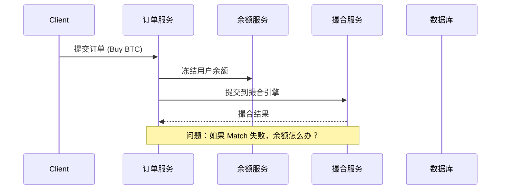
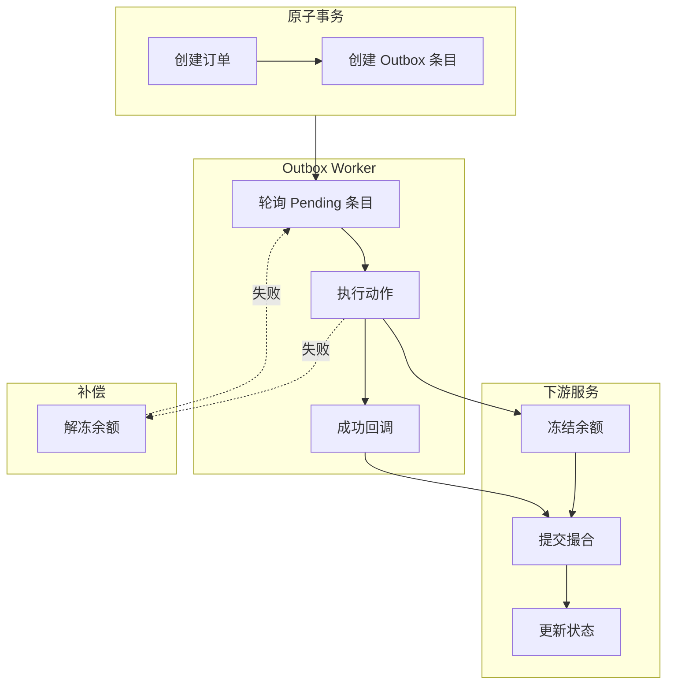
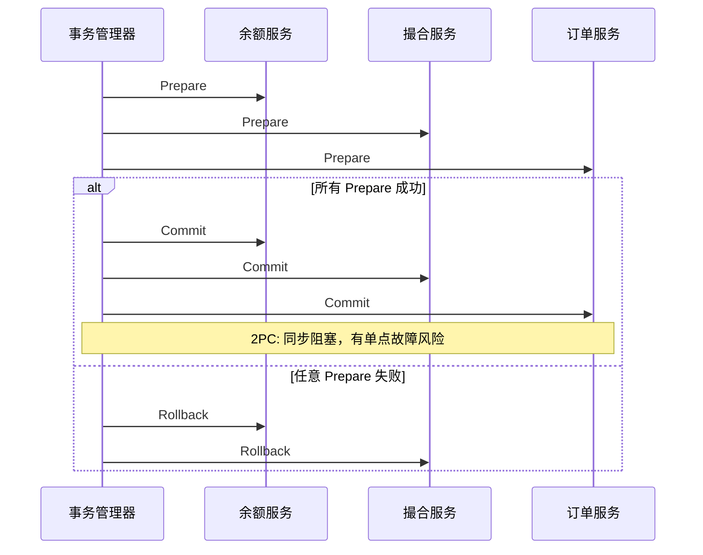

# Saga + Outbox 保证跨服务订单原子性

## 核心概念

### 什么是分布式事务问题？

在微服务架构中，一个业务操作往往涉及多个服务：



**问题**：如果撮合失败，冻结的余额需要解冻。但如果解冻也失败呢？

## Saga 模式

### 解决什么问题？

想象一个场景：用户下了一个买单，需要：
1. 冻结用户余额
2. 提交到撮合引擎
3. 更新订单状态

如果第 2 步失败了，第 1 步怎么办？**传统的事务无法跨服务回滚**。

### Saga 的核心思想

**"正向执行，失败补偿"** —— 不回滚，而是做相反的操作来弥补。

```
正常流程:                  失败补偿流程:
┌─────────────┐           ┌─────────────┐
│ 冻结余额     │ ────────► │ 解冻余额     │  ← 补偿
│ 提交撮合     │ ────────► │ (已失败)    │
│ 更新状态     │           │             │
└─────────────┘           └─────────────┘
```

### 项目中的 Saga 步骤

```86:100:docs/interview/04-saga-outbox-pattern.md
type Step string

const (
    StepFreezeBalance   Step = "freeze_balance"    // 冻结余额
    StepSubmitMatching  Step = "submit_matching"   // 提交撮合
    StepUpdateStatus    Step = "update_status"    // 更新状态
    StepUnfreezeBalance Step = "unfreeze_balance"  // 补偿：解冻余额
)
```

---

## Outbox 模式

### 解决什么问题？

**"如何在同一个事务里既保存数据又发消息？"**

```
❌ 传统做法的问题:
db.Transaction {
    save(order)
    send_mq("order_created")  // MQ 发送失败怎么办？数据不一致！
}
```

### Outbox 的核心思想

**把"发消息"变成"写表"，再异步读取表来发消息**

```
┌────────────────────────────────────────────────────┐
│                  同一事务                            │
│  ┌──────────┐    ┌──────────────┐                  │
│  │ 保存订单  │ +  │ 写入 outbox  │  ← 原子操作！    │
│  └──────────┘    └──────────────┘                  │
└────────────────────────────────────────────────────┘
                         │
                         ▼
┌────────────────────────────────────────────────────┐
│              Outbox Worker (异步)                    │
│  1. 轮询 outbox 表                                 │
│  2. 执行动作（冻结余额等）                           │
│  3. 标记完成                                       │
└────────────────────────────────────────────────────┘
```

### Outbox 表结构

```194:213:docs/interview/04-saga-outbox-pattern.md
CREATE TABLE outbox (
    id          BIGINT PRIMARY KEY AUTO_INCREMENT,
    saga_id     VARCHAR(64)   COMMENT 'Saga 标识',
    step_name   VARCHAR(64)   COMMENT '步骤名称',
    action_type VARCHAR(32)   COMMENT '动作类型',
    payload     JSON          COMMENT 'JSON 负载',
    status      ENUM('pending','processing','done','failed','dead_letter'),
    retry_count INT DEFAULT 0,
    max_retries INT DEFAULT 5,
    created_at  TIMESTAMP,
    processed_at TIMESTAMP,
    error_message TEXT
);
```

---

## 为什么两者结合？

```
┌─────────────────────────────────────────────────────────────┐
│                         完整流程                              │
├─────────────────────────────────────────────────────────────┤
│                                                             │
│  1. 创建订单 + 创建 outbox 条目（同一事务）                    │
│                         │                                   │
│                         ▼                                   │
│  2. Outbox Worker 读取条目                                   │
│                         │                                   │
│                         ▼                                   │
│  3. 执行：冻结余额                                           │
│                         │                                   │
│                         ▼                                   │
│  4. 成功 → 创建下一个 outbox（提交撮合）                       │
│     失败 → 重试 or 补偿                                      │
│                                                             │
└─────────────────────────────────────────────────────────────┘
```

| 特性     | Saga                          | Outbox                    |
| -------- | ----------------------------- | ------------------------- |
| **职责** | 定义步骤和补偿逻辑            | 保证消息可靠投递          |
| **关系** | Saga 用 Outbox 来执行每个步骤 | Outbox 是 Saga 的执行管道 |

---

## 一句话总结

- **Saga** = "一步一步执行，失败了就反着来"
- **Outbox** = "把要发的消息先存表，异步发送，保证不丢"

### 解决方案对比

| 方案 | 原理 | 优点 | 缺点 |
|------|------|------|------|
| **2PC** | 两阶段提交 | 强一致 | 性能差，有阻塞 |
| **TCC** | Try-Confirm-Cancel | 灵活 | 实现复杂 |
| **Saga** | 链式补偿 | 性能好 | 最终一致 |
| **本地消息表** | 消息表+补偿 | 简单可靠 | 只能单向补偿 |
| **Outbox** | 可靠消息 | exactly-once | 需要消息队列 |

---

## 项目中的 Saga + Outbox 实现

### 架构概览



---

## Saga 模式实现

### 1. Saga 编排器

**代码位置**: `internal/order/saga/order_saga.go`

```go
type OrderSaga struct {
    db         *gorm.DB
    orderRepo  OrderRepositoryInterface
    outboxRepo outbox.Repository
}

// Saga 步骤定义
type Step string

const (
    StepFreezeBalance   Step = "freeze_balance"    // 冻结余额
    StepSubmitMatching  Step = "submit_matching"   // 提交撮合
    StepUpdateStatus    Step = "update_status"      // 更新状态
    StepUnfreezeBalance Step = "unfreeze_balance"  // 解冻余额（补偿）
)
```

### 2. 订单状态机

```go
// internal/model/model.go

type OrderStatus string

const (
    OrderStatusCreated      OrderStatus = "created"       // 订单创建
    OrderStatusFrozen      OrderStatus = "frozen"        // 余额已冻结
    OrderStatusPending     OrderStatus = "pending"       // 已提交撮合
    OrderStatusPartialFilled OrderStatus = "partial_filled"  // 部分成交
    OrderStatusFilled      OrderStatus = "filled"        // 完全成交
    OrderStatusCancelled   OrderStatus = "cancelled"      // 已取消
    OrderStatusRejected    OrderStatus = "rejected"       // 被拒绝
    OrderStatusSubmitted   OrderStatus = "submitted"     // 撮合确认
    OrderStatusSettled     OrderStatus = "settled"        // 已结算
)

// 有效状态转换
var ValidTransitions = map[OrderStatus][]OrderStatus{
    OrderStatusCreated:      {OrderStatusFrozen, OrderStatusCancelled},
    OrderStatusFrozen:      {OrderStatusPending, OrderStatusCancelled},
    OrderStatusPending:     {OrderStatusPartialFilled, OrderStatusFilled, OrderStatusCancelled, OrderStatusRejected},
    OrderStatusPartialFilled: {OrderStatusFilled, OrderStatusCancelled, OrderStatusRejected},
    OrderStatusFilled:      {OrderStatusSettled},
    // ... 其他转换
}
```

### 3. 订单创建流程

```go
func (s *OrderSaga) CreateOrderSaga(ctx context.Context, req *CreateOrderRequest) (*SagaResult, error) {
    // 1. 幂等性检查
    if req.IdempotencyKey != "" {
        existing, err := s.orderRepo.GetByIdempotencyKey(ctx, req.IdempotencyKey)
        if existing != nil {
            return &SagaResult{
                Success: true,
                OrderID: existing.OrderID,
                Status:  string(existing.Status),
            }, nil
        }
    }
    
    // 2. 在同一事务中创建订单和 outbox 条目
    err := s.db.Transaction(func(tx *gorm.DB) error {
        // 创建订单
        order := &model.Order{
            OrderID:   orderID,
            UserID:    req.UserID,
            Symbol:    req.Symbol,
            Side:      req.Side,
            Status:    model.OrderStatusCreated,
            Quantity:  req.Quantity,
            Price:     req.Price,
        }
        if err := tx.Create(order).Error; err != nil {
            return err
        }
        
        // 创建 Outbox 条目（冻结余额操作）
        freezePayload := outbox.FreezeBalancePayload{
            UserID:  req.UserID,
            Amount:  calculateFreezeAmount(req.Price, req.Quantity),
            OrderID: orderID,
        }
        
        outboxEntry := &outbox.OutboxEntry{
            SagaID:     req.IdempotencyKey,
            StepName:   string(StepFreezeBalance),
            ActionType: outbox.ActionFreezeBalance,
            Payload:    toJSON(freezePayload),
            Status:     outbox.StatusPending,
            MaxRetries: 5,
        }
        
        return tx.Create(outboxEntry).Error
    })
    
    return &SagaResult{OrderID: orderID, SagaID: req.IdempotencyKey}, nil
}
```

---

## Outbox 模式实现

### 1. Outbox 表结构

```sql
-- migrations/002_outbox.sql

CREATE TABLE IF NOT EXISTS `outbox` (
    `id` BIGINT UNSIGNED NOT NULL AUTO_INCREMENT PRIMARY KEY,
    `saga_id` VARCHAR(64) NOT NULL COMMENT 'Saga 标识（等于 idempotency_key）',
    `step_name` VARCHAR(64) NOT NULL COMMENT '步骤名称',
    `action_type` VARCHAR(32) NOT NULL COMMENT '动作类型',
    `payload` JSON NOT NULL COMMENT 'JSON 负载',
    `status` ENUM('pending', 'processing', 'done', 'failed', 'dead_letter') NOT NULL DEFAULT 'pending',
    `retry_count` INT UNSIGNED NOT NULL DEFAULT 0,
    `max_retries` INT UNSIGNED NOT NULL DEFAULT 5,
    `created_at` TIMESTAMP NOT NULL DEFAULT CURRENT_TIMESTAMP,
    `processed_at` TIMESTAMP NULL,
    `error_message` TEXT NULL,
    
    INDEX `idx_saga_id` (`saga_id`),
    INDEX `idx_status` (`status`),
    INDEX `idx_pending_stale` (`status`, `created_at`)
);
```

### 2. Outbox Worker

```go
// internal/order/outbox/outbox.go

type Worker struct {
    repo      Repository
    handlers  ActionHandlers           // action_type -> handler
    callbacks map[ActionType]SuccessCallback
    config    WorkerConfig
    stopCh    chan struct{}
    doneCh    chan struct{}
}

// 动作处理器注册
type ActionHandlers map[ActionType]ActionHandler

func RegisterHandlers(worker *Worker) {
    worker.handlers[ActionFreezeBalance] = func(ctx context.Context, entry *OutboxEntry) error {
        var payload FreezeBalancePayload
        json.Unmarshal([]byte(entry.Payload), &payload)
        
        // 调用余额服务冻结
        return userService.FreezeBalance(ctx, payload.UserID, payload.Amount)
    }
    
    worker.handlers[ActionUnfreezeBalance] = func(ctx context.Context, entry *OutboxEntry) error {
        var payload UnfreezeBalancePayload
        json.Unmarshal([]byte(entry.Payload), &payload)
        
        return userService.UnfreezeBalance(ctx, payload.UserID, payload.Amount)
    }
}
```

### 3. Worker 处理循环

```go
func (w *Worker) processEntry(ctx context.Context, entry *OutboxEntry) {
    // 1. 获取处理器
    handler, ok := w.handlers[entry.ActionType]
    if !ok {
        w.repo.UpdateStatus(ctx, entry.ID, StatusFailed, "no handler")
        return
    }
    
    // 2. 标记为处理中
    if err := w.repo.UpdateStatus(ctx, entry.ID, StatusProcessing, ""); err != nil {
        return
    }
    
    // 3. 执行动作
    err := handler(ctx, entry)
    
    if err != nil {
        // 4a. 失败：重试或进入死信
        w.repo.IncrementRetry(ctx, entry.ID)
        if entry.RetryCount+1 >= entry.MaxRetries {
            w.repo.UpdateStatus(ctx, entry.ID, StatusDeadLetter, err.Error())
        } else {
            w.repo.UpdateStatus(ctx, entry.ID, StatusPending, err.Error())
        }
        return
    }
    
    // 4b. 成功：标记完成
    if err := w.repo.UpdateStatus(ctx, entry.ID, StatusDone, ""); err != nil {
        return
    }
    
    // 5. 触发成功回调
    if callback, ok := w.callbacks[entry.ActionType]; ok {
        callback(ctx, entry)
    }
}
```

---

## 补偿机制

### 撮合失败时的补偿

```go
// 成功回调：处理撮合结果
func (s *OrderSaga) HandleSubmitMatchingSuccess(ctx context.Context, entry *outbox.OutboxEntry) error {
    var payload outbox.SubmitMatchingPayload
    json.Unmarshal([]byte(entry.Payload), &payload)
    
    // 检查撮合结果
    result, err := s.matchClient.GetResult(ctx, payload.OrderID)
    if err != nil {
        // 撮合失败 → 触发补偿
        return s.HandleMatchingFailure(ctx, entry.SagaID, payload.OrderID)
    }
    
    // 更新订单状态
    return s.orderRepo.UpdateStatus(ctx, payload.OrderID, result.Status, result.FilledQty)
}

// 补偿处理
func (s *OrderSaga) HandleMatchingFailure(ctx context.Context, sagaID, orderID string) error {
    // 1. 更新订单状态为 rejected
    if err := s.orderRepo.UpdateStatus(ctx, orderID, model.OrderStatusRejected, 0); err != nil {
        return err
    }
    
    // 2. 获取冻结金额
    order, _ := s.orderRepo.GetByID(ctx, orderID)
    freezeAmount := calculateFreezeAmount(order.Price, order.Quantity)
    
    // 3. 创建解冻余额的 outbox 条目（补偿操作）
    unfreezePayload := outbox.UnfreezeBalancePayload{
        UserID:  order.UserID,
        Amount:  freezeAmount,
        OrderID: orderID,
    }
    
    outboxEntry := &outbox.OutboxEntry{
        SagaID:     sagaID,
        StepName:   string(StepUnfreezeBalance),
        ActionType: outbox.ActionUnfreezeBalance,
        Payload:    toJSON(unfreezePayload),
        Status:     outbox.StatusPending,
        MaxRetries: 5,
    }
    
    return s.outboxRepo.Create(ctx, outboxEntry)
}
```

---

## 为什么这样设计？

### 1. Outbox vs 直接发消息

| 方案 | 可靠性 | 复杂度 | 延迟 |
|------|--------|--------|------|
| **直接发 MQ** | 不可靠（提交后 MQ 失败） | 中 | 低 |
| **Outbox** | 可靠（同一事务） | 中 | 中 |
| **2PC + MQ** | 可靠 | 高 | 高 |

```go
// ❌ 直接发消息的问题
db.Transaction(func(tx) {
    tx.Save(order)
    mq.Send("order_created")  // 如果这里失败，订单创建了但没发消息
})

// ✅ Outbox 方案
db.Transaction(func(tx) {
    tx.Save(order)
    tx.Save(outboxEntry{"action": "order_created"})  // 同一事务
})
```

### 2. Saga vs 2PC



**2PC 问题**：
- 同步阻塞（所有服务等待）
- 单点故障（TM 挂了全局阻塞）
- 数据不一致风险（部分提交）

**Saga 优势**：
- 异步执行，性能好
- 无单点故障
- 失败时正向补偿

---

## 幂等性保证

### 1. 幂等键设计

```go
// 每个操作使用 saga_id + step_name 作为幂等键
type OutboxEntry struct {
    SagaID     string  // = idempotency_key
    StepName   string  // = "freeze_balance"
    // 唯一约束：PRIMARY KEY (saga_id, step_name)
}

// 处理器中检查是否已执行
func (s *BalanceService) FreezeBalance(ctx context.Context, userID int64, amount float64) error {
    // 检查是否已冻结
    frozen, err := s.repo.GetFrozenAmount(ctx, userID)
    if frozen >= amount {
        return nil  // 已冻结，幂等返回
    }
    // 执行冻结
    return s.repo.Freeze(ctx, userID, amount)
}
```

### 2. 重复请求处理

```go
func (s *OrderSaga) CreateOrderSaga(ctx context.Context, req *CreateOrderRequest) (*SagaResult, error) {
    // 1. 检查 outbox 表中是否有进行中的 saga
    if req.IdempotencyKey != "" {
        outboxEntries, _ := s.outboxRepo.GetBySagaID(ctx, req.IdempotencyKey)
        
        for _, entry := range outboxEntries {
            if entry.Status == outbox.StatusDone {
                return &SagaResult{
                    Success: true,
                    OrderID: "",  // 已完成，幂等处理
                    Status:  "already_completed",
                }, nil
            }
            if entry.Status == outbox.StatusPending || entry.Status == outbox.StatusProcessing {
                return &SagaResult{
                    Success: true,
                    OrderID: "",
                    Status:  "in_progress",  // 进行中
                }, nil
            }
        }
    }
    // ... 创建新订单
}
```

---

## 面试高频问题

### Q1: Saga 和 2PC 的区别？

| 维度 | 2PC | Saga |
|------|-----|------|
| **一致性** | 强一致 | 最终一致 |
| **阻塞** | 同步阻塞 | 异步执行 |
| **回滚** | 自动回滚 | 手动补偿 |
| **性能** | 差 | 好 |
| **实现** | 数据库支持 | 需要应用层实现 |

### Q2: Outbox 表会无限增长吗？

**回答**：
```sql
-- 定期清理已完成的条目
DELETE FROM outbox 
WHERE status = 'done' 
  AND processed_at < DATE_SUB(NOW(), INTERVAL 7 DAY);

-- 死信单独处理
SELECT * FROM outbox WHERE status = 'dead_letter';
-- 人工介入或告警
```

### Q3: 补偿失败了怎么办？

**项目实现**：
```go
// 1. 有限重试（5 次）
if entry.RetryCount+1 >= entry.MaxRetries {
    w.repo.UpdateStatus(ctx, entry.ID, StatusDeadLetter, err.Error())
} else {
    w.repo.UpdateStatus(ctx, entry.ID, StatusPending, err.Error())
}

// 2. 死信告警
// 3. 人工介入或补偿任务
```

### Q4: 如何保证消息不重复？

**答案**：
1. **Outbox 条目唯一性**：`PRIMARY KEY (saga_id, step_name)`
2. **幂等处理**：每个 handler 内部去重
3. **状态检查**：处理前检查 `status = 'pending'`

### Q5: 订单取消的补偿？

```go
func (s *OrderSaga) CancelOrderSaga(ctx context.Context, orderID string, userID int64) (*SagaResult, error) {
    order, _ := s.orderRepo.GetByID(ctx, orderID)
    
    // 计算需要解冻的金额（减去已成交部分）
    remainingQty := order.Quantity - order.FilledQuantity
    freezeAmount := decimal.NewFromFloat(order.Price).Mul(decimal.NewFromFloat(remainingQty))
    
    // 创建解冻 outbox 条目
    outboxEntry := &outbox.OutboxEntry{
        SagaID:     fmt.Sprintf("cancel_%s_%d", orderID, time.Now().Unix()),
        StepName:   string(StepUnfreezeBalance),
        ActionType: outbox.ActionUnfreezeBalance,
        Payload:    toJSON(UnfreezeBalancePayload{UserID: userID, Amount: freezeAmount}),
        Status:     outbox.StatusPending,
    }
    
    return s.db.Transaction(func(tx *gorm.DB) error {
        tx.Model(&model.Order{}).Where("order_id = ?", orderID).
            Updates(map[string]interface{}{"status": model.OrderStatusCancelled})
        return tx.Create(outboxEntry).Error
    })
}
```

---

## 扩展思考

### 性能优化

**1. 批量处理 Outbox**
```go
func (w *Worker) poll() {
    entries, _ := w.repo.GetPending(100)  // 批量获取
    for _, entry := range entries {
        go w.processEntry(ctx, entry)  // 并行处理
    }
}
```

**2. 异步确认**
```go
// 不等待 Outbox 处理完成，立即返回
return &SagaResult{Status: "pending"}, nil

// 客户端轮询状态
for {
    status, _ := s.orderRepo.GetStatus(ctx, orderID)
    if status.IsFinal() {
        break
    }
    time.Sleep(1 * time.Second)
}
```

### 分布式 Saga（未来扩展）

```mermaid
flowchart LR
    subgraph Node1 ["节点 1"]
        OS1[Order Saga]
        OW1[Outbox Worker]
    end
    
    subgraph Node2 ["节点 2"]
        OS2[Order Saga]
        OW2[Outbox Worker]
    end
    
    DB[(共享数据库)]
    
    OS1 --> DB
    OS2 --> DB
    OW1 --> DB
    OW2 --> DB
    
    Note over OW1,OW2: 多节点并发处理同一 outbox 表
    Note over DB: 使用 SELECT FOR UPDATE SKIP LOCKED 保证唯一处理
```

**分布式协调**：需要添加锁或选举确保同一时刻只有一个 Worker 处理同一 outbox 条目
