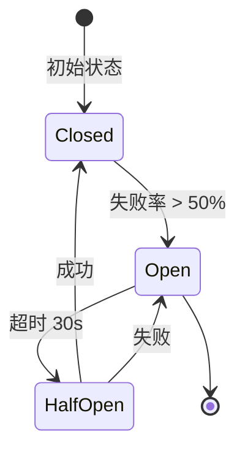

# Redis Lua 滑动窗口分布式限流 + gobreaker 熔断保护

## 核心概念

### 什么是分布式限流？

在微服务架构中，限流是保护系统的第一道防线：

```mermaid
flowchart TB
    subgraph Client ["客户端"]
        U1[用户 A]
        U2[用户 B]
        U3[用户 C]
    end
    
    subgraph Gateway ["网关层"]
        RL[Rate Limiter]
        CB[Circuit Breaker]
    end
    
    subgraph Services ["服务层"]
        MS[Matching Service]
        OS[Order Service]
    end
    
    U1 & U2 & U3 --> RL
    RL --> CB
    CB --> MS
    CB --> OS
    
    Note over RL: 滑动窗口限流
    Note over CB: 熔断保护
```

### 为什么需要滑动窗口？

| 算法 | 原理 | 优点 | 缺点 |
|------|------|------|------|
| **计数器** | N 秒内最多 M 请求 | 简单 | 边界问题 |
| **滑动日志** | 记录每次请求时间 | 精确 | 内存大 |
| **滑动窗口** | 计数器 + 时间加权 | 精确 + 节省内存 | 实现复杂 |
| **令牌桶** | 固定速率补充令牌 | 允许突发 | 需要同步 |
| **漏桶** | 固定速率消费 | 平滑 | 不允许突发 |

---

## Redis Lua 滑动窗口实现

### 1. 为什么用 Lua 脚本？

Redis Lua 脚本的优势：
- **原子性**：整个脚本在 Redis 单线程执行，无竞态
- **性能**：减少网络往返
- **灵活性**：复杂的限流逻辑一次执行

```go
// internal/gateway/middleware/ratelimit_redis.go

var slidingWindowScript = redis.NewScript(`
    local key = KEYS[1]
    local now = tonumber(ARGV[1])
    local window = tonumber(ARGV[2])      -- 窗口大小（毫秒）
    local max = tonumber(ARGV[3])        -- 最大请求数
    local ttl = tonumber(ARGV[4])        -- Key TTL
    local request_id = ARGV[5]            -- 唯一请求 ID
    
    -- 计算窗口开始时间
    local window_start = now - window
    
    -- 1. 删除窗口外的旧记录
    redis.call('ZREMRANGEBYSCORE', key, '-inf', window_start)
    
    -- 2. 统计当前窗口内请求数
    local count = redis.call('ZCARD', key)
    
    if count < max then
        -- 3. 未超限，添加新请求
        redis.call('ZADD', key, now, request_id)
        redis.call('EXPIRE', key, ttl)
        return {1, count + 1, max - count - 1}  -- {是否通过, 当前数, 剩余数}
    else
        -- 4. 超限，拒绝
        return {0, count, 0}
    end
`)
```

### 2. Sorted Set 数据结构

```
Redis Key: rate_limit:user:12345
Type: Sorted Set

Score (时间戳)     Member (唯一ID)
1561234567000     "req_abc123"
1561234567001     "req_def456"
1561234567002     "req_ghi789"
...
```

**操作原理**：
- `ZADD key timestamp request_id`：添加请求
- `ZREMRANGEBYSCORE key -inf <window_start>`：删除过期请求
- `ZCARD key`：统计窗口内请求数

### 3. 调用入口

```go
type RateLimitResult struct {
    Allowed    bool  // 是否允许
    Current    int64 // 当前请求数
    Remaining  int64 // 剩余配额
    RetryAfter int64 // 多少 ms 后重试
}

func (r *RedisRateLimiter) Check(ctx context.Context, scope, identity string, policy *config.RateLimitPolicy) (*RateLimitResult, error) {
    key := fmt.Sprintf("rate_limit:%s:%s", scope, identity)
    now := time.Now().UnixMilli()
    
    result, err := r.script.Run(ctx, r.client, []string{key},
        now,
        policy.WindowMs,
        policy.MaxRequests,
        policy.WindowMs/1000+60,  // TTL = 窗口 + 60s
        fmt.Sprintf("%s-%d", identity, now),
    ).Slice()
    
    allowed := result[0].(int64) == 1
    current := result[1].(int64)
    remaining := result[2].(int64)
    
    return &RateLimitResult{
        Allowed:   allowed,
        Current:   current,
        Remaining: remaining,
    }, nil
}
```

---

## 多维度限流策略

### 1. 限流维度

```go
type RateLimitPolicy struct {
    Scope      string  // 维度：user / ip / api / global
    MaxRequests int64  // 窗口内最大请求数
    WindowMs   int64   // 窗口大小（毫秒）
}

// 支持多种限流维度组合
policies := []config.RateLimitPolicy{
    {Scope: "ip", MaxRequests: 100, WindowMs: 1000},      // 每 IP 每秒 100 次
    {Scope: "user", MaxRequests: 50, WindowMs: 1000},      // 每用户每秒 50 次
    {Scope: "api:order", MaxRequests: 10, WindowMs: 1000}, // 下单接口每秒 10 次
    {Scope: "global", MaxRequests: 10000, WindowMs: 1000}, // 全局每秒 1 万次
}
```

### 2. 中间件集成

```go
func RateLimitByPolicy(limiter RateLimiter, policies []config.RateLimitPolicy, cb *gobreaker.CircuitBreaker) gin.HandlerFunc {
    return func(c *gin.Context) {
        if len(policies) == 0 {
            c.Next()
            return
        }

        path := c.Request.URL.Path

        for _, policy := range policies {
            if !policy.MatchPath(path) {
                continue
            }

            // 1. 提取限流标识
            identity := GetIdentity(c, policy.Scope)

            // 2. 熔断器保护 + 限流检查
            result, err := cb.Execute(func() (interface{}, error) {
                checkResult, checkErr := limiter.Check(c.Request.Context(), policy.Scope, identity, &policy)
                if checkErr != nil {
                    return nil, checkErr
                }
                metrics.GetMetrics().RecordRateLimitRequest(policy.Scope, policy.Name)
                if !checkResult.Allowed {
                    return checkResult, fmt.Errorf("rate limit exceeded")
                }
                return checkResult, nil
            })

            if err != nil {
                metrics.GetMetrics().IncRateLimitBlocked(policy.Scope, identity, policy.Name)

                // 熔断器打开 → 503
                if cb.State() == gobreaker.StateOpen {
                    c.AbortWithStatusJSON(503, gin.H{
                        "code":    503,
                        "message": "service temporarily unavailable (circuit breaker open)",
                    })
                    return
                }

                // 限流 → 429
                retryAfter := int64(0)
                if res, ok := result.(*RateLimitResult); ok {
                    retryAfter = res.RetryAfter
                }
                c.Header("Retry-After", fmt.Sprintf("%d", retryAfter))
                c.AbortWithStatusJSON(429, gin.H{
                    "code":    429,
                    "message": "rate limit exceeded",
                })
                return
            }

            // 成功路径：设置响应头
            if res, ok := result.(*RateLimitResult); ok {
                c.Header("X-RateLimit-Limit", fmt.Sprintf("%d", res.Current+res.Remaining))
                c.Header("X-RateLimit-Remaining", fmt.Sprintf("%d", res.Remaining))
                c.Header("X-RateLimit-Scope", policy.Scope)
            }

            c.Next()
            return
        }

        c.Next()
    }
}
```

---

## gobreaker 熔断保护

### 1. 为什么需要熔断？

```
正常情况：
Client -> Service A -> Service B -> Database
           (1ms)      (1ms)       (1ms)
           总延迟: 3ms

Service B 故障：
Client -> Service A -> Service B -> Database
           (1ms)      (timeout 5s!)  (timeout 5s!)
           总延迟: 10s+（如果多个并发请求）
```

**熔断器模式**：快速失败，防止级联故障



### 2. 项目配置

```go
// internal/gateway/middleware/ratelimit_redis.go

type CircuitBreakerConfig struct {
    Name    string
    MaxReq  uint32  // 半开状态下允许的请求数
    Timeout time.Duration  // 从开到半开的超时
}

var cbConfig = CircuitBreakerConfig{
    Name:    "matching-service",
    MaxReq:  100,               // 半开状态允许 100 个请求试探
    Timeout: 30 * time.Second,  // 30 秒后尝试恢复
}

func NewCircuitBreaker() *gobreaker.CircuitBreaker {
    return gobreaker.NewCircuitBreaker(gobreaker.Settings{
        Name: cbConfig.Name,
        MaxRequests: cbConfig.MaxReq,
        Timeout:     cbConfig.Timeout,
        ReadyToTrip: func(counts gobreaker.Counts) bool {
            // 条件：至少 20 个请求，且失败率 >= 50%
            failureRatio := float64(counts.TotalFailures) / float64(counts.Requests)
            return counts.Requests >= 20 && failureRatio >= 0.5
        },
        OnStateChange: func(name string, from gobreaker.State, to gobreaker.State) {
            logger.Warn("circuit breaker state changed",
                logger.S("name", name),
                logger.S("from", fmt.Sprintf("%s", from)),
                logger.S("to", fmt.Sprintf("%s", to)),
            )
            recordCircuitBreakerState(name, to)
        },
    })
}
```

### 3. 与限流集成

```go
func RateLimitByPolicy(limiter RateLimiter, policies []config.RateLimitPolicy, cb *gobreaker.CircuitBreaker) gin.HandlerFunc {
    return func(c *gin.Context) {
        // 熔断器保护
        result, err := cb.Execute(func() (interface{}, error) {
            result, checkErr := limiter.Check(c.Request.Context(), policy.Scope, identity, &policy)
            if checkErr != nil {
                return nil, checkErr  // 计入熔断器失败
            }
            return result, nil
        })
        
        // 熔断器状态检查
        if cb.State() == gobreaker.StateOpen {
            c.AbortWithStatusJSON(503, gin.H{
                "code":    503,
                "message": "service temporarily unavailable (circuit breaker open)",
            })
            return
        }
        
        // ... 正常限流逻辑
    }
}
```

---

## 全链路可观测性

### 30+ 指标体系

```go
// pkg/metrics/metrics.go

// HTTP 指标 (3)
httpRequestsTotal     *prometheus.CounterVec  // 请求总数
httpRequestDuration   *prometheus.HistogramVec  // 请求延迟
httpRequestsInFlight  int64  // 正在处理的请求

// gRPC 客户端指标 (5)
grpcRequestsTotal     *prometheus.CounterVec
grpcRequestDuration   *prometheus.HistogramVec
grpcClientFailuresTotal *prometheus.CounterVec
grpcClientCircuitState *prometheus.GaugeVec

// 订单簿指标 (5)
orderbookDepthLevels *prometheus.GaugeVec   // 深度档位数
orderbookBestBid    *prometheus.GaugeVec   // 最佳买价
orderbookBestAsk    *prometheus.GaugeVec   // 最佳卖价
orderbookOrdersTotal *prometheus.GaugeVec  // 订单总数
orderbookDepthBucket *prometheus.HistogramVec  // 深度分布

// 撮合引擎指标 (3)
matchingLatencySeconds *prometheus.HistogramVec
matchingMatchLatencySeconds *prometheus.HistogramVec
matchingMatchTotal *prometheus.CounterVec

// 限流指标 (4)
rateLimitBlockedTotal   *prometheus.CounterVec  // 被限流次数
rateLimitRequestsTotal *prometheus.CounterVec  // 总检查次数
rateLimitRemaining     *prometheus.GaugeVec    // 剩余配额
rateLimitErrorsTotal   *prometheus.CounterVec  // 限流错误

// 熔断器指标 (1)
circuitBreakerState *prometheus.GaugeVec  // 熔断器状态 (0=closed,1=half-open,2=open)

// Saga/Outbox 指标 (4)
sagaStateTransitionsTotal *prometheus.CounterVec
sagaRetryTotal           *prometheus.CounterVec
outboxPendingEntriesTotal *prometheus.GaugeVec
outboxProcessingDuration *prometheus.HistogramVec

// 总计: 33 个指标
```

### OpenTelemetry 分布式追踪

```go
// pkg/tracing/tracing.go

func Init(ctx context.Context, serviceName, otlpEndpoint string) (shutdown func(context.Context) error, err error) {
    exporter, err := otlptracegrpc.New(ctx,
        otlptracegrpc.WithEndpoint(otelEndpoint),
        otlptracegrpc.WithInsecure(),
    )
    
    tp := sdktrace.NewTracerProvider(
        sdktrace.WithBatcher(exporter),
        sdktrace.WithResource(res),
        sdktrace.WithSampler(sdktrace.ParentBased(sdktrace.AlwaysSample())),
    )
    
    otel.SetTracerProvider(tp)
    otel.SetTextMapPropagator(propagation.NewCompositeTextMapPropagator(
        propagation.TraceContext{},  // W3C TraceContext
        propagation.Baggage{},       // W3C Baggage
    ))
    
    return tp.Shutdown, nil
}
```

### 请求追踪中间件

```go
// internal/gateway/middleware/middleware.go

func RequestID() gin.HandlerFunc {
    return func(c *gin.Context) {
        requestID := c.GetHeader("X-Request-ID")
        if requestID == "" {
            requestID = c.GetHeader("X-Trace-ID")
        }
        if requestID == "" {
            requestID = generateRequestID()
        }
        
        c.Set("request_id", requestID)
        c.Header("X-Request-ID", requestID)
        
        // 将 requestID 注入 trace context
        c.Request = c.Request.WithContext(
            logger.WithRequestID(c.Request.Context(), requestID),
        )
        
        // 设置 span 属性
        if span := trace.SpanFromContext(c.Request.Context()); span.IsRecording() {
            span.SetAttributes(
                attribute.String("request.id", requestID),
                attribute.String("client.ip", c.ClientIP()),
            )
        }
        
        c.Next()
    }
}
```

---

## 面试高频问题

### Q1: 滑动窗口限流的原理？

**回答要点**：
```
Redis Sorted Set 实现：
1. 用时间戳作为 score
2. 用唯一 ID 作为 member
3. ZREMRANGEBYSCORE 删除过期数据
4. ZCARD 统计当前窗口内数量
5. 判断是否超限
```

**时间窗口示例**：
```
窗口: 1 秒, 限制: 10 请求

时间轴: 0ms -------- 500ms -------- 1000ms
请求:   1  2  3  4  5    6  7  8  9  10

T=500ms: count=5, allowed
T=1100ms: 窗口内请求 [6,7,8,9,10], count=5, allowed
T=1500ms: 窗口内请求 [6,7,8,9,10], count=5, allowed
```

### Q2: 为什么用 Lua 脚本？

**回答要点**：
1. **原子性**：整个限流逻辑在 Redis 单线程执行
2. **减少 RTT**：计算在 Redis 端完成
3. **可组合**：多个 Redis 命令组合成一个原子操作

**对比**：
```go
// ❌ 多次 Redis 调用（有竞态）
count := redis.ZCARD(key)
if count < max {
    redis.ZADD(key, now, id)
}

// ✅ Lua 脚本（原子）
script.Run(ctx, redis, keys, args...)
```

### Q3: Circuit Breaker 参数如何调优？

**项目限流熔断器配置**（保护 Redis 调用）：
```go
ReadyToTrip: func(counts gobreaker.Counts) bool {
    // 条件 1: 至少 20 个请求（避免误判）
    // 条件 2: 失败率 >= 50%
    return counts.Requests >= 20 && failureRatio >= 0.5
},
MaxRequests: 100,         // 半开状态允许 100 个请求
Timeout:     30 * time.Second,  // 30 秒后尝试恢复
```

**项目 gRPC 熔断器配置**（保护下游微服务）：
```go
// 配置位置: internal/gateway/client/clients.go
DefaultCircuitBreakerConfig:
    MaxRequests:      3,                // 半开状态允许 3 个请求
    Interval:         10 * time.Second, // Closed 状态每 10s 重置统计
    Timeout:          30 * time.Second, // 30 秒后尝试恢复
    FailureThreshold: 5,                // 连续 5 次失败触发熔断

// 触发条件: ConsecutiveFailures >= FailureThreshold
```

**调优原则**：
- `MaxRequests` 太小：恢复试探不够
- `MaxRequests` 太大：可能压垮正在恢复的服务
- `Timeout` 太短：服务还没恢复就放流量
- `Timeout` 太长：故障期间服务完全不可用

### Q4: 限流粒度如何选择？

| 粒度 | 场景 | 问题 |
|------|------|------|
| **IP** | 防止爬虫/攻击 | NAT 下多用户共用 IP |
| **User ID** | 防止资源滥用 | 需要认证 |
| **API** | 保护特定接口 | 热点接口可能误伤 |
| **全局** | 保护系统容量 | 无法区分用户 |

**项目实现**：多维度叠加（IP + User + API + 全局）

### Q5: 限流后如何处理？

**项目实现**：
```go
result, err := cb.Execute(func() (interface{}, error) {
    checkResult, checkErr := limiter.Check(ctx, policy.Scope, identity, &policy)
    if checkErr != nil {
        return nil, checkErr
    }
    if !checkResult.Allowed {
        return checkResult, fmt.Errorf("rate limit exceeded")
    }
    return checkResult, nil
})

if err != nil {
    // 熔断器打开 → 503
    if cb.State() == gobreaker.StateOpen {
        c.AbortWithStatusJSON(503, gin.H{
            "code":    503,
            "message": "service temporarily unavailable (circuit breaker open)",
        })
        return
    }

    // 限流 → 429
    retryAfter := int64(0)
    if res, ok := result.(*RateLimitResult); ok {
        retryAfter = res.RetryAfter
    }
    c.Header("Retry-After", fmt.Sprintf("%d", retryAfter))
    c.AbortWithStatusJSON(429, gin.H{
        "code":    429,
        "message": "rate limit exceeded",
    })
    return
}
```

**两种错误的区别**：
- **503（熔断）**：Redis 持续故障，快速失败，不应重试
- **429（限流）**：请求过多，应按 `Retry-After` 等待后重试

**客户端重试策略**：
```go
// 指数退避
for attempt := 0; attempt < maxRetries; attempt++ {
    resp, err := client.Do(req)
    if err == nil {
        if resp.StatusCode == 429 {
            retryAfter := parseRetryAfter(resp.Header)
            time.Sleep(retryAfter * time.Millisecond)
            continue
        }
        break
    }
    time.Sleep(time.Duration(math.Pow(2, attempt)) * time.Second)
}
```

### Q6: 限流系统的挑战？

**分布式一致性**：
```mermaid
flowchart LR
    subgraph Node1 ["节点 1"]
        RL1[Rate Limiter]
    end
    subgraph Node2 ["节点 2"]
        RL2[Rate Limiter]
    end
    subgraph Node3 ["节点 3"]
        RL3[Rate Limiter]
    end
    
    Redis[(Redis 集群)]
    
    RL1 & RL2 & RL3 --> Redis
    
    Note: Redis 是限流的单一数据源
    Note: 各节点本地限流作为预检
```

**解决方案**：
1. **集中式**：所有请求都查 Redis（延迟高）
2. **本地 + Redis 混合**：本地限流 + Redis 确认
3. **滑动计数**：当前方案，所有节点共享 Redis

---

## 扩展思考

### 本地限流优化

```go
// 本地滑动窗口（快速预检）
type LocalLimiter struct {
    counts    sync.Map  // identity -> *slidingWindow
    limit     int64
    windowMs  int64
}

func (l *LocalLimiter) Allow(identity string) bool {
    now := time.Now().UnixMilli()
    sw, _ := l.counts.LoadOrStore(identity, &slidingWindow{})
    
    sw.mu.Lock()
    defer sw.mu.Unlock()
    
    // 快速检查
    sw.removeExpired(now - l.windowMs)
    if sw.count >= l.limit {
        return false
    }
    sw.add(now)
    return true
}
```

### 突发流量处理

```go
// 令牌桶算法（允许突发）
type TokenBucket struct {
    capacity   int64
    tokens     float64
    refillRate float64  // 每秒补充的令牌数
    lastRefill int64
    mu         sync.Mutex
}

func (tb *TokenBucket) Allow(n int64) bool {
    tb.mu.Lock()
    defer tb.mu.Unlock()
    
    // 补充令牌
    now := time.Now().UnixMilli()
    elapsed := float64(now - tb.lastRefill) / 1000.0
    tb.tokens = math.Min(tb.capacity, tb.tokens + elapsed*tb.refillRate)
    tb.lastRefill = now
    
    // 消耗令牌
    if tb.tokens >= float64(n) {
        tb.tokens -= float64(n)
        return true
    }
    return false
}
```

### 多级限流架构

```
                                    ┌─────────────────┐
                                    │   CDN / WAF     │
                                    │   (L7 限流)      │
                                    └────────┬────────┘
                                             │
                                    ┌────────▼────────┐
                                    │  API Gateway    │
                                    │  (全局限流)      │
                                    └────────┬────────┘
                                             │
                         ┌───────────────────┼───────────────────┐
                         │                   │                   │
                ┌────────▼────────┐ ┌────────▼────────┐ ┌────────▼────────┐
                │  Service A      │ │  Service B      │ │  Service C      │
                │  (接口级限流)    │ │  (接口级限流)    │ │  (接口级限流)    │
                └────────┬────────┘ └────────┬────────┘ └────────┬────────┘
                         │                   │                   │
                ┌────────▼────────┐ ┌────────▼────────┐ ┌────────▼────────┐
                │  Redis          │ │  Redis          │ │  Redis          │
                │  (分布式限流)    │ │  (分布式限流)    │ │  (分布式限流)    │
                └─────────────────┘ └─────────────────┘ └─────────────────┘
```

---

## 相关文档

本文档聚焦于"限流"场景下的熔断器使用。如需了解项目熔断器的完整架构（包括 gRPC 客户端层熔断器、状态机详解、与重试/超时的协作等），请参阅：

- [gobreaker 熔断器详解（项目实践）](10-gobreaker-circuit-breaker.md)
