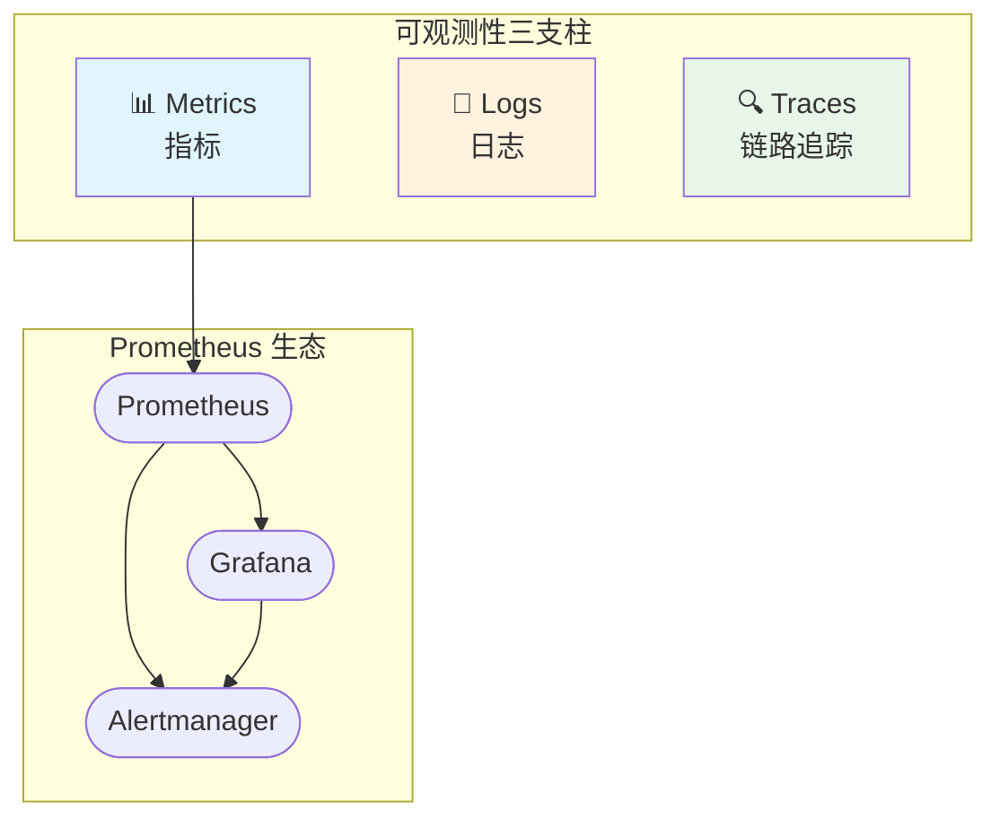
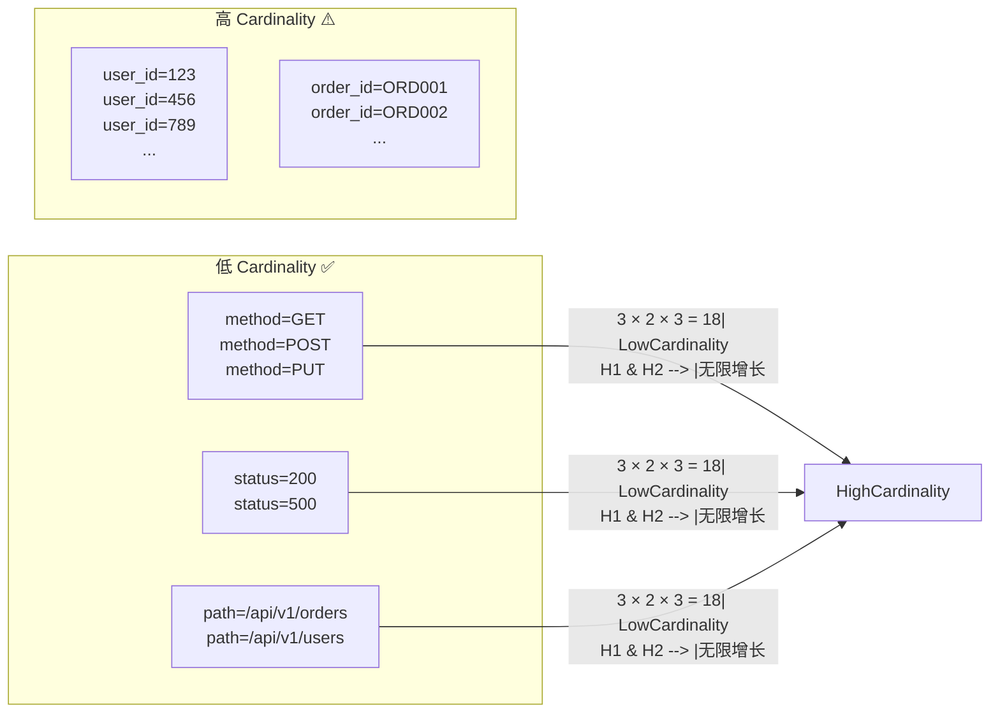
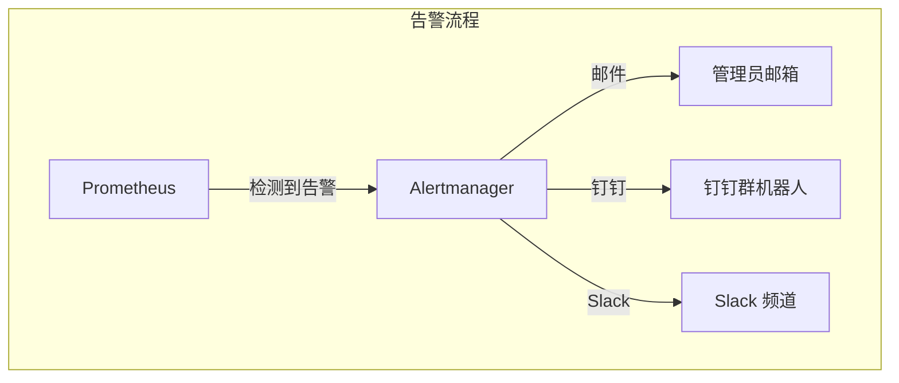
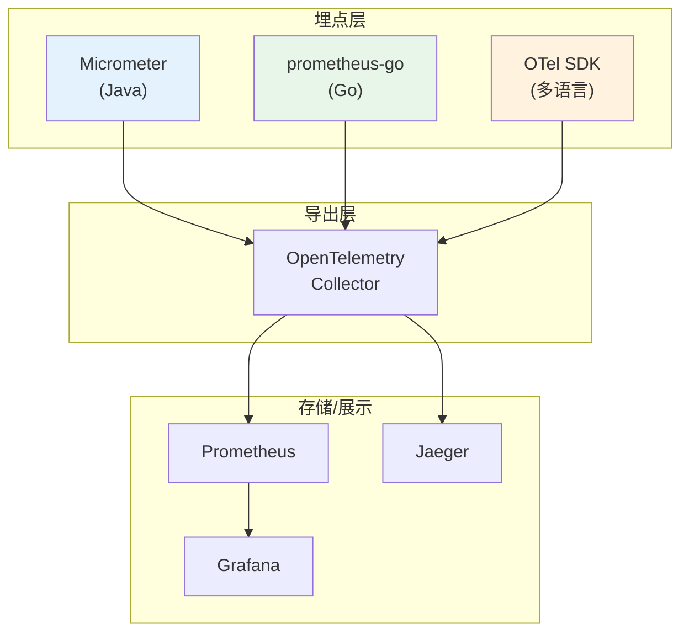

# Prometheus + Grafana 可观测性实践

## 核心概念

### 什么是可观测性？

可观测性（Observability）由三个支柱组成：



| 支柱 | 关注点 | 项目中的实现 |
|------|--------|-------------|
| **Metrics** | "发生了什么？" - 量化指标 | Prometheus + 本项目的 `pkg/metrics` |
| **Logs** | "怎么发生的？" - 事件详情 | 结构化日志 `pkg/logger` |
| **Traces** | "在哪发生的？" - 调用链路 | OpenTelemetry + Jaeger |

### Prometheus 核心概念

**Pull 模式**：Prometheus 主动从目标服务拉取指标，而非服务推送。

```
┌─────────────┐       pull (15s)        ┌─────────────────┐
│   你的应用   │ ◄───────────────────── │   Prometheus     │
│ /metrics    │                        │   Server         │
└─────────────┘                        └────────┬────────┘
                                                │
                                                │ PromQL 查询
                                                ▼
                                        ┌───────────────┐
                                        │   Grafana     │
                                        │  Dashboard    │
                                        └───────────────┘
```

**数据模型**：

```
指标名{标签1="值1", 标签2="值2"} 数值

# 示例
http_requests_total{method="POST", path="/api/v1/orders", status="200"} 1523
```

---

## 项目中的实际使用

### 1. 暴露指标端点

**代码位置**: `internal/gateway/router/router.go`

```go
import (
    "github.com/prometheus/client_golang/prometheus/promhttp"
)

func Setup(r *gin.Engine, cfg *Config) {
    // ...
    // Prometheus metrics endpoint
    r.GET("/metrics", gin.WrapH(promhttp.Handler()))
}
```

**验证方法**：

```bash
curl http://localhost:8080/metrics
```

返回格式：

```
# HELP http_requests_total Total number of HTTP requests
# TYPE http_requests_total counter
http_requests_total{method="POST",path="/api/v1/orders",status="200"} 42
http_requests_total{method="GET",path="/healthz",status="200"} 156
```

### 2. 指标收集器实现

**代码位置**: `pkg/metrics/metrics.go`

```go
import (
    "github.com/prometheus/client_golang/prometheus"
    "github.com/prometheus/client_golang/prometheus/promauto"
)

// 单例模式，确保全局只有一个指标实例
var (
    once     sync.Once
    instance *Metrics
)

func GetMetrics() *Metrics {
    once.Do(func() {
        instance = newMetrics()
    })
    return instance
}
```

### 3. 三种指标类型详解

| 类型 | 特点 | 使用场景 | 项目示例 |
|------|------|----------|----------|
| **Counter** | 只增不减 | 累计计数 | `order_created_total`、`http_requests_total` |
| **Gauge** | 可增可减 | 瞬时值 | `orderbook_best_bid`、`http_requests_in_flight` |
| **Histogram** | 桶统计 | 延迟分布 | `http_request_duration_seconds`、`matching_latency_seconds` |

**Counter 示例**：

```go
// pkg/metrics/metrics.go

// 定义 Counter
orderCreatedTotal: promauto.NewCounterVec(
    prometheus.CounterOpts{
        Name: "order_created_total",
        Help: "Total number of orders created",
    },
    []string{"side", "symbol"},  // Labels
),

// 记录订单创建
func (m *Metrics) RecordOrderCreated(side, symbol string) {
    m.orderCreatedTotal.WithLabelValues(side, symbol).Inc()
}
```

**Histogram 示例**：

```go
// 定义 Histogram（自动创建多个 bucket）
matchingLatencySeconds: promauto.NewHistogramVec(
    prometheus.HistogramOpts{
        Name:    "matching_latency_seconds",
        Help:    "Matching engine operation latency in seconds",
        Buckets: []float64{.0001, .0005, .001, .005, .01, .025, .05, .1, .5, 1},
        // 会自动创建: _bucket{le="0.0001"}、_bucket{le="0.0005"}...
        // 以及 _sum、_count
    },
    []string{"operation", "symbol"},
),

// 记录延迟
func (m *Metrics) RecordMatchingLatency(operation, symbol string, duration time.Duration) {
    m.matchingLatencySeconds.WithLabelValues(operation, symbol).Observe(duration.Seconds())
}
```

**Gauge 示例**：

```go
// 定义 Gauge
orderbookBestBid: promauto.NewGaugeVec(
    prometheus.GaugeOpts{
        Name: "orderbook_best_bid",
        Help: "Best bid price in the order book",
    },
    []string{"symbol"},
),

// 设置值
func (m *Metrics) SetOrderbookBestBid(symbol string, price float64) {
    m.orderbookBestBid.WithLabelValues(symbol).Set(price)
}
```

### 4. 业务代码中的指标记录

**HTTP 请求中间件** (`internal/gateway/middleware/middleware.go`)：

```go
func AccessLog() gin.HandlerFunc {
    return func(c *gin.Context) {
        start := time.Now()
        m := metrics.GetMetrics()
        m.IncHTTPRequestsInFlight()  // 请求开始 +1

        c.Next()

        latency := time.Since(start)
        m.DecHTTPRequestsInFlight()  // 请求结束 -1
        m.RecordHTTPRequest(c.Request.Method, path, status, latency)
    }
}
```

**撮合引擎** (`internal/matching/engine/engine.go`)：

```go
func (m *Matcher) SubmitOrder(...) (*MatchResult, error) {
    start := time.Now()
    result, err := m.dispatch(ctx, symbol, cmd)
    duration := time.Since(start)

    // 记录撮合延迟
    metrics.GetMetrics().RecordMatchingLatency("submit", symbol, duration)

    // 记录成交次数
    if len(result.Trades) > 0 {
        metrics.GetMetrics().RecordMatchingMatch(sideStr, symbol, float64(len(result.Trades)))
    }

    return result, err
}
```

**限流拦截** (`internal/gateway/middleware/ratelimit_redis.go`)：

```go
// 当请求被限流拦截时
metrics.GetMetrics().IncRateLimitBlocked("ip", clientIP, policy)
```

### 5. 项目完整指标清单

```
# HTTP 指标
http_requests_total{method, path, status}           # 请求总数
http_request_duration_seconds{method, path}         # 请求延迟
http_requests_in_flight                            # 正在处理的请求数

# gRPC 指标
grpc_server_requests_total{service, method, code}   # gRPC 服务请求数
grpc_server_duration_seconds{service, method}      # gRPC 服务延迟
grpc_clients_circuit_state{client}                # 熔断器状态 (0=关闭, 1=开启, 2=半开)

# 订单簿指标
orderbook_depth_levels{side, symbol}               # 订单簿深度
orderbook_best_bid{symbol}                         # 最优买价
orderbook_best_ask{symbol}                         # 最优卖价

# 撮合指标
matching_latency_seconds{operation, symbol}        # 撮合延迟
matching_match_total{side, symbol}                 # 成交笔数
matching_wal_append_seconds                        # WAL 追加延迟

# 订单指标
order_created_total{side, symbol}                  # 订单创建数
order_cancelled_total{side, symbol}               # 订单取消数
order_fill_rate{side, symbol}                     # 订单成交率分布

# 限流指标
rate_limit_blocked_total{scope, identity, policy} # 被拦截的请求数
rate_limit_requests_total{scope, policy}          # 总请求数
rate_limit_remaining{scope, identity}             # 剩余配额

# Saga 指标
saga_state_transitions_total{from, to}            # Saga 状态转移
saga_retry_total{step}                           # Saga 重试次数

# Outbox 指标
outbox_pending_entries_total{status}             # 待处理事件数
outbox_processing_duration_seconds{action_type}  # 事件处理延迟
```

---

## PromQL 查询实战

### 常用查询语法

```promql
# ===========================
# 基础查询
# ===========================

# 查询所有 HTTP 请求
http_requests_total

# 带标签过滤
http_requests_total{status="500"}

# 正则匹配
http_requests_total{path=~"/api/v1/.*"}

# ===========================
# Rate 计算（求变化率）
# ===========================

# 每秒请求数（5分钟窗口）
rate(http_requests_total[5m])

# 请求成功率
sum(rate(http_requests_total{status="200"}[5m]))
  /
sum(rate(http_requests_total[5m]))

# ===========================
# Histogram 分位数
# ===========================

# P99 延迟（99% 请求在多少时间内完成）
histogram_quantile(0.99, rate(http_request_duration_seconds_bucket[5m]))

# P50 延迟
histogram_quantile(0.50, rate(http_request_duration_seconds_bucket[5m]))

# ===========================
# 聚合运算
# ===========================

# 按 path 分组求和
sum by (path) (rate(http_requests_total[5m]))

# 按 status 分组计算比例
sum by (status) (rate(http_requests_total[5m]))

# Top N
topk(5, sum by (identity) (rate(rate_limit_blocked_total{scope="ip"}[5m])))

# ===========================
# 多指标组合
# ===========================

# 订单成交率 = 成交笔数 / 订单创建数
sum(rate(matching_match_total[5m]))
  /
sum(rate(order_created_total[5m]))

# 取消率
sum(rate(order_cancelled_total[5m]))
  /
sum(rate(order_created_total[5m]))
```

---

## 面试问题与参考答案

### Q1: Prometheus 的 Push 和 Pull 模式有什么区别？你项目用的是哪种？

**参考答案**：

| 模式 | 原理 | 优点 | 缺点 |
|------|------|------|------|
| **Pull** | Prometheus 主动拉取 | 服务端可控、易发现异常、无需改应用 | 需要应用暴露端口 |
| **Push** | 应用主动推送 | 适合短生命周期任务 | 需要 PushGateway、难以确认目标存活 |

**项目中使用的是 Pull 模式**：

```go
// internal/gateway/router/router.go
r.GET("/metrics", gin.WrapH(promhttp.Handler()))
```

Prometheus 配置：

```yaml
# prometheus.yml
scrape_configs:
  - job_name: 'exchange-gateway'
    static_configs:
      - targets: ['gateway:8080']
    scrape_interval: 15s
```

---

### Q2: Counter、Gauge、Histogram 的区别和使用场景？

**参考答案**：

```
┌─────────────────────────────────────────────────────────────────┐
│                        指标类型对比                              │
├───────────────┬─────────────────────────────────────────────────┤
│ Counter       │                                                 │
│ ┌───────────┐ │  时间 ─────────────────────────────────────►     │
│ │       ╱   │ │        1  →  2  →  3  →  4  →  5  →  6          │
│ │     ╱     │ │  特点：只增不减，用于累计计数                         │
│ │   ╱       │ │  示例：请求数、订单数、错误数                       │
│ │ ╱         │ │                                                 │
│ └───────────┘ │                                                 │
├───────────────┼─────────────────────────────────────────────────┤
│ Gauge         │                                                 │
│ ┌───────────┐ │  时间 ─────────────────────────────────────►     │
│ │     ╱╲    │ │        3  →  5  →  2  →  4  →  3  →  5          │
│ │    ╱  ╲   │ │  特点：可增可减，用于瞬时值                         │
│ │   ╱    ╲  │ │  示例：CPU使用率、当前在线人数、最优价格              │
│ │  ╱      ╲ │ │                                                 │
│ └───────────┘ │                                                 │
├───────────────┼─────────────────────────────────────────────────┤
│ Histogram     │                                                 │
│ ┌───────────┐ │  时间 ─────────────────────────────────────►     │
│ │  ████     │ │  自动生成 bucket：≤0.1s、≤0.5s、≤1s、≤5s...        │
│ │ ██████    │ │  特点：记录分布，可计算分位数                        │
│ │████████   │ │  示例：延迟、响应时间分布                           │
│ └───────────┘ │                                                 │
└───────────────┴─────────────────────────────────────────────────┘
```

**Histogram 计算 P99 的原理**：

```promql
# histogram_quantile(0.99, rate(http_request_duration_seconds_bucket[5m]))
#
# 原理：
# 1. rate() 计算每个 bucket 的增加速率
# 2. histogram_quantile() 根据桶累积分布计算分位数
#
# 例如：P99 = 0.05s 表示 99% 的请求在 50ms 内完成
```

---

### Q3: 你们项目怎么监控撮合引擎的性能？有哪些关键指标？

**参考答案**：

**关键指标**：

```promql
# 1. 撮合延迟 P99（核心指标）
histogram_quantile(0.99, rate(matching_latency_seconds_bucket[5m]))

# 2. 撮合吞吐量（每秒成交笔数）
rate(matching_match_total[5m])

# 3. 订单簿深度变化
orderbook_depth_levels{symbol="BTC-USDT"}

# 4. 买卖价差
orderbook_best_ask{symbol="BTC-USDT"} - orderbook_best_bid{symbol="BTC-USDT"}

# 5. WAL 追加延迟
histogram_quantile(0.99, rate(matching_wal_append_seconds_bucket[5m]))
```

**项目代码中的实现**：

```go
// internal/matching/engine/engine.go
func (m *Matcher) SubmitOrder(...) {
    start := time.Now()
    result, err := m.dispatch(ctx, symbol, cmd)

    // 记录延迟
    metrics.GetMetrics().RecordMatchingLatency("submit", symbol, time.Since(start))

    // 记录成交
    if len(result.Trades) > 0 {
        metrics.GetMetrics().RecordMatchingMatch(side, symbol, float64(len(result.Trades)))
    }
}
```

---

### Q4: 什么是 Cardinality 问题？怎么避免？

**参考答案**：

**Cardinality = Label 组合的唯一值数量**



**危害**：高 cardinality 导致 Prometheus 内存爆炸、查询变慢。

**项目中的最佳实践**：

```go
// ✅ 正确做法 - 使用有限的值
http_requests_total{path="/api/v1/orders/:id"}  // 固定格式
rate_limit_blocked_total{scope="ip"}            // 有限范围

// ❌ 错误做法 - 不要把动态 ID 放进 label
http_requests_total{user_id="123456"}            // 用户数 = 指标数 → 爆炸
http_requests_total{order_id="ORD001"}           // 订单数 = 指标数 → 爆炸
```

**Cardinality 监控**：

```promql
# 查看每个指标的 Cardinality
count by (__name__) ({__name__=~"http_.*"})

# 高 Cardinality 告警（超过 10000 个唯一组合）
count by (le) (rate(http_requests_total[1m])) > 10000
```

---

### Q5: 如果 Prometheus 挂掉了怎么办？你们有告警吗？

**参考答案**：

**架构设计**：



**Alertmanager 配置示例**：

```yaml
# alertmanager.yml
global:
  smtp_smarthost: 'smtp.gmail.com:587'
  smtp_from: 'alert@example.com'

route:
  group_by: ['alertname']
  group_wait: 10s
  receiver: 'email'

receivers:
  - name: 'email'
    email_configs:
      - to: 'admin@example.com'
```

**关键告警规则**：

```yaml
# prometheus/rules/*.yml
groups:
  - name: exchange-alerts
    rules:
      # 服务挂了
      - alert: ServiceDown
        expr: up == 0
        for: 1m
        labels:
          severity: critical
        annotations:
          summary: "服务 {{ $labels.instance }} 挂了"

      # 错误率过高
      - alert: HighErrorRate
        expr: |
          sum(rate(http_requests_total{status=~"5.."}[5m]))
          / sum(rate(http_requests_total[5m])) > 0.05
        for: 5m
        labels:
          severity: warning
        annotations:
          summary: "5xx 错误率超过 5%"

      # 撮合延迟过高
      - alert: HighMatchingLatency
        expr: |
          histogram_quantile(0.99, rate(matching_latency_seconds_bucket[5m])) > 0.1
        for: 2m
        labels:
          severity: warning
        annotations:
          summary: "撮合 P99 延迟超过 100ms"
```

---

### Q6: 怎么用 Prometheus 衡量订单系统的健康度？

**参考答案**：

**核心指标仪表盘**：

```promql
# ====================
# 1. 请求量
# ====================
# QPS
sum(rate(http_requests_total[1m]))

# ====================
# 2. 成功率
# ====================
# HTTP 成功率
sum(rate(http_requests_total{status=~"2.."}[5m]))
  /
sum(rate(http_requests_total[5m]))

# ====================
# 3. 延迟
# ====================
# API P99
histogram_quantile(0.99, rate(http_request_duration_seconds_bucket[5m]))

# 撮合 P99
histogram_quantile(0.99, rate(matching_latency_seconds_bucket[5m]))

# ====================
# 4. 业务指标
# ====================
# 订单成交率
sum(rate(matching_match_total[5m]))
  /
sum(rate(order_created_total[5m]))

# 订单取消率
sum(rate(order_cancelled_total[5m]))
  /
sum(rate(order_created_total[5m]))

# ====================
# 5. 系统保护
# ====================
# 限流拦截率
sum(rate(rate_limit_blocked_total[5m]))
  /
sum(rate(rate_limit_requests_total[5m]))

# 熔断器开启数
sum(grpc_clients_circuit_state > 0)
```

---

### Q7: Prometheus 和 Micrometer、OpenTelemetry 是什么关系？

**参考答案**：



| 框架 | 定位 | 项目使用 |
|------|------|----------|
| **Micrometer** | Java 生态指标抽象 | 未使用（项目是 Go） |
| **prometheus/client_golang** | Go 语言 Prometheus 客户端 | ✅ 核心使用 `pkg/metrics` |
| **OpenTelemetry** | 统一的可观测性标准 | ✅ 用于链路追踪（Jaeger） |

**OpenTelemetry + Prometheus 配合**：

```go
// 项目中同时使用
import (
    "github.com/prometheus/client_golang/prometheus/promhttp"      // 指标
    "go.opentelemetry.io/contrib/instrumentation/github.com/gin-gonic/gin/otelgin" // 链路
)

// 指标用于：性能监控、业务分析
// 链路用于：请求追踪、问题定位
```

---

## Grafana Dashboard 配置

### 项目推荐 Dashboard

**1. Overview 面板**：

```json
{
  "title": "Exchange 系统概览",
  "panels": [
    {
      "title": "QPS",
      "targets": [
        {
          "expr": "sum(rate(http_requests_total[1m]))",
          "legendFormat": "QPS"
        }
      ]
    },
    {
      "title": "P99 延迟",
      "targets": [
        {
          "expr": "histogram_quantile(0.99, rate(http_request_duration_seconds_bucket[5m]))",
          "legendFormat": "P99"
        }
      ]
    }
  ]
}
```

**2. 订单簿健康面板**：

```promql
# 买单深度 vs 卖单深度
orderbook_depth_levels{symbol="$symbol", side="buy"}
orderbook_depth_levels{symbol="$symbol", side="sell"}

# 买卖价差百分比
(orderbook_best_ask{symbol="$symbol"} - orderbook_best_bid{symbol="$symbol"})
  / orderbook_best_bid{symbol="$symbol"} * 100
```

**3. 告警规则面板**：

```promql
# 当前被限流的 IP
topk(10, sum by (identity) (rate(rate_limit_blocked_total{scope="ip"}[5m])))

# 熔断器状态
grpc_clients_circuit_state
```

---

## 总结

| 组件 | 职责 | 项目中的位置 |
|------|------|-------------|
| **Prometheus** | 收集、存储指标 | 你只需暴露 `/metrics` 端点 |
| **PromQL** | 查询语言 | 各种 Dashboard 和告警规则 |
| **Grafana** | 可视化、告警 | 查询 Prometheus 数据 |
| **你的代码** | 定义 + 记录指标 | `pkg/metrics/metrics.go` + 业务代码 |

**面试加分点**：

1. ✅ 理解 Pull vs Push 模式的选择
2. ✅ 掌握 Counter/Gauge/Histogram 的使用场景
3. ✅ 能写出实际的 PromQL 查询
4. ✅ 了解 Cardinality 问题及避免方法
5. ✅ 理解 Prometheus + OpenTelemetry 的配合使用
6. ✅ 知道怎么用指标构建业务 Dashboard
