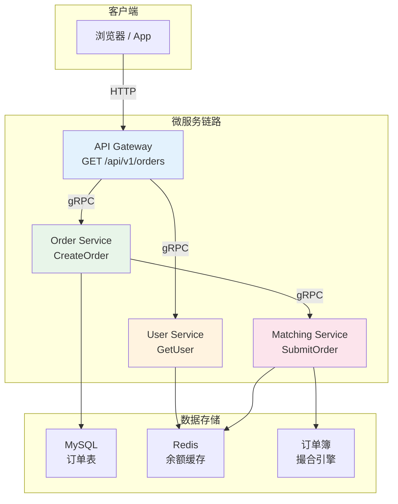
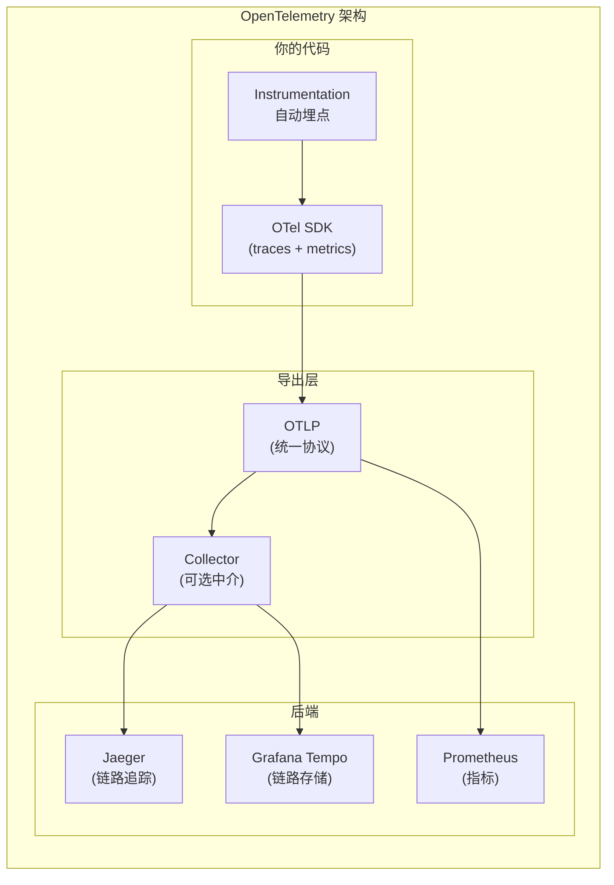
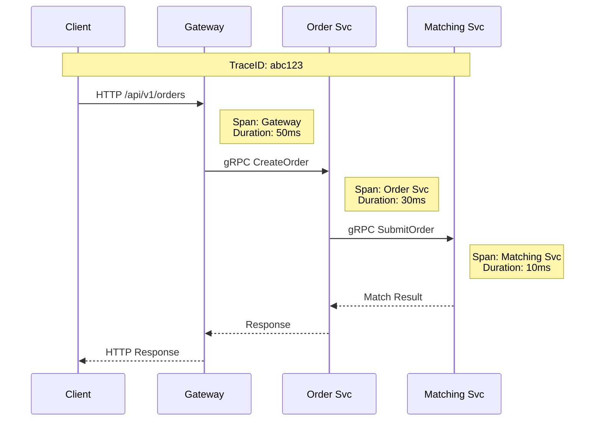
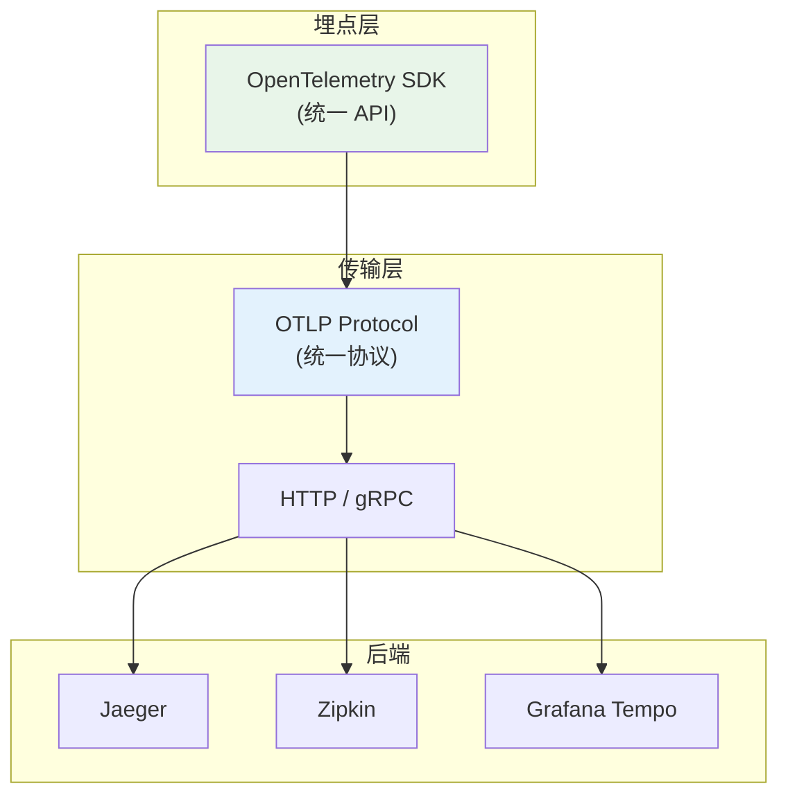
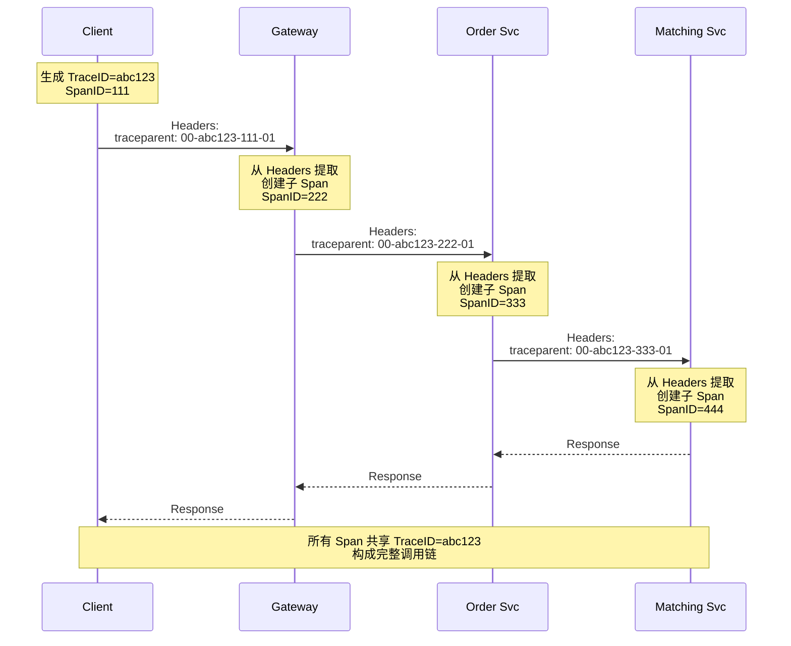
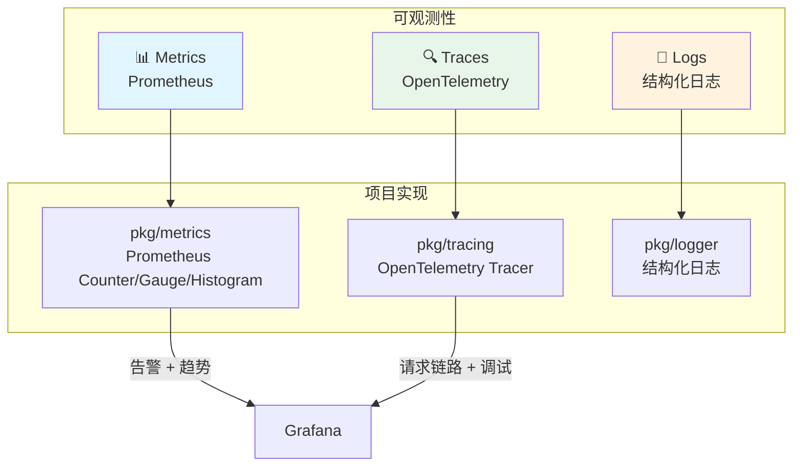
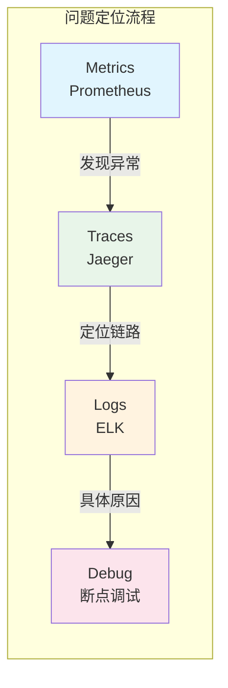
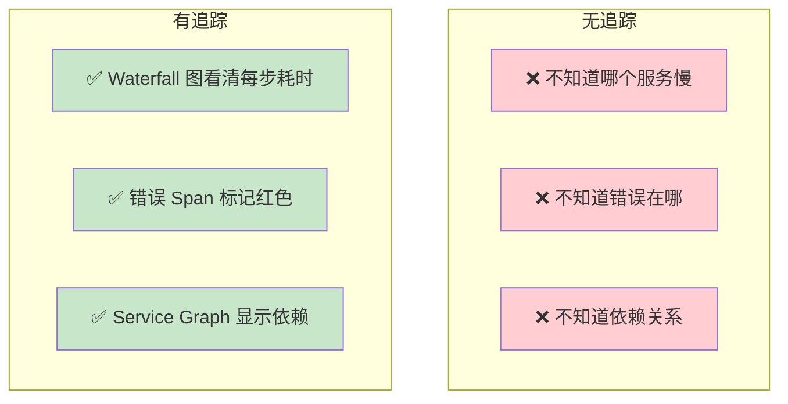

# OpenTelemetry 分布式追踪实践

## 核心概念

### 什么是分布式追踪？

分布式追踪用于跟踪一个请求从入口（网关）到多个微服务的完整调用路径，回答"这个请求经历了哪些服务？每一步耗时多少？哪里出错了？"



### OpenTelemetry 是什么？

OpenTelemetry（简称 OTel）是 CNCF 的可观测性标准项目，统一了 **Traces**、**Metrics**、**Logs** 的采集规范。



### 核心概念：Trace、Span、Context

| 概念 | 说明 | 类比 |
|------|------|------|
| **Trace** | 一次完整请求的追踪记录 | 一条完整的"故事线" |
| **Span** | Trace 中的一个操作单元 | 故事线中的一个"章节" |
| **Context** | 追踪上下文，包含 TraceID 和 SpanID | "书页书签"，跨服务传递 |



---

## 项目中的实际使用

### 1. 整体架构

```
┌─────────────────────────────────────────────────────────────────────────┐
│                         分布式追踪架构                                   │
├─────────────────────────────────────────────────────────────────────────┤
│                                                                         │
│   Gateway                    Order Svc              Matching Svc        │
│  ┌─────────┐               ┌─────────┐             ┌─────────┐        │
│  │ otelgin │               │otelgrpc │             │ otelgrpc │        │
│  │(HTTP)   │               │(Server) │             │ (Server) │        │
│  └────┬────┘               └────┬────┘             └────┬────┘        │
│       │                         │                       │             │
│       │ OTLP gRPC                │ OTLP gRPC            │ OTLP gRPC   │
│       ▼                         ▼                       ▼             │
│  ┌─────────────────────────────────────────────────────────────┐      │
│  │                    Jaeger (All-in-One)                      │      │
│  │                     :16686 (UI)                            │      │
│  │                     :4317 (OTLP gRPC)                      │      │
│  └─────────────────────────────────────────────────────────────┘      │
│                                                                         │
└─────────────────────────────────────────────────────────────────────────┘
```

### 2. 初始化 Tracing SDK

**代码位置**: `pkg/tracing/tracing.go`

```go
package tracing

import (
    "context"
    "go.opentelemetry.io/otel"
    "go.opentelemetry.io/otel/exporters/otlp/otlptrace/otlptracegrpc"
    "go.opentelemetry.io/otel/propagation"
    "go.opentelemetry.io/otel/sdk/resource"
    sdktrace "go.opentelemetry.io/otel/sdk/trace"
    semconv "go.opentelemetry.io/otel/semconv/v1.26.0"
)

// Init 初始化 OpenTelemetry SDK
func Init(ctx context.Context, serviceName, otlpEndpoint string) (shutdown func(context.Context) error, err error) {
    // 1. 创建 OTLP gRPC 导出器
    exporter, err := otlptracegrpc.New(ctx,
        otlptracegrpc.WithEndpoint(otlpEndpoint),
        otlptracegrpc.WithInsecure(),  // 开发环境不使用 TLS
    )

    // 2. 创建资源（服务信息）
    res, err := resource.New(ctx,
        resource.WithAttributes(
            semconv.ServiceName(serviceName),  // 注册服务名
        ),
    )

    // 3. 创建 TracerProvider
    tp := sdktrace.NewTracerProvider(
        sdktrace.WithBatcher(exporter),           // 批量导出，提升性能
        sdktrace.WithResource(res),                // 绑定服务资源
        sdktrace.WithSampler(sdktrace.ParentBased( // 继承父 Span 的采样决策
            sdktrace.AlwaysSample())),             // 全部采样（开发环境）
    )

    // 4. 注册全局 TracerProvider
    otel.SetTracerProvider(tp)

    // 5. 设置上下文传播器（W3C TraceContext）
    otel.SetTextMapPropagator(propagation.NewCompositeTextMapPropagator(
        propagation.TraceContext{},  // traceparent, tracestate
        propagation.Baggage{},       // 自定义 baggage
    ))

    return tp.Shutdown, nil
}
```

**服务启动时初始化** (`cmd/gateway/main.go`)：

```go
func main() {
    // ...

    // Initialize OpenTelemetry tracing
    otelEndpoint := os.Getenv("OTEL_EXPORTER_OTLP_ENDPOINT")
    tracingShutdown, err := tracing.Init(context.Background(), "gateway", otelEndpoint)
    if err != nil {
        logger.Warn("failed to init tracing", logger.Err(err))
    } else {
        defer func() {
            ctx, cancel := context.WithTimeout(context.Background(), 5*time.Second)
            defer cancel()
            tracingShutdown(ctx)  // 优雅关闭时导出剩余 spans
        }()
    }

    // ...
}
```

### 3. HTTP 自动埋点

使用 `otelgin` 中间件自动为所有 HTTP 请求创建 Span。

**代码位置**: `internal/gateway/router/router.go`

```go
import (
    "go.opentelemetry.io/contrib/instrumentation/github.com/gin-gonic/gin/otelgin"
)

func Setup(r *gin.Engine, cfg *Config) {
    // 全局中间件
    r.Use(middleware.RequestID())
    r.Use(otelgin.Middleware(cfg.ServiceName))  // 自动创建 HTTP Span
    r.Use(middleware.Recovery())
    r.Use(middleware.AccessLog())
    // ...
}
```

**自动创建的 Span 属性**：

```yaml
span.name: "POST /api/v1/orders"
span.kind: "server"
http.method: "POST"
http.url: "http://localhost:8080/api/v1/orders"
http.target: "/api/v1/orders"
http.status_code: 200
http.host: "localhost:8080"
http.user_agent: "PostmanRuntime/7.32.0"
```

### 4. gRPC 自动埋点

使用 `otelgrpc` 分别为 Server 和 Client 创建 Span。

**gRPC Server 端** (`cmd/order-svc/main.go`)：

```go
import (
    "go.opentelemetry.io/contrib/instrumentation/google.golang.org/grpc/otelgrpc"
)

func main() {
    // 创建 gRPC Server，添加 OTel Handler
    grpcServer := grpc.NewServer(
        grpc.StatsHandler(otelgrpc.NewServerHandler()),  // 自动创建 Server Span
        grpc.UnaryInterceptor(grpcx.UnaryServerRequestID()),
    )
}
```

**gRPC Client 端** (`internal/gateway/client/order_client.go`)：

```go
import (
    "go.opentelemetry.io/contrib/instrumentation/google.golang.org/grpc/otelgrpc"
)

func NewOrderClient(addr string) (*OrderClient, error) {
    conn, err := grpc.Dial(addr,
        grpc.WithTransportCredentials(insecure.NewCredentials()),
        grpc.WithStatsHandler(otelgrpc.NewClientHandler()),  // 自动创建 Client Span
        // ...
    )
    return &OrderClient{conn: conn, client: orderpb.NewOrderServiceClient(conn)}, nil
}
```

**自动创建的 Span 属性**：

```yaml
# Server Span
span.name: "proto.OrderService/CreateOrder"
span.kind: "server"
rpc.method: "CreateOrder"
rpc.service: "proto.OrderService"
rpc.system: "grpc"
rpc.grpc.status_code: 0  # 0 = OK

# Client Span
span.name: "proto.OrderService/CreateOrder"
span.kind: "client"
rpc.method: "CreateOrder"
rpc.service: "proto.OrderService"
rpc.system: "grpc"
```

### 5. 请求 ID 跨服务传递

确保请求 ID 能从 HTTP Header → gRPC Metadata 传播。

**gRPC Client 拦截器** (`pkg/grpcx/interceptor.go`)：

```go
// UnaryClientRequestID 从 Context 获取 Request ID，添加到 gRPC Metadata
func UnaryClientRequestID() grpc.UnaryClientInterceptor {
    return func(ctx context.Context, method string, req interface{},
               reply interface{}, cc *grpc.ClientConn, invoker grpc.UnaryInvoker, opts ...grpc.CallOption) error {
        if requestID := logger.GetRequestID(ctx); requestID != "" {
            // 将 Request ID 添加到 outgoing metadata
            ctx = metadata.AppendToOutgoingContext(ctx, "x-request-id", requestID)
        }
        return invoker(ctx, method, req, reply, cc, opts...)
    }
}
```

**gRPC Server 拦截器**：

```go
// UnaryServerRequestID 从 gRPC Metadata 提取 Request ID，设置到 Context
func UnaryServerRequestID() grpc.UnaryServerInterceptor {
    return func(ctx context.Context, req interface{},
               info *grpc.UnaryServerInfo, handler grpc.UnaryHandler) (interface{}, error) {
        md, ok := metadata.FromIncomingContext(ctx)
        if ok {
            if vals := md.Get("x-request-id"); len(vals) > 0 {
                // 将 Request ID 设置到 Context
                ctx = logger.WithRequestID(ctx, vals[0])
                // 同时设置到当前 Span
                if span := trace.SpanFromContext(ctx); span.IsRecording() {
                    span.SetAttributes(attribute.String("request.id", vals[0]))
                }
            }
        }
        return handler(ctx, req)
    }
}
```

### 6. 手动创建 Span（自定义业务逻辑）

对于自动埋点覆盖不到的场景，可以手动创建 Span。

```go
import (
    "go.opentelemetry.io/otel"
    "go.opentelemetry.io/otel/attribute"
    "go.opentelemetry.io/otel/trace"
)

func ProcessOrder(ctx context.Context, order *Order) error {
    // 从 Context 获取 Tracer
    tracer := otel.Tracer("order-service")

    // 创建子 Span
    ctx, span := tracer.Start(ctx, "ProcessOrder")
    defer span.End()

    // 添加业务属性
    span.SetAttributes(
        attribute.String("order.id", order.ID),
        attribute.String("order.symbol", order.Symbol),
        attribute.String("order.side", string(order.Side)),
    )

    // 执行业务逻辑
    if err := validateOrder(order); err != nil {
        // 记录错误
        span.RecordError(err)
        span.SetStatus(codes.Error, err.Error())
        return err
    }

    span.SetStatus(codes.Ok, "")
    return nil
}
```

### 7. OTel Collector（可选中介）

当需要将 traces 同时发送给多个后端，或进行过滤/采样时，使用 Collector。

**代码位置**: `deploy/otel-collector.yaml`

```yaml
receivers:
  otlp:
    protocols:
      grpc:
        endpoint: 0.0.0.0:4317
      http:
        endpoint: 0.0.0.0:4318

processors:
  batch:
    timeout: 1s
    send_batch_size: 1024

exporters:
  otlp/jaeger:
    endpoint: jaeger:4317
    tls:
      insecure: true

service:
  pipelines:
    traces:
      receivers: [otlp]
      processors: [batch]
      exporters: [otlp/jaeger]
```

---

## 面试问题与参考答案

### Q1: OpenTelemetry 和 Jaeger/Zipkin 是什么关系？

**参考答案**：



| 组件 | 角色 | 项目使用 |
|------|------|----------|
| **OpenTelemetry** | 可观测性标准 + SDK | ✅ 核心使用 |
| **Jaeger** | Trace 后端存储 + UI | ✅ 链路可视化 |
| **Zipkin** | 早期 Trace 系统 | ❌ 未使用 |
| **Grafana Tempo** | 新型 Trace 存储 | ❌ 可考虑迁移 |

**类比**：
- OpenTelemetry = USB 接口标准
- Jaeger/Zipkin = 不同的显示器
- OTLP = USB 数据线

---

### Q2: 上下文传播（Context Propagation）是怎么工作的？

**参考答案**：

**W3C TraceContext 标准**：

```
Traceparent 头格式：
traceparent: 00-<TraceID>-<SpanID>-<TraceFlags>

示例：
traceparent: 00-0af7651916cd43dd8448eb211c80319c-b7ad6b7169203331-01
                   │                          │                       │
                   │                          │                       └─ 01=采样标志
                   │                          └─ 当前 Span ID
                   └─ 32字符 Trace ID
```

**传播流程**：



**项目代码中的传播**：

```go
// 1. HTTP → gRPC：网关层
// otelgin 自动从 HTTP Headers 提取 traceparent，创建子 Span

// 2. gRPC → gRPC：grpcx 拦截器
func UnaryClientRequestID() grpc.UnaryClientInterceptor {
    return func(ctx, method, req, reply, cc, invoker, opts...) error {
        // otelgrpc 自动将 traceparent 注入到 gRPC Metadata
        return invoker(ctx, method, req, reply, cc, opts...)
    }
}

// 3. gRPC Server
// otelgrpc 自动从 Metadata 提取 traceparent
```

---

### Q3: 采样（Sampling）是什么？为什么需要？

**参考答案**：

**采样策略**：

| 策略 | 行为 | 适用场景 |
|------|------|----------|
| **AlwaysSample** | 全部记录 | 开发环境、调试 |
| **NeverSample** | 全部丢弃 | 高流量生产环境 |
| **ParentBased** | 继承父 Span | 主流方案 |
| **TraceIDRatio** | 按比例采样 | 生产环境 |
| **TailSampling** | 尾部采样 | 只保留错误/慢请求 |

**项目配置**：

```go
// pkg/tracing/tracing.go
sdktrace.WithSampler(sdktrace.ParentBased(sdktrace.AlwaysSample()))
```

**生产环境推荐配置**：

```go
import "go.opentelemetry.io/otel/sdk/trace/sampler"

sdktrace.WithSampler(
    sdktrace.ParentBased(
        sampler.TraceIDRatioBased(0.1),  // 10% 采样
    ),
)
```

**Tail Sampling（尾部采样）示例**：

```yaml
# otel-collector.yaml - 只保留错误或慢请求
processors:
  tail_sampling:
    decision_wait: 10s
    policies:
      - name: errors-policy
        type: status_code
        status_code: {status_codes: [ERROR]}
      - name: slow-traces-policy
        type: latency
        latency: {threshold_ms: 1000}
```

---

### Q4: OpenTelemetry 和 Prometheus Metrics 是什么关系？怎么配合？

**参考答案**：



**职责对比**：

| 维度 | Prometheus Metrics | OpenTelemetry Traces |
|------|-------------------|---------------------|
| **关注点** | "发生了什么？" | "怎么发生的？" |
| **粒度** | 聚合统计 | 单个请求 |
| **用途** | 告警、Dashboard | 问题定位、性能分析 |
| **存储** | 时序数据库 | Trace 后端（Jaeger/Tempo） |

**项目中的配合**：

```go
// pkg/tracing/tracing.go
// Tracing 导出时记录指标
type metricsExporter struct {
    delegate sdktrace.SpanExporter
}

func (e *metricsExporter) ExportSpans(ctx context.Context, spans []sdktrace.ReadOnlySpan) error {
    err := e.delegate.ExportSpans(ctx, spans)
    if err != nil {
        metrics.GetMetrics().RecordTraceExporterExport("error")  // 记录导出错误
        return err
    }
    metrics.GetMetrics().RecordTraceExporterExport("success")  // 记录导出成功
    return nil
}
```

---

### Q5: 链路追踪能解决什么问题？不能解决什么？

**参考答案**：

**能解决的问题**：

```
✅ 定位跨服务调用链中的瓶颈
✅ 定位某个请求为什么慢
✅ 定位错误发生在哪个服务
✅ 分析服务间依赖关系
✅ 追踪特定用户的请求路径
```

**不能解决的问题**：

```
❌ 单个服务内部的业务逻辑问题（需要日志）
❌ 性能指标聚合分析（需要 Metrics）
❌ 长时间的趋势分析（需要 Metrics）
❌ 代码级别的 Bug（需要 Debugger）
```

**最佳实践**：



---

### Q6: 怎么验证链路追踪正常工作？

**参考答案**：

**方法1：访问 Jaeger UI**

```bash
# docker-compose up 后访问
http://localhost:16686
```

查看 traces：
1. 选择服务（gateway）
2. 点击 "Find Traces"
3. 查看完整的调用链

**方法2：发送测试请求带 Request ID**

```bash
curl -X POST http://localhost:8080/api/v1/orders \
  -H "Authorization: Bearer $TOKEN" \
  -H "x-request-id: test-123456"
```

然后在 Jaeger 中搜索 `request.id=test-123456`

**方法3：运行冒烟测试**

```bash
# smoke/tracing_test.go
OTEL_SMOKE_TEST=1 go test -v ./smoke/...
```

**验证清单**：

```yaml
✅ Trace 中能看到 Gateway span
✅ Trace 中能看到 Order Svc span
✅ Trace 中能看到 Matching Svc span
✅ 所有 span 共享同一个 Trace ID
✅ Span 包含正确的 HTTP/gRPC 属性
✅ 错误请求的 span 标记了 error=true
```

---

### Q7: 分布式追踪和微服务架构的关系？

**参考答案**：

**微服务架构的挑战**：

```
┌──────────────────────────────────────────────────────────────┐
│  微服务架构的问题                                             │
├──────────────────────────────────────────────────────────────┤
│                                                              │
│  问题 1: 请求链路不透明                                      │
│  ┌────┐   ┌────┐   ┌────┐   ┌────┐   ┌────┐                │
│  │ API │──▶│Auth│──▶│Order│──▶│Match│──▶│DB  │              │
│  └────┘   └────┘   └────┘   └────┘   └────┘                │
│                                                              │
│  "一个请求要经过 5 个服务，哪个服务慢了？"                     │
│                                                              │
│  问题 2: 错误定位困难                                        │
│  "用户说下单失败了，怎么知道是哪里出问题？"                    │
│                                                              │
│  问题 3: 服务依赖复杂                                        │
│  ┌──────────────────────────────┐                           │
│  │    A 依赖 B、C、D            │                           │
│  │    B 依赖 C、E               │                           │
│  │    C 依赖 D、F               │  → 依赖关系图             │
│  └──────────────────────────────┘                           │
│                                                              │
└──────────────────────────────────────────────────────────────┘
```

**链路追踪的解决方案**：



---

## 实践技巧

### 1. Span 命名规范

```go
// ✅ 正确：描述操作
span.Name = "CreateOrder"
span.Name = "ProcessPayment"
span.Name = "FetchUserBalance"

// ❌ 错误：描述资源
span.Name = "user-svc.GetUser"
span.Name = "/api/v1/orders"
```

### 2. 添加关键属性

```go
// 添加有助于排查的属性
span.SetAttributes(
    attribute.String("user.id", userID),
    attribute.String("order.id", orderID),
    attribute.String("operation.type", "market_buy"),
    attribute.Int("order.quantity", int(quantity)),
)

// 添加有助于性能分析的属性
span.SetAttributes(
    attribute.Int("db.query.count", queryCount),
    attribute.Int("cache.hit.count", cacheHits),
)
```

### 3. 记录错误

```go
if err != nil {
    span.RecordError(err)              // 记录错误详情
    span.SetStatus(codes.Error, err.Error())  // 设置错误状态
    return err
}

// 成功时也要设置状态
span.SetStatus(codes.Ok, "")
```

### 4. Span 生命周期

```go
// ✅ 推荐：defer 确保 span 结束
func handler(ctx context.Context) {
    tracer := otel.Tracer("service")
    _, span := tracer.Start(ctx, "operation")
    defer span.End()

    // 业务逻辑
}

// ❌ 避免：忘记调用 End()
func handler(ctx context.Context) {
    _, span := tracer.Start(ctx, "operation")
    // 忘记 defer span.End()
}
```

---

## 总结

| 组件 | 作用 | 项目中的位置 |
|------|------|-------------|
| **OTel SDK** | 埋点 API | `pkg/tracing/tracing.go` |
| **otelgin** | HTTP 自动埋点 | `router.go` |
| **otelgrpc** | gRPC 自动埋点 | `order_client.go` |
| **grpcx** | Request ID 传播 | `pkg/grpcx/interceptor.go` |
| **Jaeger** | Trace 可视化 | `docker-compose.yml` |

**面试加分点**：

1. ✅ 理解 Trace/Span/Context 三层模型
2. ✅ 掌握 W3C TraceContext 传播机制
3. ✅ 知道如何验证链路追踪是否工作
4. ✅ 理解 Sampling 策略及适用场景
5. ✅ 能说明 OTel 与 Prometheus 的互补关系
6. ✅ 理解微服务架构中链路追踪的价值
7. ✅ 了解 Span 命名和属性的最佳实践
