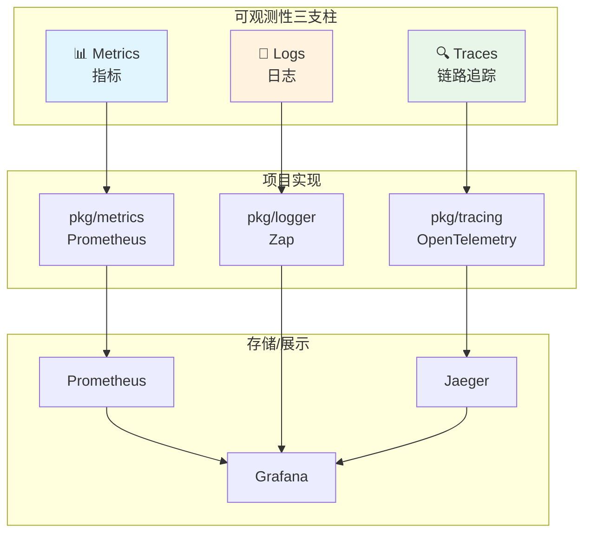
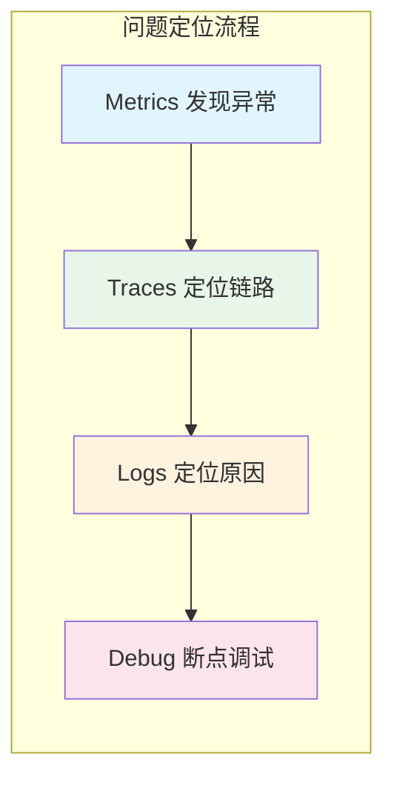
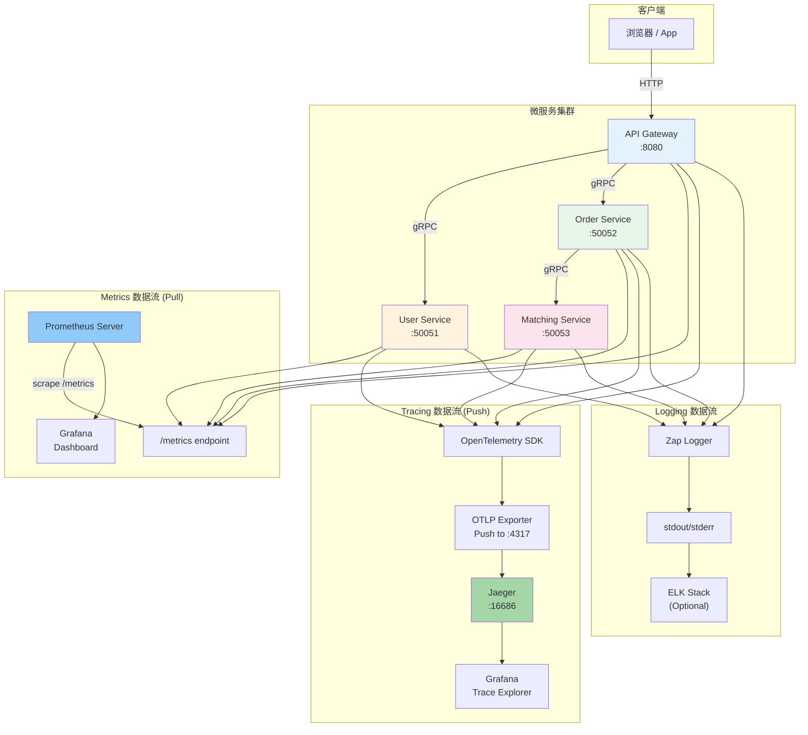
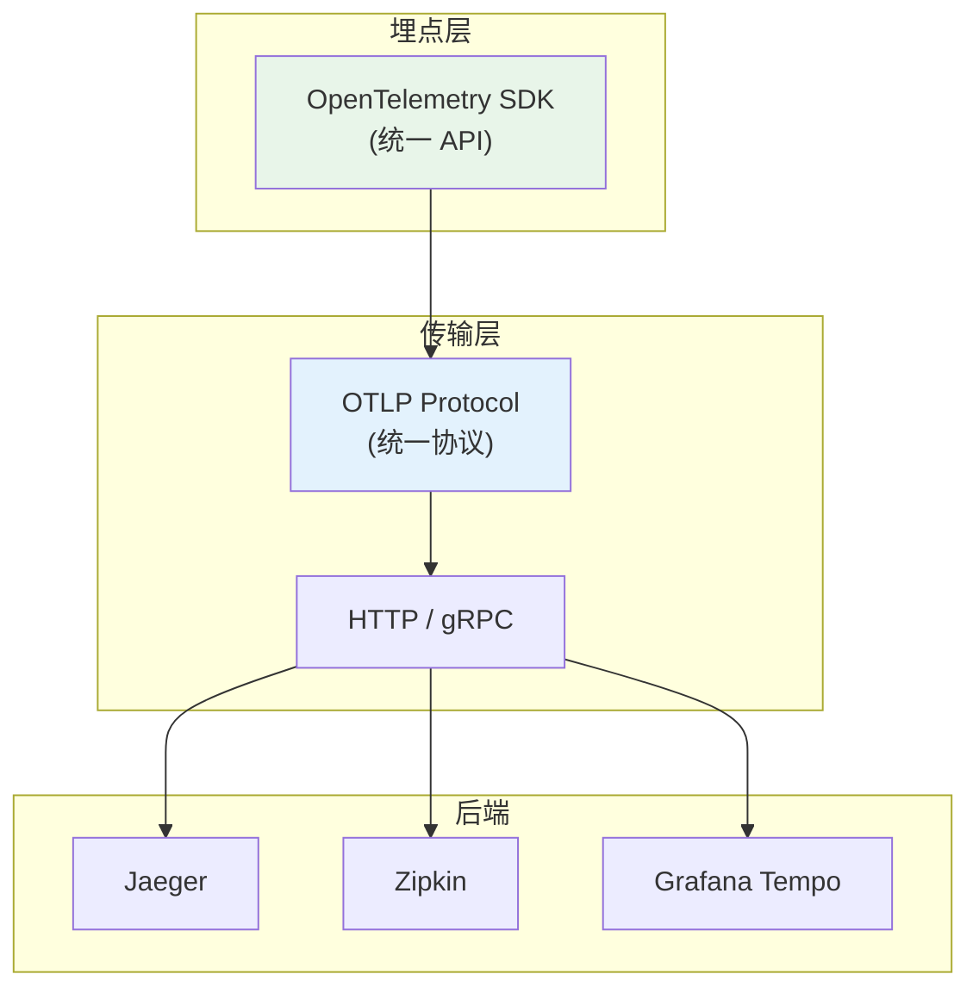
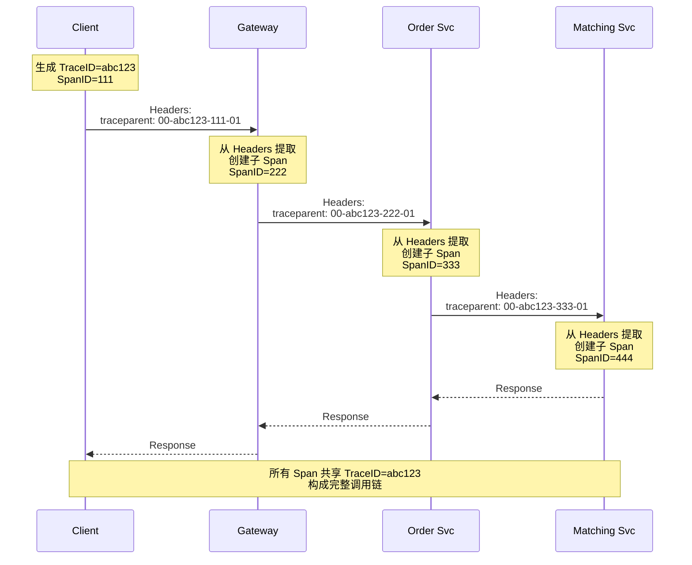

# Exchange Project 可观测性架构

## 目录

- [一、架构概览](#一架构概览)
- [二、三支柱模型](#二，三支柱模型)
- [三、Metrics 实现详解](#三metrics-实现详解)
- [四、Tracing 实现详解](#四tracing-实现详解)
- [五、Logging 实现详解](#五logging-实现详解)
- [六、数据流架构图](#六数据流架构图)
- [七、面试问答](#七面试问答)
- [八、总结](#八总结)

---

## 一、架构概览

### 1.1 整体架构

本项目采用 **Metrics + Tracing + Logging** 三支柱可观测性架构：

```
┌─────────────────────────────────────────────────────────────────────────────┐
│                           Exchange 可观测性架构                               │
├─────────────────────────────────────────────────────────────────────────────┤
│                                                                             │
│   ┌─────────┐     ┌─────────────┐     ┌─────────────┐     ┌─────────────┐ │
│   │ Gateway │────▶│  User Svc   │     │  Order Svc  │────▶│Matching Svc │ │
│   │  :8080  │     │   :50051    │     │   :50052    │     │   :50053    │ │
│   └────┬────┘     └──────┬──────┘     └──────┬──────┘     └──────┬──────┘ │
│        │                  │                    │                    │         │
│        │                  │                    │                    │         │
│   ┌────┴────┐       ┌────┴────┐        ┌────┴────┐        ┌────┴────┐   │
│   │ /metrics│       │ /metrics│        │ /metrics│        │ /metrics│   │
│   │ (Pull)  │       │ (Pull)  │        │ (Pull)  │        │ (Pull)  │   │
│   └────┬────┘       └────┬────┘        └────┬────┘        └────┬────┘   │
│        │                  │                    │                    │         │
│        ▼                  ▼                    ▼                    ▼         │
│   ┌─────────────────────────────────────────────────────────────┐          │
│   │                      Prometheus Pull Model                     │          │
│   │                  ┌─────────────────────────┐                 │          │
│   │                  │   Prometheus Server     │                 │          │
│   │                  │   (主动拉取 /metrics)   │                 │          │
│   │                  └─────────────────────────┘                 │          │
│   └─────────────────────────────────────────────────────────────┘          │
│                                    │                                     │
│                                    ▼                                     │
│   ┌─────────────────────────────────────────────────────────────┐          │
│   │              OpenTelemetry Push Model (OTLP)                  │          │
│   │   ┌─────────────────────────────────────────────────┐       │          │
│   │   │          各服务主动 Push Spans 到                │       │          │
│   │   │          OTEL_EXPORTER_OTLP_ENDPOINT           │       │          │
│   │   └─────────────────────────────────────────────────┘       │          │
│   └─────────────────────────────────────────────────────────────┘          │
│                                    │                                     │
│                                    ▼                                     │
│   ┌─────────────────────────────────────────────────────────────┐          │
│   │                      Jaeger (All-in-One)                     │          │
│   │   ┌───────────────┐  ┌───────────────┐  ┌───────────────┐  │          │
│   │   │  OTLP Receiver│  │  Data Store   │  │     UI       │  │          │
│   │   │    :4317      │  │   (Trace)    │  │   :16686     │  │          │
│   │   └───────────────┘  └───────────────┘  └───────────────┘  │          │
│   └─────────────────────────────────────────────────────────────┘          │
│                                    │                                     │
│                                    ▼                                     │
│   ┌─────────────────────────────────────────────────────────────┐          │
│   │                     Grafana Dashboard                        │          │
│   │   ┌───────────────┐  ┌───────────────┐  ┌───────────────┐  │          │
│   │   │  Metrics Panel│  │ Trace Explorer│  │    Alert     │  │          │
│   │   └───────────────┘  └───────────────┘  └───────────────┘  │          │
│   └─────────────────────────────────────────────────────────────┘          │
│                                                                             │
└─────────────────────────────────────────────────────────────────────────────┘
```

### 1.2 核心组件清单

| 组件 | 类型 | 协议 | 端口 | 职责 |
|------|------|------|------|------|
| **Prometheus** | Pull 模型 | HTTP | - | 主动拉取各服务的 `/metrics` 端点 |
| **Jaeger** | Push 接收器 | OTLP gRPC | `:4317` | 接收服务推送的 Traces |
| **Grafana** | 可视化 | HTTP | `:3000` | 查询 Prometheus/Jaeger 数据 |
| **Zip Logger** | 日志库 | stdout | - | 结构化日志输出 |

### 1.3 关键区别：Prometheus Pull vs OpenTelemetry Push

```
┌─────────────────────────────────────────────────────────────────────────────┐
│                        数据采集模式对比                                       │
├─────────────────────────────────────────────────────────────────────────────┤
│                                                                             │
│  ┌─────────────────────────────┐    ┌─────────────────────────────┐        │
│  │     Prometheus (Pull)       │    │   OpenTelemetry (Push)      │        │
│  ├─────────────────────────────┤    ├─────────────────────────────┤        │
│  │                             │    │                             │        │
│  │   ┌─────────┐               │    │   ┌─────────┐              │        │
│  │   │Service A│──GET /metrics│     │   │Service A│──Push Spans │        │
│  │   └─────────┘       │       │    │   └─────────┘       │       │        │
│  │                     │       │    │                      │       │        │
│  │   ┌─────────┐       │       │    │   ┌─────────┐       │       │        │
│  │   │Service B│──GET /metrics │    │   │Service B│──Push Spans │        │
│  │   └─────────┘       │       │    │   └─────────┘       │       │        │
│  │                     │       │    │                      │       │        │
│  │   ┌──────────────────────┐  │    │   ┌──────────────────────┐  │        │
│  │   │   Prometheus Server  │  │    │   │       Jaeger          │  │        │
│  │   │   (主动拉取)          │  │    │   │    (被动接收)         │  │        │
│  │   └──────────────────────┘  │    │   └──────────────────────┘  │        │
│  │                             │    │                             │        │
│  │  特点：服务被动暴露端点        │    │  特点：服务主动推送数据      │        │
│  │  优点：服务端可控、易发现      │    │  优点：实时性好、异步友好   │        │
│  └─────────────────────────────┘    └─────────────────────────────┘        │
│                                                                             │
└─────────────────────────────────────────────────────────────────────────────┘
```

---

## 二、三支柱模型

### 2.1 可观测性三支柱

| 支柱 | 核心问题 | 数据特点 | 项目实现 |
|------|----------|----------|----------|
| **Metrics** | "发生了什么？" | 聚合的数值、计数器 | Prometheus + `pkg/metrics` |
| **Logs** | "怎么发生的？" | 离散的事件、详情 | Zap Logger + `pkg/logger` |
| **Traces** | "在哪发生的？" | 请求链路、Span 树 | OpenTelemetry + Jaeger |



### 2.2 三支柱协作流程



---

## 三、Metrics 实现详解

### 3.1 架构设计

**Prometheus 采用 Pull 模式：Prometheus Server 主动拉取，服务被动暴露**

```
┌─────────────────┐         GET /metrics          ┌─────────────────┐
│  Prometheus     │  ───────────────────────────▶ │   Your Service  │
│  Server         │  ◄─────────────────────────── │   (Passive)     │
└─────────────────┘         Metrics Data          └─────────────────┘
                              ↑
                              │ scrape_interval (默认 15s)
```

### 3.2 核心文件

| 文件 | 职责 |
|------|------|
| [`pkg/metrics/metrics.go`](pkg/metrics/metrics.go) | Prometheus 指标定义和收集（单例模式） |
| [`internal/gateway/router/router.go`](internal/gateway/router/router.go) | 暴露 `/metrics` 端点 |

### 3.3 暴露 Metrics 端点

**代码位置**: `internal/gateway/router/router.go`

```go
import (
    "github.com/prometheus/client_golang/prometheus/promhttp"
)

func Setup(r *gin.Engine, cfg *Config) {
    // Prometheus metrics endpoint
    r.GET("/metrics", gin.WrapH(promhttp.Handler()))
}
```

**验证方法**：

```bash
curl http://localhost:8080/metrics
```

**返回格式**：

```
# HELP http_requests_total Total number of HTTP requests
# TYPE http_requests_total counter
http_requests_total{method="POST",path="/api/v1/orders",status="200"} 42
http_requests_total{method="GET",path="/healthz",status="200"} 156
```

### 3.4 三种指标类型

| 类型 | 特点 | 使用场景 | 项目示例 |
|------|------|----------|----------|
| **Counter** | 只增不减 | 累计计数 | `order_created_total`、`http_requests_total` |
| **Gauge** | 可增可减 | 瞬时值 | `orderbook_best_bid`、`http_requests_in_flight` |
| **Histogram** | 桶统计 | 延迟分布 | `http_request_duration_seconds`、`matching_latency_seconds` |

### 3.5 Counter 示例

```go
// pkg/metrics/metrics.go

// 定义 Counter
orderCreatedTotal: promauto.NewCounterVec(
    prometheus.CounterOpts{
        Name: "order_created_total",
        Help: "Total number of orders created",
    },
    []string{"side", "symbol"},  // Labels
),

// 记录订单创建
func (m *Metrics) RecordOrderCreated(side, symbol string) {
    m.orderCreatedTotal.WithLabelValues(side, symbol).Inc()
}
```

### 3.6 Histogram 示例

```go
// 定义 Histogram（自动创建多个 bucket）
matchingLatencySeconds: promauto.NewHistogramVec(
    prometheus.HistogramOpts{
        Name:    "matching_latency_seconds",
        Help:    "Matching engine operation latency in seconds",
        Buckets: []float64{.0001, .0005, .001, .005, .01, .025, .05, .1, .5, 1},
        // 会自动创建: _bucket{le="0.0001"}、_bucket{le="0.0005"}...
        // 以及 _sum、_count
    },
    []string{"operation", "symbol"},
),

// 记录延迟
func (m *Metrics) RecordMatchingLatency(operation, symbol string, duration time.Duration) {
    m.matchingLatencySeconds.WithLabelValues(operation, symbol).Observe(duration.Seconds())
}
```

### 3.7 Gauge 示例

```go
// 定义 Gauge
orderbookBestBid: promauto.NewGaugeVec(
    prometheus.GaugeOpts{
        Name: "orderbook_best_bid",
        Help: "Best bid price in the order book",
    },
    []string{"symbol"},
),

// 设置值
func (m *Metrics) SetOrderbookBestBid(symbol string, price float64) {
    m.orderbookBestBid.WithLabelValues(symbol).Set(price)
}
```

### 3.8 业务代码中的指标记录

**HTTP 请求中间件** (`internal/gateway/middleware/middleware.go`)：

```go
func AccessLog() gin.HandlerFunc {
    return func(c *gin.Context) {
        start := time.Now()
        m := metrics.GetMetrics()
        m.IncHTTPRequestsInFlight()  // 请求开始 +1

        c.Next()

        latency := time.Since(start)
        m.DecHTTPRequestsInFlight()  // 请求结束 -1
        m.RecordHTTPRequest(c.Request.Method, path, status, latency)
    }
}
```

**撮合引擎** (`internal/matching/engine/engine.go`)：

```go
func (m *Matcher) SubmitOrder(...) (*MatchResult, error) {
    start := time.Now()
    result, err := m.dispatch(ctx, symbol, cmd)
    duration := time.Since(start)

    // 记录撮合延迟
    metrics.GetMetrics().RecordMatchingLatency("submit", symbol, duration)

    // 记录成交次数
    if len(result.Trades) > 0 {
        metrics.GetMetrics().RecordMatchingMatch(sideStr, symbol, float64(len(result.Trades)))
    }

    return result, err
}
```

### 3.9 项目完整指标清单

```
# HTTP 指标
http_requests_total{method, path, status}           # 请求总数
http_request_duration_seconds{method, path}         # 请求延迟
http_requests_in_flight                            # 正在处理的请求数

# gRPC 指标
grpc_server_requests_total{service, method, code}   # gRPC 服务请求数
grpc_server_duration_seconds{service, method}      # gRPC 服务延迟
grpc_clients_circuit_state{client}                # 熔断器状态 (0=关闭, 1=开启, 2=半开)

# 订单簿指标
orderbook_depth_levels{side, symbol}               # 订单簿深度
orderbook_best_bid{symbol}                         # 最优买价
orderbook_best_ask{symbol}                         # 最优卖价

# 撮合指标
matching_latency_seconds{operation, symbol}        # 撮合延迟
matching_match_total{side, symbol}                 # 成交笔数
matching_wal_append_seconds                        # WAL 追加延迟

# 订单指标
order_created_total{side, symbol}                  # 订单创建数
order_cancelled_total{side, symbol}               # 订单取消数
order_fill_rate{side, symbol}                     # 订单成交率分布

# 限流指标
rate_limit_blocked_total{scope, identity, policy} # 被拦截的请求数
rate_limit_requests_total{scope, policy}          # 总请求数
rate_limit_remaining{scope, identity}             # 剩余配额

# Saga 指标
saga_state_transitions_total{from, to}            # Saga 状态转移
saga_retry_total{step}                           # Saga 重试次数

# Outbox 指标
outbox_pending_entries_total{status}             # 待处理事件数
outbox_processing_duration_seconds{action_type}  # 事件处理延迟

# Trace 导出指标
trace_exporter_export_total{result}               # Trace 导出成功/失败
```

---

## 四、Tracing 实现详解

### 4.1 架构设计

**OpenTelemetry 采用 Push 模型：服务主动推送 Spans 到 Jaeger**

```
┌─────────────────────────────────────────────────────────────────────────────┐
│                         OpenTelemetry 链路追踪架构                            │
├─────────────────────────────────────────────────────────────────────────────┤
│                                                                             │
│   Gateway                    Order Svc              Matching Svc            │
│  ┌─────────┐               ┌─────────┐             ┌─────────┐             │
│  │ otelgin │               │otelgrpc │             │ otelgrpc │             │
│  │(HTTP)   │               │(Server) │             │ (Server) │             │
│  └────┬────┘               └────┬────┘             └────┬────┘             │
│       │                         │                       │                  │
│       │ OTLP gRPC Push          │ OTLP gRPC Push        │ OTLP gRPC Push   │
│       ▼                         ▼                       ▼                  │
│  ┌─────────────────────────────────────────────────────────────┐          │
│  │                    Jaeger (All-in-One)                      │          │
│  │                     :16686 (UI)                            │          │
│  │                     :4317 (OTLP gRPC)                      │          │
│  └─────────────────────────────────────────────────────────────┘          │
│                                                                             │
└─────────────────────────────────────────────────────────────────────────────┘
```

### 4.2 核心文件

| 文件 | 职责 |
|------|------|
| [`pkg/tracing/tracing.go`](pkg/tracing/tracing.go) | OpenTelemetry SDK 初始化 |
| 各服务的 `main.go` | OTEL 集成启动 |

### 4.3 初始化 Tracing SDK

**代码位置**: `pkg/tracing/tracing.go`

```go
package tracing

import (
    "context"
    "go.opentelemetry.io/otel"
    "go.opentelemetry.io/otel/exporters/otlp/otlptrace/otlptracegrpc"
    "go.opentelemetry.io/otel/propagation"
    "go.opentelemetry.io/otel/sdk/resource"
    sdktrace "go.opentelemetry.io/otel/sdk/trace"
    semconv "go.opentelemetry.io/otel/semconv/v1.26.0"
)

// Init 初始化 OpenTelemetry SDK
func Init(ctx context.Context, serviceName, otlpEndpoint string) (shutdown func(context.Context) error, err error) {
    // 1. 创建 OTLP gRPC 导出器
    exporter, err := otlptracegrpc.New(ctx,
        otlptracegrpc.WithEndpoint(otlpEndpoint),
        otlptracegrpc.WithInsecure(),  // 开发环境不使用 TLS
    )

    // 2. 创建资源（服务信息）
    res, err := resource.New(ctx,
        resource.WithAttributes(
            semconv.ServiceName(serviceName),  // 注册服务名
        ),
    )

    // 3. 创建 TracerProvider
    tp := sdktrace.NewTracerProvider(
        sdktrace.WithBatcher(exporter),           // 批量导出，提升性能
        sdktrace.WithResource(res),              // 绑定服务资源
        sdktrace.WithSampler(sdktrace.ParentBased(
            sdktrace.AlwaysSample())),            // 继承父 Span 采样决策
    )

    // 4. 注册全局 TracerProvider
    otel.SetTracerProvider(tp)

    // 5. 设置上下文传播器（W3C TraceContext）
    otel.SetTextMapPropagator(propagation.NewCompositeTextMapPropagator(
        propagation.TraceContext{},  // traceparent, tracestate
        propagation.Baggage{},       // 自定义 baggage
    ))

    return tp.Shutdown, nil
}
```

### 4.4 服务启动初始化

**Gateway** (`cmd/gateway/main.go`)：

```go
func main() {
    // Initialize OpenTelemetry tracing
    otelEndpoint := os.Getenv("OTEL_EXPORTER_OTLP_ENDPOINT")
    tracingShutdown, err := tracing.Init(context.Background(), "gateway", otelEndpoint)
    if err != nil {
        logger.Warn("failed to init tracing", logger.Err(err))
    } else {
        defer func() {
            ctx, cancel := context.WithTimeout(context.Background(), 5*time.Second)
            defer cancel()
            tracingShutdown(ctx)  // 优雅关闭时导出剩余 spans
        }()
    }
}
```

### 4.5 HTTP 自动埋点

使用 `otelgin` 中间件自动为所有 HTTP 请求创建 Span。

**代码位置**: `internal/gateway/router/router.go`

```go
import (
    "go.opentelemetry.io/contrib/instrumentation/github.com/gin-gonic/gin/otelgin"
)

func Setup(r *gin.Engine, cfg *Config) {
    // 全局中间件
    r.Use(middleware.RequestID())
    r.Use(otelgin.Middleware(cfg.ServiceName))  // 自动创建 HTTP Span
    r.Use(middleware.Recovery())
    r.Use(middleware.AccessLog())
}
```

### 4.6 gRPC 自动埋点

使用 `otelgrpc` 分别为 Server 和 Client 创建 Span。

**gRPC Server 端** (`cmd/order-svc/main.go`)：

```go
import (
    "go.opentelemetry.io/contrib/instrumentation/google.golang.org/grpc/otelgrpc"
)

func main() {
    grpcServer := grpc.NewServer(
        grpc.StatsHandler(otelgrpc.NewServerHandler()),  // 自动创建 Server Span
        grpc.UnaryInterceptor(grpcx.UnaryServerRequestID()),
    )
}
```

**gRPC Client 端** (`internal/gateway/client/order_client.go`)：

```go
import (
    "go.opentelemetry.io/contrib/instrumentation/google.golang.org/grpc/otelgrpc"
)

func NewOrderClient(addr string) (*OrderClient, error) {
    conn, err := grpc.Dial(addr,
        grpc.WithTransportCredentials(insecure.NewCredentials()),
        grpc.WithStatsHandler(otelgrpc.NewClientHandler()),  // 自动创建 Client Span
    )
    return &OrderClient{conn: conn, client: orderpb.NewOrderServiceClient(conn)}, nil
}
```

### 4.7 请求 ID 跨服务传递

确保请求 ID 能从 HTTP Header → gRPC Metadata 传播。

**gRPC Client 拦截器** (`pkg/grpcx/interceptor.go`)：

```go
// UnaryClientRequestID 从 Context 获取 Request ID，添加到 gRPC Metadata
func UnaryClientRequestID() grpc.UnaryClientInterceptor {
    return func(ctx context.Context, method string, req interface{},
               reply interface{}, cc *grpc.ClientConn, invoker grpc.UnaryInvoker, opts ...grpc.CallOption) error {
        if requestID := logger.GetRequestID(ctx); requestID != "" {
            ctx = metadata.AppendToOutgoingContext(ctx, "x-request-id", requestID)
        }
        return invoker(ctx, method, req, reply, cc, opts...)
    }
}
```

**gRPC Server 拦截器**：

```go
// UnaryServerRequestID 从 gRPC Metadata 提取 Request ID，设置到 Context
func UnaryServerRequestID() grpc.UnaryServerInterceptor {
    return func(ctx context.Context, req interface{},
               info *grpc.UnaryServerInfo, handler grpc.UnaryHandler) (interface{}, error) {
        md, ok := metadata.FromIncomingContext(ctx)
        if ok {
            if vals := md.Get("x-request-id"); len(vals) > 0 {
                ctx = logger.WithRequestID(ctx, vals[0])
                if span := trace.SpanFromContext(ctx); span.IsRecording() {
                    span.SetAttributes(attribute.String("request.id", vals[0]))
                }
            }
        }
        return handler(ctx, req)
    }
}
```

### 4.8 手动创建 Span（自定义业务逻辑）

```go
import (
    "go.opentelemetry.io/otel"
    "go.opentelemetry.io/otel/attribute"
    "go.opentelemetry.io/otel/trace"
)

func ProcessOrder(ctx context.Context, order *Order) error {
    tracer := otel.Tracer("order-service")

    ctx, span := tracer.Start(ctx, "ProcessOrder")
    defer span.End()

    span.SetAttributes(
        attribute.String("order.id", order.ID),
        attribute.String("order.symbol", order.Symbol),
        attribute.String("order.side", string(order.Side)),
    )

    if err := validateOrder(order); err != nil {
        span.RecordError(err)
        span.SetStatus(codes.Error, err.Error())
        return err
    }

    span.SetStatus(codes.Ok, "")
    return nil
}
```

### 4.9 OTel Collector（可选中介）

**代码位置**: `deploy/otel-collector.yaml`

```yaml
receivers:
  otlp:
    protocols:
      grpc:
        endpoint: 0.0.0.0:4317
      http:
        endpoint: 0.0.0.0:4318

processors:
  batch:
    timeout: 1s
    send_batch_size: 1024

exporters:
  otlp/jaeger:
    endpoint: jaeger:4317
    tls:
      insecure: true

service:
  pipelines:
    traces:
      receivers: [otlp]
      processors: [batch]
      exporters: [otlp/jaeger]
```

---

## 五、Logging 实现详解

### 5.1 核心文件

| 文件 | 职责 |
|------|------|
| [`pkg/logger/logger.go`](pkg/logger/logger.go) | Zap 日志封装 |

### 5.2 日志特性

- 结构化日志（JSON 格式，生产环境）
- 彩色输出（开发环境）
- Context 传播 (request_id, trace_id, user_id)

### 5.3 上下文传播

```go
// pkg/logger/logger.go
func WithContext(ctx context.Context) *zap.Logger {
    l := GetLogger()

    requestID := ctx.Value(RequestIDKey)
    if requestID != nil {
        l = l.With(zap.String("request_id", requestID.(string)))
    }

    traceID := ctx.Value(TraceIDKey)
    if traceID != nil {
        l = l.With(zap.String("trace_id", traceID.(string)))
    }

    userID := ctx.Value(UserIDKey)
    if userID != nil {
        l = l.With(zap.Int64("user_id", userID.(int64)))
    }

    return l
}
```

### 5.4 日志使用示例

```go
// 记录访问日志
logger.Info("access log",
    logger.S("method", c.Request.Method),
    logger.S("path", path),
    logger.I("status", status),
    logger.I64("latency_ms", latency.Milliseconds()),
    logger.S("request_id", c.GetString("request_id")),
)

// 记录错误
logger.Error("failed to process order",
    logger.Err(err),
    logger.S("order_id", orderID),
    logger.S("request_id", requestID),
)
```

---

## 六、数据流架构图

### 6.1 完整数据流



### 6.2 Docker Compose 配置

**代码位置**: `docker-compose.yml`

```yaml
services:
  # Jaeger (OpenTelemetry backend)
  jaeger:
    image: jaegertracing/all-in-one:1.52
    ports:
      - "6831:6831/udp"   # Jaeger agent
      - "16686:16686"       # Jaeger UI
      - "4317:4317"         # OTLP gRPC receiver
      - "4318:4318"         # OTLP HTTP receiver

  # Gateway
  gateway:
    environment:
      OTEL_EXPORTER_OTLP_ENDPOINT: http://jaeger:4317
      OTEL_SERVICE_NAME: gateway
    ports:
      - "8080:8080"

  # User Service
  user-svc:
    environment:
      OTEL_EXPORTER_OTLP_ENDPOINT: http://jaeger:4317
      OTEL_SERVICE_NAME: user-svc
    ports:
      - "50051:50051"

  # Order Service
  order-svc:
    environment:
      OTEL_EXPORTER_OTLP_ENDPOINT: http://jaeger:4317
      OTEL_SERVICE_NAME: order-svc
    ports:
      - "50052:50052"

  # Matching Service
  matching-svc:
    environment:
      OTEL_EXPORTER_OTLP_ENDPOINT: http://jaeger:4317
      OTEL_SERVICE_NAME: matching-svc
    ports:
      - "50053:50053"
```

---

## 七、面试问答

### Q1: Prometheus 的 Push 和 Pull 模式有什么区别？你项目用的是哪种？

**参考答案**：

| 模式 | 原理 | 优点 | 缺点 |
|------|------|------|------|
| **Pull** | Prometheus 主动拉取 | 服务端可控、易发现异常、无需改应用 | 需要应用暴露端口 |
| **Push** | 应用主动推送 | 适合短生命周期任务 | 需要 PushGateway、难以确认目标存活 |

**项目中使用的是 Pull 模式**：

```go
// internal/gateway/router/router.go
r.GET("/metrics", gin.WrapH(promhttp.Handler()))
```

---

### Q2: OpenTelemetry 和 Jaeger/Zipkin 是什么关系？

**参考答案**：



| 组件 | 角色 | 项目使用 |
|------|------|----------|
| **OpenTelemetry** | 可观测性标准 + SDK | ✅ 核心使用 |
| **Jaeger** | Trace 后端存储 + UI | ✅ 链路可视化 |
| **Zipkin** | 早期 Trace 系统 | ❌ 未使用 |
| **Grafana Tempo** | 新型 Trace 存储 | ❌ 可考虑迁移 |

**类比**：
- OpenTelemetry = USB 接口标准
- Jaeger/Zipkin = 不同的显示器
- OTLP = USB 数据线

---

### Q3: 上下文传播（Context Propagation）是怎么工作的？

**参考答案**：

**W3C TraceContext 标准**：

```
Traceparent 头格式：
traceparent: 00-<TraceID>-<SpanID>-<TraceFlags>

示例：
traceparent: 00-0af7651916cd43dd8448eb211c80319c-b7ad6b7169203331-01
                   │                          │                       │
                   │                          │                       └─ 01=采样标志
                   │                          └─ 当前 Span ID
                   └─ 32字符 Trace ID
```

**传播流程**：



---

### Q4: 采样（Sampling）是什么？为什么需要？

**参考答案**：

| 策略 | 行为 | 适用场景 |
|------|------|----------|
| **AlwaysSample** | 全部记录 | 开发环境、调试 |
| **NeverSample** | 全部丢弃 | 高流量生产环境 |
| **ParentBased** | 继承父 Span | 主流方案 |
| **TraceIDRatio** | 按比例采样 | 生产环境 |
| **TailSampling** | 尾部采样 | 只保留错误/慢请求 |

**项目配置**：

```go
// pkg/tracing/tracing.go
sdktrace.WithSampler(sdktrace.ParentBased(sdktrace.AlwaysSample()))
```

---

### Q5: OpenTelemetry 和 Prometheus Metrics 是什么关系？怎么配合？

**参考答案**：

| 维度 | Prometheus Metrics | OpenTelemetry Traces |
|------|-------------------|---------------------|
| **关注点** | "发生了什么？" | "在哪发生的？" |
| **粒度** | 聚合统计 | 单个请求 |
| **用途** | 告警、Dashboard | 问题定位、性能分析 |
| **存储** | 时序数据库 | Trace 后端（Jaeger/Tempo） |

**项目中的配合**：

```go
// pkg/tracing/tracing.go
// Tracing 导出时记录指标
type metricsExporter struct {
    delegate sdktrace.SpanExporter
}

func (e *metricsExporter) ExportSpans(ctx context.Context, spans []sdktrace.ReadOnlySpan) error {
    err := e.delegate.ExportSpans(ctx, spans)
    if err != nil {
        metrics.GetMetrics().RecordTraceExporterExport("error")
        return err
    }
    metrics.GetMetrics().RecordTraceExporterExport("success")
    return nil
}
```

---

### Q6: Counter、Gauge、Histogram 的区别和使用场景？

**参考答案**：

```
┌─────────────────────────────────────────────────────────────────┐
│                        指标类型对比                              │
├───────────────┬─────────────────────────────────────────────────┤
│ Counter       │                                                 │
│ ┌───────────┐ │  时间 ─────────────────────────────────────►     │
│ │       ╱   │ │        1  →  2  →  3  →  4  →  5  →  6          │
│ │     ╱     │ │  特点：只增不减，用于累计计数                         │
│ │   ╱       │ │  示例：请求数、订单数、错误数                       │
│ │ ╱         │ │                                                 │
│ └───────────┘ │                                                 │
├───────────────┼─────────────────────────────────────────────────┤
│ Gauge         │                                                 │
│ ┌───────────┐ │  时间 ─────────────────────────────────────►     │
│ │     ╱╲    │ │        3  →  5  →  2  →  4  →  3  →  5          │
│ │    ╱  ╲   │ │  特点：可增可减，用于瞬时值                         │
│ │   ╱    ╲  │ │  示例：CPU使用率、当前在线人数、最优价格              │
│ │  ╱      ╲ │ │                                                 │
│ └───────────┘ │                                                 │
├───────────────┼─────────────────────────────────────────────────┤
│ Histogram     │                                                 │
│ ┌───────────┐ │  时间 ─────────────────────────────────────►     │
│ │  ████     │ │  自动生成 bucket：≤0.1s、≤0.5s、≤1s、≤5s...        │
│ │ ██████    │ │  特点：记录分布，可计算分位数                        │
│ │████████   │ │  示例：延迟、响应时间分布                           │
│ └───────────┘ │                                                 │
└───────────────┴─────────────────────────────────────────────────┘
```

---

### Q7: 怎么验证链路追踪正常工作？

**参考答案**：

**方法1：访问 Jaeger UI**

```bash
# docker-compose up 后访问
http://localhost:16686
```

**方法2：发送测试请求带 Request ID**

```bash
curl -X POST http://localhost:8080/api/v1/orders \
  -H "Authorization: Bearer $TOKEN" \
  -H "x-request-id: test-123456"
```

然后在 Jaeger 中搜索 `request.id=test-123456`

**方法3：运行冒烟测试**

```bash
# smoke/tracing_test.go
OTEL_SMOKE_TEST=1 go test -v ./smoke/...
```

**验证清单**：

```
✅ Trace 中能看到 Gateway span
✅ Trace 中能看到 Order Svc span
✅ Trace 中能看到 Matching Svc span
✅ 所有 span 共享同一个 Trace ID
✅ Span 包含正确的 HTTP/gRPC 属性
✅ 错误请求的 span 标记了 error=true
```

---

## 八、总结

### 8.1 架构总览

| 组件 | 职责 | 项目中的位置 |
|------|------|-------------|
| **Prometheus** | 收集、存储指标 (Pull) | 你只需暴露 `/metrics` 端点 |
| **OpenTelemetry SDK** | 链路追踪埋点 | `pkg/tracing/tracing.go` |
| **otelgin** | HTTP 自动埋点 | `router.go` |
| **otelgrpc** | gRPC 自动埋点 | `*_client.go` |
| **grpcx** | Request ID 传播 | `pkg/grpcx/interceptor.go` |
| **Jaeger** | Trace 可视化 | `docker-compose.yml` |
| **Grafana** | Metrics + Trace 查询 | Prometheus/Jaeger 数据源 |

### 8.2 面试加分点

1. ✅ 理解 Pull vs Push 模式的选择
2. ✅ 掌握 Counter/Gauge/Histogram 的使用场景
3. ✅ 理解 Trace/Span/Context 三层模型
4. ✅ 掌握 W3C TraceContext 传播机制
5. ✅ 知道如何验证链路追踪是否工作
6. ✅ 理解 Sampling 策略及适用场景
7. ✅ 能说明 OTel 与 Prometheus 的互补关系
8. ✅ 理解微服务架构中链路追踪的价值

### 8.3 扩展阅读

- [Prometheus + Grafana 监控实践](06-prometheus-grafana-monitoring.md)
- [OpenTelemetry 分布式追踪](07-opentelemetry-distributed-tracing.md)
