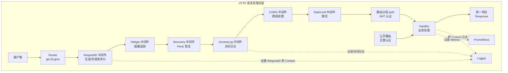

# Exchange Project Gin 框架实践总结

## 目录

- [一、项目 Gin 架构总览](#一项目-gin-架构总览)
- [二、路由与中间件架构](#二路由与中间件架构)
- [三、核心中间件实现](#三核心中间件实现)
- [四、Handler 设计模式](#四handler-设计模式)
- [五、请求绑定与响应处理](#五请求绑定与响应处理)
- [六、gRPC 客户端集成](#六grpc-客户端集成)
- [七、面试问答](#七面试问答)
- [八、总结](#八总结)

---

## 一、项目 Gin 架构总览

### 1.1 项目结构

```
internal/gateway/
├── main.go                      # Gateway 主入口
├── router/
│   └── router.go               # 路由注册（核心）
├── middleware/
│   ├── middleware.go           # 基础中间件（RequestID、AccessLog、Recovery、CORS）
│   ├── jwt.go                 # JWT 认证中间件
│   ├── rbac.go                # RBAC 权限控制
│   └── ratelimit_redis.go     # Redis 分布式限流
└── handler/
    └── handler.go              # HTTP Handler 实现
```

### 1.2 核心组件关系图



### 1.3 启动入口

**代码位置**: `cmd/gateway/main.go`

```go
func main() {
    // 1. 加载配置
    cfg, err := config.Load("")
    if err != nil {
        logger.Fatal("failed to load config", logger.Err(err))
    }

    // 2. 初始化日志
    if err := logger.Init(cfg.App.Environment); err != nil {
        logger.Fatal("failed to init logger", logger.Err(err))
    }
    defer logger.Sync()

    // 3. 初始化 OpenTelemetry（返回 shutdown 函数用于优雅关闭）
    otelEndpoint := os.Getenv("OTEL_EXPORTER_OTLP_ENDPOINT")
    tracingShutdown, err := tracing.Init(context.Background(), "gateway", otelEndpoint)
    if err != nil {
        logger.Warn("failed to init tracing", logger.Err(err))
    } else {
        defer func() {
            ctx, cancel := context.WithTimeout(context.Background(), 5*time.Second)
            defer cancel()
            if err := tracingShutdown(ctx); err != nil {
                logger.Error("failed to shutdown tracing", logger.Err(err))
            }
        }()
    }

    // 4. 初始化数据库
    db, err := gorm.Open(mysql.Open(cfg.Database.DSN()), &gorm.Config{})
    if err != nil {
        logger.Fatal("failed to connect to database", zap.Error(err))
    }
    sqlDB, err := db.DB()
    sqlDB.SetMaxIdleConns(cfg.Database.MaxIdleConns)
    sqlDB.SetMaxOpenConns(cfg.Database.MaxOpenConns)
    sqlDB.SetConnMaxLifetime(time.Duration(cfg.Database.ConnMaxLife) * time.Minute)
    defer sqlDB.Close()

    // 5. 初始化 gRPC 客户端
    clients, err := client.NewClients(&client.Config{
        UserGRPCAddr:     cfg.GRPC.UserGRPCAddr,
        OrderGRPCAddr:   cfg.GRPC.OrderGRPCAddr,
        MatchingGRPCAddr: cfg.GRPC.MatchingGRPCAddr,
    })
    if err != nil {
        logger.Fatal("failed to create gRPC clients", zap.Error(err))
    }
    defer clients.Close()

    // 6. 初始化 Redis
    redisClient := redis.NewClient(&redis.Options{
        Addr:     cfg.Redis.Addr(),
        Password: cfg.Redis.Password,
        DB:       cfg.Redis.DB,
        PoolSize: cfg.Redis.PoolSize,
    })
    defer redisClient.Close()

    // 7. 创建 Gin 引擎
    r, outboxWorker := router.NewRouter(cfg, clients, redisClient, db)

    // 8. 启动 Outbox Worker
    outboxWorker.Start(context.Background())
    defer outboxWorker.Stop()

    // 9. 创建 HTTP 服务器（带超时配置）
    srv := &http.Server{
        Addr:         cfg.Server.Address(),
        Handler:      r,
        ReadTimeout:  15 * time.Second,
        WriteTimeout: 15 * time.Second,
        IdleTimeout:  60 * time.Second,
    }

    // 10. 启动服务器
    go func() {
        if err := srv.ListenAndServe(); err != nil && err != http.ErrServerClosed {
            logger.Fatal("server failed to start", zap.Error(err))
        }
    }()

    // 11. 等待信号并优雅关闭
    quit := make(chan os.Signal, 1)
    signal.Notify(quit, syscall.SIGINT, syscall.SIGTERM)
    <-quit

    logger.Info("shutting down server...")
    outboxWorker.Stop()

    ctx, cancel := context.WithTimeout(context.Background(), 30*time.Second)
    defer cancel()
    if err := srv.Shutdown(ctx); err != nil {
        logger.Error("server forced to shutdown", zap.Error(err))
    }
    logger.Info("server stopped")
}
```

---

## 二、路由与中间件架构

### 2.1 Gin 引擎创建

**代码位置**: `internal/gateway/router/router.go`

```go
func NewRouter(cfg *config.Config, clients *client.Clients, redisClient *redis.Client, db *gorm.DB) (*gin.Engine, *outbox.Worker) {
    // 设置 Gin 模式
    gin.SetMode(gin.ReleaseMode)

    // 创建 Gin 引擎
    r := gin.New()

    // 设置路由
    Setup(r, &Config{
        JWTConfig: middleware.JWTConfig{
            Secret:     cfg.JWT.Secret,
            ExpireTime: cfg.JWT.GetExpireDuration(),
        },
        Clients:      clients,
        ServiceName:  cfg.App.Name,
        RedisClient:  redisClient,
        RateLimitCfg: &cfg.RateLimit,
        DB:           db,
        OutboxWorker: outboxWorker,
    })

    return r, outboxWorker
}
```

### 2.2 中间件注册顺序

```go
func Setup(r *gin.Engine, cfg *Config) {
    // ============ 全局中间件（按顺序执行）============
    r.Use(middleware.RequestID())                              // 1. 生成请求ID
    if cfg.ServiceName != "" {
        r.Use(otelgin.Middleware(cfg.ServiceName))              // 2. 链路追踪
    }
    r.Use(middleware.Recovery())                               // 3. Panic 恢复
    r.Use(middleware.AccessLog())                              // 4. 访问日志
    r.Use(middleware.CORS())                                   // 5. 跨域

    // 6. 分布式限流（Redis）
    if cfg.RedisClient != nil && cfg.RateLimitCfg != nil && cfg.RateLimitCfg.Enabled {
        r.Use(middleware.RateLimitMiddleware(cfg.RedisClient, cfg.RateLimitCfg))
    }

    // ============ 路由定义 =============
    // 健康检查（无需认证）
    r.GET("/healthz", healthHandler.Health)
    r.GET("/readyz", healthHandler.Ready)

    // Prometheus 指标端点
    r.GET("/metrics", gin.WrapH(promhttp.Handler()))

    // API v1 路由组
    v1 := r.Group("/api/v1")
    {
        // 公开路由（无需认证）
        public := v1.Group("")
        {
            public.POST("/auth/login", authHandler.Login)
            public.POST("/auth/register", authHandler.Register)
        }

        // 需要认证的路由
        auth := v1.Group("")
        auth.Use(middleware.JWT(cfg.JWTConfig))
        {
            // 订单相关（需权限控制）
            orders := auth.Group("/orders")
            {
                orders.POST("", middleware.RequirePermission(middleware.PermissionOrderCreate), orderHandler.CreateOrder)
                orders.POST("/cancel", middleware.RequirePermission(middleware.PermissionOrderCancel), orderHandler.CancelOrder)
                orders.GET("", middleware.RequirePermission(middleware.PermissionOrderQuery), orderHandler.ListOrders)
                orders.GET("/:order_id", middleware.RequirePermission(middleware.PermissionOrderQuery), orderHandler.GetOrder)
            }

            // 余额相关
            balance := auth.Group("/balance")
            {
                balance.GET("", middleware.RequirePermission(middleware.PermissionBalanceQuery), balanceHandler.GetBalance)
            }
        }
    }

    // 订单簿路由（公开，有频率限制）
    orderbook := r.Group("/orderbook")
    {
        orderbook.GET("/:symbol", orderBookHandler.GetOrderBook)
        orderbook.GET("", orderBookHandler.GetOrderBook)
    }
}
```

### 2.3 中间件执行顺序图

```
请求进入
    │
    ▼
┌─────────────────────────────────────────────────────────────────┐
│  RequestID Middleware                                           │
│  - 检查 Header 中的 X-Request-ID                                │
│  - 没有则生成 UUID                                              │
│  - 设置到 c.Set("request_id") 和 c.Request.Context()          │
│  - 响应头返回 X-Request-ID                                      │
└─────────────────────────────────────────────────────────────────┘
    │
    ▼
┌─────────────────────────────────────────────────────────────────┐
│  Otelgin Middleware                                             │
│  - 自动创建 HTTP Span                                           │
│  - 从 Header 提取 traceparent，关联父 Span                       │
│  - 设置 span 属性：http.method, http.url, http.status_code      │
└─────────────────────────────────────────────────────────────────┘
    │
    ▼
┌─────────────────────────────────────────────────────────────────┐
│  Recovery Middleware                                             │
│  - defer recover()                                               │
│  - 捕获 Panic，记录日志                                         │
│  - 返回 500 错误                                                 │
└─────────────────────────────────────────────────────────────────┘
    │
    ▼
┌─────────────────────────────────────────────────────────────────┐
│  AccessLog Middleware                                           │
│  - 记录开始时间                                                  │
│  - IncHTTPRequestsInFlight()                                    │
│  - c.Next() 执行后续中间件和 Handler                            │
│  - 记录耗时、状态码                                             │
│  - DecHTTPRequestsInFlight()                                    │
└─────────────────────────────────────────────────────────────────┘
    │
    ▼
┌─────────────────────────────────────────────────────────────────┐
│  RateLimit Middleware                                           │
│  - 从 Redis 检查限流策略                                        │
│  - 允许则继续，拒绝则返回 429                                    │
└─────────────────────────────────────────────────────────────────┘
    │
    ▼
    ┌─────────────────────────────────────────────────────────────┐
    │ 分支：公开路由 → Handler                                     │
    │ 分支：认证路由 → JWT 中间件 → RBAC 中间件 → Handler          │
    └─────────────────────────────────────────────────────────────┘
    │
    ▼
响应返回（经过同样的中间件，但是反向）
```

---

## 三、核心中间件实现

### 3.1 RequestID 中间件

**代码位置**: `internal/gateway/middleware/middleware.go`

```go
// RequestID 请求ID中间件
func RequestID() gin.HandlerFunc {
    return func(c *gin.Context) {
        // 1. 尝试从 Header 获取
        requestID := c.GetHeader("X-Request-ID")
        if requestID == "" {
            requestID = c.GetHeader("X-Trace-ID")
        }

        // 2. 没有则生成
        if requestID == "" {
            requestID = generateRequestID()
        }

        // 3. 设置到 Gin Context
        c.Set("request_id", requestID)

        // 4. 响应头返回
        c.Header("X-Request-ID", requestID)

        // 5. 设置到 Go Context（供链路追踪使用）
        c.Request = c.Request.WithContext(logger.WithRequestID(c.Request.Context(), requestID))

        // 6. 设置到当前 Span
        if span := trace.SpanFromContext(c.Request.Context()); span.IsRecording() {
            span.SetAttributes(attribute.String("request.id", requestID))
        }

        c.Next()
    }
}

// generateRequestID 生成请求ID
func generateRequestID() string {
    return uuid.NewString()
}
```

### 3.2 AccessLog 中间件

```go
// AccessLog 访问日志中间件（带指标记录）
func AccessLog() gin.HandlerFunc {
    return func(c *gin.Context) {
        start := time.Now()
        path := c.Request.URL.Path
        query := c.Request.URL.RawQuery

        // 增加正在处理的请求数
        m := metrics.GetMetrics()
        m.IncHTTPRequestsInFlight()

        // 执行后续中间件和 Handler
        c.Next()

        // ============ Handler 执行完毕后 ============
        latency := time.Since(start)
        status := c.Writer.Status()

        // 减少正在处理的请求数
        m.DecHTTPRequestsInFlight()

        // 记录 HTTP 指标
        m.RecordHTTPRequest(c.Request.Method, path, status, latency)
        m.RecordGatewayRequest(c.Request.Method, path, status, latency)

        // 记录结构化日志
        logger.Info("access log",
            logger.S("method", c.Request.Method),
            logger.S("path", path),
            logger.S("query", query),
            logger.I("status", status),
            logger.I64("latency_ms", latency.Milliseconds()),
            logger.S("client_ip", c.ClientIP()),
            logger.S("user_agent", c.Request.UserAgent()),
            logger.S("request_id", c.GetString("request_id")),
        )
    }
}
```

### 3.3 Recovery 中间件

```go
// Recovery 恢复中间件，防止 panic 导致服务崩溃
func Recovery() gin.HandlerFunc {
    return func(c *gin.Context) {
        start := time.Now()
        defer func() {
            if err := recover(); err != nil {
                // 记录错误日志
                logger.Error("panic recovered",
                    logger.Err(err.(error)),
                    logger.S("path", c.Request.URL.Path),
                    logger.S("method", c.Request.Method),
                    logger.S("request_id", c.GetString("request_id")),
                )

                // 记录错误指标
                m := metrics.GetMetrics()
                m.RecordHTTPRequest(c.Request.Method, c.Request.URL.Path, 500, time.Since(start))
                m.RecordGatewayRequest(c.Request.Method, c.Request.URL.Path, 500, time.Since(start))

                // 返回 500 错误
                response.InternalServerError(c, "internal server error")
                c.Abort()
            }
        }()

        c.Next()
    }
}
```

### 3.4 CORS 中间件

```go
// CORS 跨域中间件
func CORS() gin.HandlerFunc {
    return func(c *gin.Context) {
        c.Header("Access-Control-Allow-Origin", "*")
        c.Header("Access-Control-Allow-Methods", "GET, POST, PUT, PATCH, DELETE, OPTIONS")
        c.Header("Access-Control-Allow-Headers", "Origin, Content-Type, Accept, Authorization, X-Request-ID, X-Idempotency-Key")
        c.Header("Access-Control-Expose-Headers", "Content-Length, Content-Type, X-Request-ID")

        if c.Request.Method == "OPTIONS" {
            c.AbortWithStatus(204)
            return
        }

        c.Next()
    }
}
```

### 3.5 JWT 认证中间件

**代码位置**: `internal/gateway/middleware/jwt.go`

```go
// Context 常量定义
const (
    UserIDKey   = "user_id"
    UsernameKey = "username"
    RoleKey    = "role"
)

// JWT JWT 认证中间件
func JWT(cfg JWTConfig) gin.HandlerFunc {
    return func(c *gin.Context) {
        // 1. 获取 Authorization Header
        authHeader := c.GetHeader("Authorization")
        if authHeader == "" {
            response.Unauthorized(c, "missing authorization header")
            c.Abort()
            return
        }

        // 2. 验证 Bearer 格式
        if !strings.HasPrefix(authHeader, "Bearer ") {
            response.Unauthorized(c, "invalid authorization header format")
            c.Abort()
            return
        }

        // 3. 提取 Token
        tokenString := strings.TrimPrefix(authHeader, "Bearer ")

        // 4. 解析 Token
        claims, err := ParseToken(tokenString, cfg.Secret)
        if err != nil {
            if err == jwt.ErrTokenExpired {
                response.Unauthorized(c, "token expired")
            } else {
                response.Unauthorized(c, "invalid token")
            }
            c.Abort()
            return
        }

        // 5. 将用户信息设置到 Context（使用常量 key）
        c.Set(UserIDKey, claims.UserID)
        c.Set(UsernameKey, claims.Username)
        c.Set(RoleKey, claims.Role)

        c.Next()
    }
}

// Claims JWT Claims 定义
type Claims struct {
    UserID   int64  `json:"user_id"`
    Username string `json:"username"`
    Role     string `json:"role"`
    jwt.RegisteredClaims
}

// GenerateToken 生成 Token
func GenerateToken(userID int64, username, role string, secret string, expireTime time.Duration) (string, error) {
    now := time.Now()
    claims := &Claims{
        UserID:   userID,
        Username: username,
        Role:     role,
        RegisteredClaims: jwt.RegisteredClaims{
            ExpiresAt: jwt.NewNumericDate(now.Add(expireTime)),
            IssuedAt:  jwt.NewNumericDate(now),
            NotBefore: jwt.NewNumericDate(now),
            Issuer:    "exchange-project",
            Subject:   username,
        },
    }

    token := jwt.NewWithClaims(jwt.SigningMethodHS256, claims)
    return token.SignedString([]byte(secret))
}
```

### 3.6 RBAC 权限控制中间件

**代码位置**: `internal/gateway/middleware/rbac.go`

```go
// Permission 权限定义
type Permission string

const (
    PermissionOrderCreate   Permission = "order:create"
    PermissionOrderCancel  Permission = "order:cancel"
    PermissionOrderQuery   Permission = "order:query"
    PermissionBalanceQuery Permission = "balance:query"
)

// RolePermissionMap 角色权限映射
var RolePermissionMap = map[string][]Permission{
    "admin": {
        PermissionOrderCreate,
        PermissionOrderCancel,
        PermissionOrderQuery,
        PermissionBalanceQuery,
    },
    "trader": {
        PermissionOrderCreate,
        PermissionOrderCancel,
        PermissionOrderQuery,
        PermissionBalanceQuery,
    },
    "viewer": {
        PermissionOrderQuery,
        PermissionBalanceQuery,
    },
}

// RequirePermission 权限检查中间件
func RequirePermission(permission Permission) gin.HandlerFunc {
    return func(c *gin.Context) {
        // 使用辅助函数获取角色
        role := GetRole(c)
        if role == "" {
            response.Forbidden(c, "role not found")
            c.Abort()
            return
        }

        // 查找角色权限
        permissions, ok := RolePermissionMap[role]
        if !ok {
            response.Forbidden(c, "invalid role")
            c.Abort()
            return
        }

        // 检查是否有该权限
        for _, p := range permissions {
            if p == permission {
                c.Next()
                return
            }
        }

        response.Forbidden(c, "permission denied")
        c.Abort()
    }
}

// RequireRole 角色检查中间件
func RequireRole(roles ...string) gin.HandlerFunc {
    return func(c *gin.Context) {
        role := GetRole(c)
        if role == "" {
            response.Forbidden(c, "role not found")
            c.Abort()
            return
        }

        for _, r := range roles {
            if r == role {
                c.Next()
                return
            }
        }

        response.Forbidden(c, "role not allowed")
        c.Abort()
    }
}

// GetRole 获取当前用户角色
func GetRole(c *gin.Context) string {
    if role, exists := c.Get(RoleKey); exists {
        return role.(string)
    }
    return ""
}
```

### 3.7 Redis 分布式限流中间件

**代码位置**: `internal/gateway/middleware/ratelimit_redis.go`

```go
// RateLimitMiddleware 创建基于 Redis 的限流中间件
func RateLimitMiddleware(redisClient *redis.Client, cfg *config.RateLimitConfig) gin.HandlerFunc {
    if !cfg.Enabled || len(cfg.Policies) == 0 {
        return func(c *gin.Context) {
            c.Next()
        }
    }

    limiter := NewRedisRateLimiter(redisClient)
    cb := NewCircuitBreaker()
    return RateLimitByPolicy(limiter, cfg.Policies, cb)
}

// RateLimitByPolicy 按策略限流
func RateLimitByPolicy(limiter RateLimiter, policies []config.RateLimitPolicy, cb *gobreaker.CircuitBreaker) gin.HandlerFunc {
    return func(c *gin.Context) {
        path := c.Request.URL.Path

        // 匹配限流策略
        for _, policy := range policies {
            if !policy.MatchPath(path) {
                continue
            }

            // 获取身份标识（IP/User/API）
            identity := GetIdentity(c, policy.Scope)

            // 执行限流检查（带熔断器保护）
            result, err := cb.Execute(func() (interface{}, error) {
                return limiter.Check(c.Request.Context(), policy.Scope, identity, &policy)
            })

            if err != nil {
                // 限流被触发
                metrics.GetMetrics().IncRateLimitBlocked(policy.Scope, identity, policy.Name)

                // 熔断器开启时返回 503
                if cb.State() == gobreaker.StateOpen {
                    c.AbortWithStatusJSON(503, gin.H{
                        "code":    503,
                        "message": "service temporarily unavailable (circuit breaker open)",
                    })
                    return
                }

                // 从结果中提取 RetryAfter
                retryAfter := int64(0)
                if res, ok := result.(*RateLimitResult); ok {
                    retryAfter = res.RetryAfter
                }
                c.Header("Retry-After", fmt.Sprintf("%d", retryAfter))
                c.AbortWithStatusJSON(429, gin.H{
                    "code":    429,
                    "message": "rate limit exceeded",
                })
                return
            }

            // 设置限流响应头（需要类型断言）
            if res, ok := result.(*RateLimitResult); ok {
                c.Header("X-RateLimit-Limit", fmt.Sprintf("%d", res.Current+res.Remaining))
                c.Header("X-RateLimit-Remaining", fmt.Sprintf("%d", res.Remaining))
                c.Header("X-RateLimit-Scope", policy.Scope)
            }

            c.Next()
            return
        }

        c.Next()
    }
}

// GetIdentity 获取限流身份标识
func GetIdentity(c *gin.Context, scope string) string {
    switch scope {
    case "ip":
        return c.ClientIP()
    case "user":
        if userID, exists := c.Get(UserIDKey); exists {
            return fmt.Sprintf("%v", userID)
        }
        return c.ClientIP()
    case "api":
        return c.FullPath()
    default:
        return c.ClientIP()
    }
}
```

---

## 四、Handler 设计模式

### 4.1 Handler 结构定义

**代码位置**: `internal/gateway/handler/handler.go`

```go
// AuthHandler 认证 Handler
type AuthHandler struct {
    userClient UserServiceClient
    jwtSecret  string
    expireTime time.Duration
}

func NewAuthHandler(userClient UserServiceClient, secret string, expire time.Duration) *AuthHandler {
    return &AuthHandler{
        userClient: userClient,
        jwtSecret:  secret,
        expireTime: expire,
    }
}

// OrderHandler 订单 Handler
type OrderHandler struct {
    clients          *client.Clients
    sagaOrchestrator *saga.OrderSaga
    outboxWorker     *outbox.Worker
}

func NewOrderHandlerWithSaga(clients *client.Clients, db *gorm.DB, outboxWorker *outbox.Worker) *OrderHandler {
    orderRepo := NewGatewayOrderRepository(db)
    outboxRepo := outbox.NewGormRepository(db)
    orderSaga := saga.NewOrderSaga(db, orderRepo, outboxRepo)

    return &OrderHandler{
        clients:          clients,
        sagaOrchestrator: orderSaga,
        outboxWorker:     outboxWorker,
    }
}
```

### 4.2 Handler 方法签名

```go
// Gin Handler 方法签名
func (h *AuthHandler) Login(c *gin.Context) {
    // 获取请求参数
    var req LoginRequest
    if err := c.ShouldBindJSON(&req); err != nil {
        response.BadRequest(c, "invalid request")
        return
    }

    // 业务逻辑
    loginResp, err := h.userClient.Login(c.Request.Context(), &userpb.LoginRequest{
        Username: req.Username,
        Password: req.Password,
    })
    if err != nil {
        response.Unauthorized(c, "invalid username or password")
        return
    }

    // 生成 Token
    token, err := middleware.GenerateToken(
        loginResp.UserId,
        loginResp.Username,
        loginResp.Role,
        h.jwtSecret,
        h.expireTime,
    )

    // 返回成功响应
    response.Success(c, LoginResponse{
        Token:     token,
        ExpiresAt: time.Now().Add(h.expireTime).Unix(),
    })
}
```

### 4.3 请求结构体定义

```go
// LoginRequest 登录请求
type LoginRequest struct {
    Username string `json:"username" binding:"required"`
    Password string `json:"password" binding:"required"`
}

// RegisterRequest 注册请求
type RegisterRequest struct {
    Username string `json:"username" binding:"required,min=3,max=32"`
    Password string `json:"password" binding:"required,min=6"`
    Email    string `json:"email" binding:"omitempty,email"`
}

// CreateOrderRequest 创建订单请求
type CreateOrderRequest struct {
    Symbol         string  `json:"symbol" binding:"required"`
    Side           string  `json:"side" binding:"required,oneof=buy sell"`
    OrderType      string  `json:"order_type" binding:"omitempty,oneof=limit market ioc fok"`
    Price          float64 `json:"price"`
    Quantity       float64 `json:"quantity" binding:"required,gt=0"`
    IdempotencyKey string  `json:"idempotency_key" binding:"omitempty"`
}
```

---

## 五、请求绑定与响应处理

### 5.1 请求参数绑定

```go
// JSON Body 绑定
var req LoginRequest
if err := c.ShouldBindJSON(&req); err != nil {
    response.BadRequest(c, "invalid request: "+err.Error())
    return
}

// URL 参数获取
orderID := c.Param("order_id")

// Query 参数获取
symbol := c.Query("symbol")
depth := c.DefaultQuery("depth", "10")

// Header 获取
requestID := c.GetHeader("X-Request-ID")

// Form 数据绑定
var form Request
if err := c.ShouldBind(&form); err != nil {
    // 处理错误
}
```

### 5.2 统一响应结构

**代码位置**: `pkg/response/response.go`

```go
// Response 统一响应结构
type Response struct {
    Code      int         `json:"code"`
    Message   string      `json:"message"`
    Data      interface{} `json:"data,omitempty"`
    RequestID string     `json:"request_id,omitempty"`
}

// Success 成功响应
func Success(c *gin.Context, data interface{}) {
    c.JSON(http.StatusOK, Response{
        Code:      errors.CodeSuccess,
        Message:   "success",
        Data:      data,
        RequestID: c.GetString("request_id"),
    })
}

// ErrorWithStatus 错误响应（指定 HTTP 状态码）
func ErrorWithStatus(c *gin.Context, httpStatus int, code int, message string) {
    c.JSON(httpStatus, Response{
        Code:      code,
        Message:   message,
        RequestID: c.GetString("request_id"),
    })
}

// BadRequest 400 错误
func BadRequest(c *gin.Context, message string) {
    ErrorWithStatus(c, http.StatusBadRequest, errors.CodeInvalidParam, message)
}

// Unauthorized 401 错误
func Unauthorized(c *gin.Context, message string) {
    ErrorWithStatus(c, http.StatusUnauthorized, errors.CodeUnauthorized, message)
}

// Forbidden 403 错误
func Forbidden(c *gin.Context, message string) {
    ErrorWithStatus(c, http.StatusForbidden, errors.CodeForbidden, message)
}

// InternalServerError 500 错误
func InternalServerError(c *gin.Context, message string) {
    ErrorWithStatus(c, http.StatusInternalServerError, errors.CodeInternalError, message)
}

// TooManyRequests 429 错误
func TooManyRequests(c *gin.Context, message string) {
    ErrorWithStatus(c, http.StatusTooManyRequests, errors.CodeRateLimitExceeded, message)
}

// PageData 分页数据
type PageData struct {
    List       interface{} `json:"list"`
    Total      int64       `json:"total"`
    Page       int         `json:"page"`
    PageSize   int         `json:"page_size"`
    TotalPages int         `json:"total_pages"`
}

// SuccessWithPage 分页成功响应
func SuccessWithPage(c *gin.Context, list interface{}, total int64, page, pageSize int) {
    totalPages := int(total) / pageSize
    if int(total)%pageSize > 0 {
        totalPages++
    }

    SuccessWithCode(c, errors.CodeSuccess, "success", PageData{
        List:       list,
        Total:      total,
        Page:       page,
        PageSize:   pageSize,
        TotalPages: totalPages,
    })
}
```

### 5.3 响应示例

**成功响应**：

```json
{
    "code": 0,
    "message": "success",
    "data": {
        "token": "eyJhbGciOiJIUzI1NiIsInR5cCI6IkpXVCJ9...",
        "expires_at": 1719398400,
        "user_id": 123,
        "username": "testuser",
        "role": "trader"
    },
    "request_id": "550e8400-e29b-41d4-a716-446655440000"
}
```

**分页响应**：

```json
{
    "code": 0,
    "message": "success",
    "data": {
        "list": [...],
        "total": 100,
        "page": 1,
        "page_size": 10,
        "total_pages": 10
    },
    "request_id": "550e8400-e29b-41d4-a716-446655440000"
}
```

**错误响应**：

```json
{
    "code": 401,
    "message": "token expired",
    "request_id": "550e8400-e29b-41d4-a716-446655440000"
}
```

---

## 六、gRPC 客户端集成

### 6.1 客户端封装

**代码位置**: `internal/gateway/client/clients.go`

```go
// Clients 统一管理所有 gRPC 客户端
type Clients struct {
    User     *UserClient
    Order    *OrderClient
    Matching *MatchingClient
}

// NewClients 创建所有 gRPC 客户端
func NewClients(cfg *Config) (*Clients, error) {
    clients := &Clients{}

    userClient, err := NewUserClient(cfg.UserGRPCAddr)
    if err != nil {
        return nil, err
    }
    clients.User = userClient

    // ... 其他客户端

    return clients, nil
}

// Close 关闭所有连接
func (c *Clients) Close() error {
    if c.User != nil {
        c.User.Close()
    }
    // ...
}
```

### 6.2 拦截器链

```go
// unaryClientInterceptors 返回带重试和超时的拦截器链
func unaryClientInterceptors() []grpc.UnaryClientInterceptor {
    return []grpc.UnaryClientInterceptor{
        grpcx.UnaryClientRequestID(),    // 1. RequestID 传播
        logInterceptor,                   // 2. 日志
        retry.UnaryClientInterceptor(    // 3. 重试
            retry.WithMax(MaxRetries),
            retry.WithBackoff(retry.BackoffExponential(100*time.Millisecond)),
        ),
        timeout.UnaryClientInterceptor(DefaultTimeout),  // 4. 超时
    }
}
```

### 6.3 熔断器保护

```go
// CircuitBreaker 熔断器封装
type CircuitBreaker struct {
    *gobreaker.CircuitBreaker
    name   string
    method string
}

// Execute 执行带熔断器保护的函数
func (cb *CircuitBreaker) Execute(ctx context.Context, fn func() error) error {
    result, err := cb.CircuitBreaker.Execute(func() (interface{}, error) {
        return nil, fn()
    })
    if err != nil {
        // 记录失败
        metrics.GetMetrics().RecordGRPCClientFailure(cb.name, cb.method, categorizeError(err))
        return err
    }
    return nil
}
```

---

## 七、面试问答

### Q1: Gin 中间件的执行顺序是怎样的？

**参考答案**：

中间件按照 `Use()` 注册的顺序执行，请求按正序，响应按倒序。

```
请求 → Middleware1 → Middleware2 → Handler → Middleware2 → Middleware1 → 响应
              ↓            ↓                    ↓
           c.Next()     c.Next()              defer
```

**项目中的注册顺序**（全局中间件）：

```go
r.Use(middleware.RequestID())                  // 1. 生成请求ID
r.Use(otelgin.Middleware(...))                 // 2. 链路追踪
r.Use(middleware.Recovery())                   // 3. Panic 恢复
r.Use(middleware.AccessLog())                  // 4. 访问日志
r.Use(middleware.CORS())                       // 5. 跨域
r.Use(middleware.RateLimitMiddleware(...))     // 6. 限流
```

**注意**：JWT 和 RBAC 不是全局中间件，而是路由分组级别：
- JWT：挂载在 `auth` 分组上 `auth.Use(middleware.JWT(...))`
- RBAC：挂载在具体路由上 `orders.POST("", RequirePermission(...), handler)`

---

### Q2: Gin 的 Context 是如何传递数据的？

**参考答案**：

Gin Context 提供多种数据存储和获取方式：

```go
// 1. Set/Get - 存储任意类型（使用常量 key）
c.Set(UserIDKey, 123)
userID := c.Get(UserIDKey).(int64)

// 2. 路由参数
c.Param("order_id")

// 3. Query 参数
c.Query("symbol")
c.DefaultQuery("depth", "10")

// 4. 请求体绑定
c.ShouldBindJSON(&req)

// 5. 转换 Go Context（用于传递链路信息）
ctx := c.Request.Context()
```

**项目中使用的常量 Key**：
```go
const (
    UserIDKey   = "user_id"
    UsernameKey = "username"
    RoleKey    = "role"
)
```

---

### Q3: 如何实现 JWT 认证？

**参考答案**：

**1. 定义 Claims 结构体**：

```go
type Claims struct {
    UserID   int64  `json:"user_id"`
    Username string `json:"username"`
    Role     string `json:"role"`
    jwt.RegisteredClaims
}
```

**2. 生成 Token**：

```go
func GenerateToken(userID int64, username, role string, secret string, expireTime time.Duration) (string, error) {
    now := time.Now()
    claims := &Claims{
        UserID:   userID,
        Username: username,
        Role:     role,
        RegisteredClaims: jwt.RegisteredClaims{
            ExpiresAt: jwt.NewNumericDate(now.Add(expireTime)),
            IssuedAt:  jwt.NewNumericDate(now),
            NotBefore: jwt.NewNumericDate(now),
            Issuer:    "exchange-project",
            Subject:   username,
        },
    }
    return jwt.NewWithClaims(jwt.SigningMethodHS256, claims).SignedString([]byte(secret))
}
```

**3. 中间件验证**：

```go
func JWT(cfg JWTConfig) gin.HandlerFunc {
    return func(c *gin.Context) {
        tokenString := c.GetHeader("Authorization")
        if !strings.HasPrefix(tokenString, "Bearer ") {
            response.Unauthorized(c, "invalid format")
            c.Abort()
            return
        }
        tokenString = strings.TrimPrefix(tokenString, "Bearer ")

        claims := &Claims{}
        token, err := jwt.ParseWithClaims(tokenString, claims, func(token *jwt.Token) (interface{}, error) {
            return []byte(cfg.Secret), nil
        })

        if err != nil || !token.Valid {
            response.Unauthorized(c, "invalid token")
            c.Abort()
            return
        }

        // 使用常量 key 设置到 Context
        c.Set(UserIDKey, claims.UserID)
        c.Set(UsernameKey, claims.Username)
        c.Set(RoleKey, claims.Role)

        c.Next()
    }
}
```

---

### Q4: Gin 如何实现限流？

**参考答案**：

**滑动窗口限流算法（Redis + Lua）**：

```go
// 滑动窗口 Lua 脚本实现
const slidingWindowScript = `
    local key = KEYS[1]
    local now = tonumber(ARGV[1])
    local window = tonumber(ARGV[2])
    local max = tonumber(ARGV[3])
    local request_id = ARGV[4]

    -- 计算窗口开始时间
    local window_start = now - window

    -- 移除过期记录
    redis.call('ZREMRANGEBYSCORE', key, '-inf', window_start)

    -- 统计当前请求数
    local count = redis.call('ZCARD', key)

    if count < max then
        -- 添加新请求（使用 request_id 作为唯一标识）
        redis.call('ZADD', key, now, request_id)
        return {1, count + 1}  -- 允许
    else
        return {0, count}  -- 拒绝
    end
`
```

**使用方式**：

```go
limiter := NewRedisRateLimiter(redisClient)
r.Use(middleware.RateLimitMiddleware(redisClient, rateLimitConfig))

// 或者手动使用
result, err := limiter.Check(ctx, "ip", c.ClientIP(), policy)
if !result.Allowed {
    c.AbortWithStatusJSON(429, gin.H{"message": "rate limit exceeded"})
    return
}
```

---

### Q5: Gin 中如何实现 RBAC 权限控制？

**参考答案**：

**1. 定义权限常量**：

```go
type Permission string

const (
    PermissionOrderCreate   Permission = "order:create"
    PermissionOrderCancel  Permission = "order:cancel"
    PermissionOrderQuery  Permission = "order:query"
    PermissionBalanceQuery Permission = "balance:query"
)
```

**2. 角色权限映射**：

```go
var RolePermissionMap = map[string][]Permission{
    "admin":  {PermissionOrderCreate, PermissionOrderCancel, PermissionOrderQuery, PermissionBalanceQuery},
    "trader": {PermissionOrderCreate, PermissionOrderCancel, PermissionOrderQuery, PermissionBalanceQuery},
    "viewer": {PermissionOrderQuery, PermissionBalanceQuery},
}
```

**3. 权限检查中间件**：

```go
func RequirePermission(permission Permission) gin.HandlerFunc {
    return func(c *gin.Context) {
        // 使用辅助函数获取角色
        role := GetRole(c)
        if role == "" {
            response.Forbidden(c, "role not found")
            c.Abort()
            return
        }

        permissions := RolePermissionMap[role]
        for _, p := range permissions {
            if p == permission {
                c.Next()
                return
            }
        }

        response.Forbidden(c, "permission denied")
        c.Abort()
    }
}
```

**4. 使用方式**：

```go
orders := auth.Group("/orders")
orders.POST("", middleware.RequirePermission(middleware.PermissionOrderCreate), orderHandler.CreateOrder)
orders.GET("", middleware.RequirePermission(middleware.PermissionOrderQuery), orderHandler.ListOrders)
```

---

### Q6: Gin 的路由分组有什么作用？

**参考答案**：

**1. 按功能分组**：

```go
// 公开 API
public := v1.Group("")
public.POST("/auth/login", LoginHandler)
public.POST("/auth/register", RegisterHandler)

// 需要认证的 API
auth := v1.Group("")
auth.Use(JWTMiddleware())
auth.GET("/profile", ProfileHandler)

// 管理员 API
admin := v1.Group("/admin")
admin.Use(RequireRole("admin"))
admin.DELETE("/users/:id", DeleteUser)
```

**2. 按版本分组**：

```go
v1 := r.Group("/api/v1")
v2 := r.Group("/api/v2")
```

**3. 项目中的完整示例**：

```go
v1 := r.Group("/api/v1")
{
    public := v1.Group("")              // 无需认证
    public.POST("/auth/login", ...)     // 登录
    public.POST("/auth/register", ...)  // 注册

    auth := v1.Group("")               // 需要认证
    auth.Use(JWTMiddleware())
    {
        orders := auth.Group("/orders")
        orders.POST("", RequirePermission(PermissionOrderCreate), ...)
        orders.GET("", RequirePermission(PermissionOrderQuery), ...)
    }
}
```

---

### Q7: Gin 如何处理 Panic？

**参考答案**：

**Recovery 中间件**：

```go
func Recovery() gin.HandlerFunc {
    return func(c *gin.Context) {
        start := time.Now()
        defer func() {
            if err := recover(); err != nil {
                // 记录错误日志
                logger.Error("panic recovered",
                    logger.Err(err.(error)),
                    logger.S("path", c.Request.URL.Path),
                    logger.S("method", c.Request.Method),
                    logger.S("request_id", c.GetString("request_id")),
                )

                // 记录错误指标
                m := metrics.GetMetrics()
                m.RecordHTTPRequest(c.Request.Method, c.Request.URL.Path, 500, time.Since(start))
                m.RecordGatewayRequest(c.Request.Method, c.Request.URL.Path, 500, time.Since(start))

                // 返回 500
                response.InternalServerError(c, "internal server error")
                c.Abort()
            }
        }()
        c.Next()
    }
}
```

**为什么需要**：
- 防止一个请求的 Panic 导致整个服务崩溃
- 记录详细的错误信息用于排查
- 返回友好的错误响应给客户端
- 同时记录错误指标用于监控

---

### Q8: c.Next() 的作用是什么？

**参考答案**：

`c.Next()` 是 Gin 中间件链式调用的核心，它将控制权传递给下一个中间件/Handler：

```go
func AccessLog() gin.HandlerFunc {
    return func(c *gin.Context) {
        fmt.Println("1. 请求开始")

        c.Next()  // 执行后续所有中间件和 Handler

        fmt.Println("3. 请求结束（Handler 执行完成后）")
    }
}

func Handler(c *gin.Context) {
    fmt.Println("2. 处理业务")

    // 注意：Handler 中一般不需要再次调用 c.Next()
    // 因为 Handler 是链的最后一环
}
```

**输出顺序**：
```
1. 请求开始
2. 处理业务
3. 请求结束（Handler 执行完成后）
```

**关键理解**：
- `c.Next()` 之前的代码在请求处理前执行
- `c.Next()` 之后的代码在请求处理后执行
- defer 常用在 Recovery 中确保错误处理

---

### Q9: Gin 和 gRPC 如何配合使用？

**参考答案**：

**架构**：

```
客户端 → HTTP → Gateway (Gin) → gRPC → 微服务
```

**Gateway 作为 HTTP 网关**：

```go
// Gin 接收 HTTP 请求
func (h *OrderHandler) CreateOrder(c *gin.Context) {
    var req CreateOrderRequest
    if err := c.ShouldBindJSON(&req); err != nil {
        response.BadRequest(c, "invalid request")
        return
    }

    // 获取用户 ID（从 JWT 中间件设置）
    userID, _ := c.Get(UserIDKey)

    // 转换为 gRPC 请求
    grpcReq := &orderpb.CreateOrderRequest{
        UserId:    userID.(int64),
        Symbol:    req.Symbol,
        Side:      orderpb.OrderSide_ORDER_SIDE_BUY,
        OrderType: orderpb.OrderType_ORDER_TYPE_LIMIT,
        Price:     req.Price,
        Quantity:  req.Quantity,
    }

    // 调用 gRPC 服务
    resp, err := h.clients.Matching.SubmitOrder(c.Request.Context(), grpcReq)
    if err != nil {
        response.InternalServerError(c, "failed to create order")
        return
    }

    // 转换响应
    response.Success(c, gin.H{
        "order_id": resp.OrderId,
        "status":   resp.Status.String(),
    })
}
```

---

### Q10: Gin 中间件如何获取用户信息？

**参考答案**：

**JWT 中间件设置**：

```go
const (
    UserIDKey   = "user_id"
    UsernameKey = "username"
    RoleKey    = "role"
)

func JWT(cfg JWTConfig) gin.HandlerFunc {
    return func(c *gin.Context) {
        claims := parseToken(token)

        // 设置到 Context（使用常量 key）
        c.Set(UserIDKey, claims.UserID)
        c.Set(UsernameKey, claims.Username)
        c.Set(RoleKey, claims.Role)

        c.Next()
    }
}
```

**后续中间件/Handler 获取**：

```go
func Handler(c *gin.Context) {
    // 方法1：使用 c.Get() + 类型断言
    if userID, exists := c.Get(UserIDKey); exists {
        id := userID.(int64)
    }

    // 方法2：使用辅助函数
    userID := GetUserID(c)     // 返回 int64
    username := GetUsername(c)  // 返回 string
    role := GetRole(c)         // 返回 string

    // 方法3：直接类型断言（需确保存在）
    userID := c.Get(UserIDKey).(int64)
}
```

**辅助函数实现**：

```go
func GetUserID(c *gin.Context) int64 {
    if userID, exists := c.Get(UserIDKey); exists {
        return userID.(int64)
    }
    return 0
}

func GetUsername(c *gin.Context) string {
    if username, exists := c.Get(UsernameKey); exists {
        return username.(string)
    }
    return ""
}

func GetRole(c *gin.Context) string {
    if role, exists := c.Get(RoleKey); exists {
        return role.(string)
    }
    return ""
}
```

---

## 八、总结

### 8.1 Gin 核心知识点

| 知识点 | 说明 |
|--------|------|
| **Engine 创建** | `gin.Default()` 或 `gin.New()`，项目使用 `gin.New()` + `gin.SetMode(gin.ReleaseMode)` |
| **中间件注册** | `r.Use(middleware)` 按顺序执行，请求正序、响应倒序 |
| **路由注册** | `r.GET()`, `r.POST()` 等 |
| **路由分组** | `r.Group()` 用于组织路由，可挂载中间件 |
| **参数获取** | `c.Param()`, `c.Query()`, `c.ShouldBindJSON()` |
| **Context 传递** | `c.Set()` / `c.Get()`，使用常量 key |
| **响应处理** | `c.JSON()`, `c.AbortWithStatusJSON()` |

### 8.2 项目中的 Gin 使用模式

| 模式 | 示例 |
|------|------|
| **全局中间件链** | RequestID → Otelgin → Recovery → AccessLog → CORS → RateLimit |
| **路由分组** | `/api/v1` → `public`（无需认证）/ `auth`（JWT） |
| **权限控制** | RBAC 中间件挂载到具体路由 |
| **统一响应** | `pkg/response` 封装 Success/Error/BadRequest 等 |
| **gRPC 集成** | HTTP → Gateway(Gin) → gRPC → 微服务 |

### 8.3 面试加分点

1. 理解中间件执行顺序和 c.Next() 原理
2. 掌握 JWT + RBAC 的完整实现
3. 了解分布式限流算法（滑动窗口 + Redis Lua）
4. 理解 Panic 恢复机制和 metrics 记录
5. 知道如何与 gRPC 微服务配合
6. 掌握统一响应封装的好处
7. 理解 graceful shutdown 的重要性

### 8.4 相关文档

- [Prometheus + Grafana 监控实践](06-prometheus-grafana-monitoring.md)
- [OpenTelemetry 分布式追踪](07-opentelemetry-distributed-tracing.md)
- [可观测性架构](08-observability-architecture.md)
- [gobreaker 熔断器详解](10-gobreaker-circuit-breaker.md)
