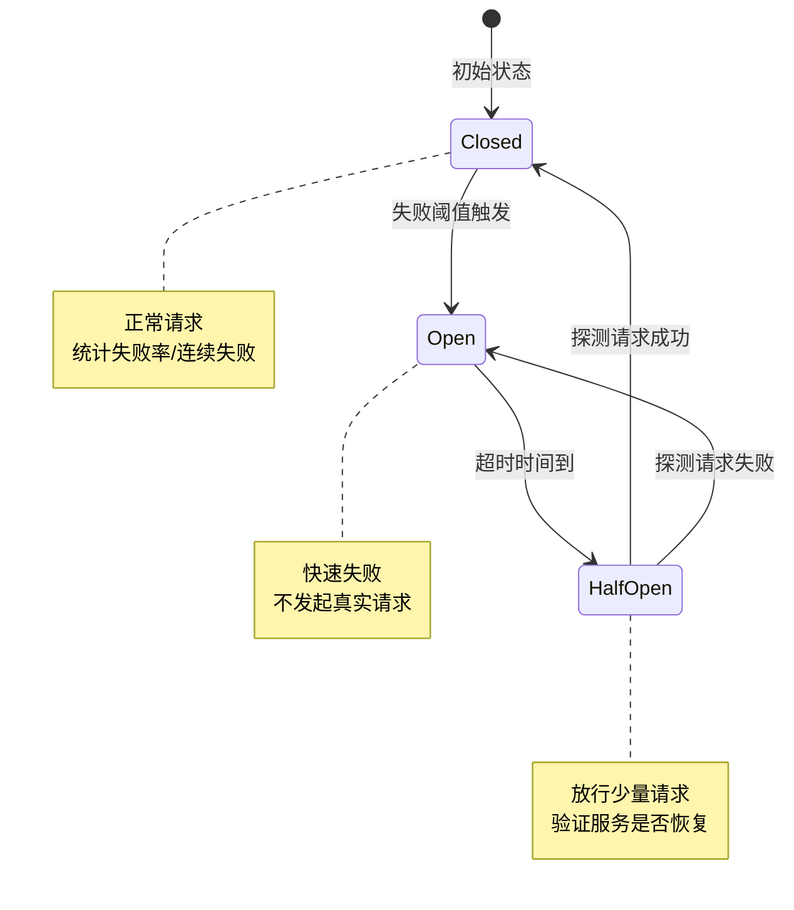
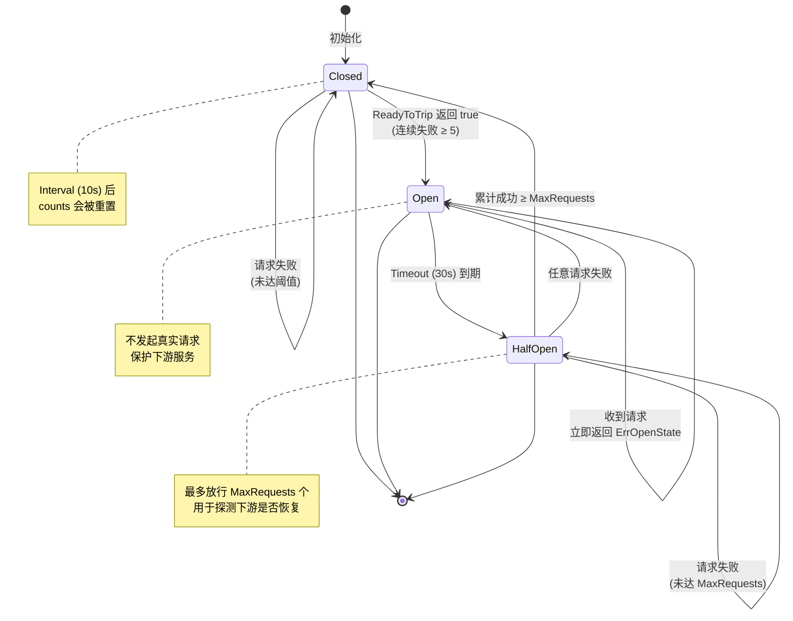
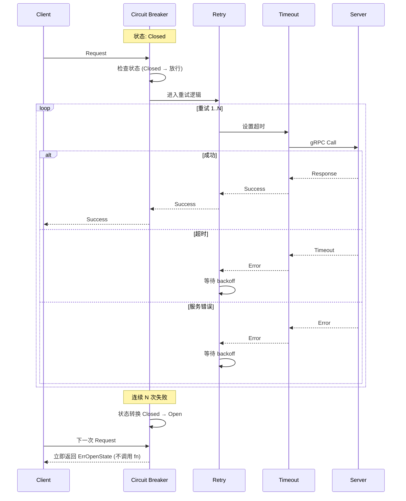
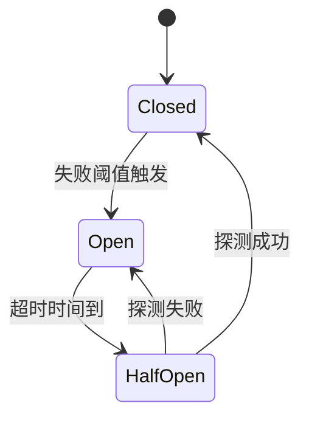

# gobreaker 熔断器详解（项目实践）

## 目录

- [一、为什么需要熔断器](#一为什么需要熔断器)
- [二、gobreaker 核心原理](#二gobreaker-核心原理)
- [三、项目中的两套熔断器实现](#三项目中的两套熔断器实现)
- [四、Gateway 层限流熔断实现](#四gateway-层限流熔断实现)
- [五、gRPC 客户端熔断实现](#五grpc-客户端熔断实现)
- [六、状态机与转换流程](#六状态机与转换流程)
- [七、熔断器与重试/超时的协作](#七熔断器与重试超时的协作)
- [八、可观测性集成](#八可观测性集成)
- [九、面试高频问题](#九面试高频问题)
- [十、总结与最佳实践](#十总结与最佳实践)

---

## 一、为什么需要熔断器

### 1.1 微服务调用链路的雪崩效应

```
正常链路：
Client → Gateway → Matching Service → Order Service → DB
           1ms          2ms                 3ms          1ms
           总延迟: ~7ms

Matching 故障（无熔断）：
Client → Gateway → Matching Service (timeout: 5s) → Order Service
           1ms          5s ❌                         (排队中)
           总延迟: 5s+

高并发雪崩：
┌──────────────────────────────────────────────────┐
│ 1000 个并发请求                                   │
│   全部卡在 Matching 上 5s+                       │
│   → Gateway 连接池耗尽                            │
│   → Order Service 队列堆积                       │
│   → DB 连接耗尽                                    │
│   → 整个系统崩溃                                   │
└──────────────────────────────────────────────────┘
```

**熔断器的作用**：在检测到下游服务持续故障时，**快速失败**，避免请求堆积导致级联故障。

### 1.2 熔断器 vs 限流 vs 重试

| 维度 | 熔断器 | 限流 | 重试 |
|------|--------|------|------|
| **目标** | 防止下游故障导致雪崩 | 控制系统入口流量 | 容忍瞬时故障 |
| **触发条件** | 失败率/连续失败 | 流量阈值 | 错误类型 |
| **失败处理** | 快速失败 | 拒绝请求 | 重新发起 |
| **保护对象** | 下游服务 | 系统容量 | 单次请求 |
| **恢复策略** | 探测性放行 | 等待窗口 | 立即重试 |

### 1.3 三种状态机



---

## 二、gobreaker 核心原理

### 2.1 sony/gobreaker 库介绍

**项目依赖**（`go.mod`）：
```go
github.com/sony/gobreaker v1.0.0
```

**核心 API**：

```go
// 设置
type Settings struct {
    Name          string                            // 熔断器名称
    MaxRequests   uint32                            // 半开状态允许的请求数
    Interval      time.Duration                     // Closed 状态下的统计周期
    Timeout       time.Duration                     // Open → HalfOpen 的等待时间
    ReadyToTrip   func(counts Counts) bool         // 跳闸条件
    OnStateChange func(name string, from, to State) // 状态变化回调
    IsSuccessful  func(err error) bool              // 判断是否成功
}

// 创建熔断器
func NewCircuitBreaker(st Settings) *CircuitBreaker

// 执行受保护的函数
func (cb *CircuitBreaker) Execute(req func() (interface{}, error)) (interface{}, error)

// 状态查询
func (cb *CircuitBreaker) State() State
func (cb *CircuitBreaker) Counts() Counts
```

### 2.2 Counts 内部计数器

```go
type Counts struct {
    Requests             uint32  // 总请求数
    TotalSuccesses       uint32  // 成功总数
    TotalFailures        uint32  // 失败总数
    ConsecutiveSuccesses uint32  // 连续成功数
    ConsecutiveFailures  uint32  // 连续失败数
}
```

**使用方式**：

```go
ReadyToTrip: func(counts gobreaker.Counts) bool {
    // 方式 1：失败率模式
    failureRatio := float64(counts.TotalFailures) / float64(counts.Requests)
    return counts.Requests >= 20 && failureRatio >= 0.5

    // 方式 2：连续失败模式
    return counts.ConsecutiveFailures >= 5
}
```

### 2.3 状态转换内部逻辑

```
┌─────────────────────────────────────────────────────────────┐
│ gobreaker 内部状态机                                          │
├─────────────────────────────────────────────────────────────┤
│                                                             │
│  Closed 状态                                                 │
│  ─────────                                                  │
│  - 每次请求：counts.Requests++, counts.TotalSuccesses/Failures++│
│  - 周期性重置（Interval）：归零 counts                       │
│  - 触发条件：ReadyToTrip(counts) 返回 true                   │
│  - 转移：生成过期时间 = now + Timeout，进入 Open              │
│                                                             │
│  Open 状态                                                    │
│  ────────                                                    │
│  - 所有 Execute() 立即返回 ErrOpenState（不调用 fn）          │
│  - 过期检查：now > expiry → 进入 HalfOpen                    │
│  - 半开探测：放行 MaxRequests 个请求                          │
│                                                             │
│  HalfOpen 状态                                                │
│  ───────────                                                │
│  - 限制放行：当前成功+失败请求数 < MaxRequests               │
│  - 超出：返回 ErrTooManyRequests                             │
│  - 探测成功（连续 ConsecutiveSuccesses >= MaxRequests）     │
│    → 转移：进入 Closed，重置 counts                          │
│  - 探测失败（任意失败）                                       │
│    → 转移：重新进入 Open，重置 expiry                        │
│                                                             │
└─────────────────────────────────────────────────────────────┘
```

---

## 三、项目中的两套熔断器实现

### 3.1 整体架构图

```
┌─────────────────────────────────────────────────────────────────┐
│                          Gateway                                │
│                                                                 │
│  ┌──────────────────────────────────────────────────────────┐  │
│  │  HTTP Layer (Gin Middleware)                             │  │
│  │                                                          │  │
│  │   Request → RateLimitMiddleware ──→ [CB #1: 限流熔断]    │  │
│  │                                       ↓                  │  │
│  │                                    Redis Check            │  │
│  └──────────────────────────────────────────────────────────┘  │
│                              ↓                                  │
│  ┌──────────────────────────────────────────────────────────┐  │
│  │  gRPC Client Layer                                       │  │
│  │                                                          │  │
│  │   User Client    ──→ [CB #2: user-service]               │  │
│  │   Order Client   ──→ [CB #3: order-service]              │  │
│  │   Matching Client──→ [CB #4: matching-service]           │  │
│  │                       ↓                                  │  │
│  │                   gRPC Interceptor                        │  │
│  └──────────────────────────────────────────────────────────┘  │
│                              ↓                                  │
│  ┌──────────────────────────────────────────────────────────┐  │
│  │  Microservices                                            │  │
│  │   User / Order / Matching                                 │  │
│  └──────────────────────────────────────────────────────────┘  │
└─────────────────────────────────────────────────────────────────┘
```

### 3.2 两套熔断器对比

| 维度 | Gateway 限流熔断 | gRPC 客户端熔断 |
|------|------------------|------------------|
| **位置** | `internal/gateway/middleware/ratelimit_redis.go` | `internal/gateway/client/clients.go` |
| **数量** | 1 个单例 | 每服务 1 个（user/order/matching） |
| **保护对象** | Redis 限流检查 | gRPC 微服务调用 |
| **触发条件** | 连续 5 次失败 | 连续失败 >= 5 次 |
| **MaxRequests** | 10 | 3 |
| **Timeout** | 10s | 30s |
| **Interval** | 未设置（默认不清零） | 10s（Closed 状态重置周期） |
| **错误处理** | 503 (熔断) / 429 (限流) | 直接返回 gRPC 错误 |
| **指标** | `RecordCircuitBreakerState` | `RecordCircuitState` + `RecordGRPCClientFailure` |
| **使用方式** | `cb.Execute(func() (interface{}, error))` | gRPC UnaryClientInterceptor |
| **是否拦截请求** | 是（Execute 失败即拒绝） | 是（拦截器链最外层） |

### 3.3 设计意图

- **限流熔断**：保护 Redis，避免 Redis 故障时所有请求都去重试 Redis
- **gRPC 熔断**：保护微服务调用，避免下游服务故障拖垮 Gateway
- **多层防护**：即使 Redis 熔断器打开，下游微服务仍有自己的熔断器保护

---

## 四、Gateway 层限流熔断实现

### 4.1 完整代码

**代码位置**：`internal/gateway/middleware/ratelimit_redis.go`

```go
// CircuitBreakerConfig 熔断器配置
type CircuitBreakerConfig struct {
    Name    string
    MaxReq  uint32
    Timeout time.Duration
}

var cbConfig = CircuitBreakerConfig{
	Name:    "rate-limit-service", // 保护限流服务（Redis）
	MaxReq:  10,                  // 半开状态允许 10 个请求
	Timeout: 10 * time.Second,    // Open → HalfOpen 等待 10s
}

// NewCircuitBreaker 创建熔断器
func NewCircuitBreaker() *gobreaker.CircuitBreaker {
    return gobreaker.NewCircuitBreaker(gobreaker.Settings{
        Name:        cbConfig.Name,
        MaxRequests: cbConfig.MaxReq,
        Timeout:     cbConfig.Timeout,
ReadyToTrip: func(counts gobreaker.Counts) bool {
	// 触发条件：连续 5 次失败
	return counts.ConsecutiveFailures >= 5
},
        OnStateChange: func(name string, from gobreaker.State, to gobreaker.State) {
            logger.Warn("circuit breaker state changed",
                logger.S("name", name),
                logger.S("from", fmt.Sprintf("%s", from)),
                logger.S("to", fmt.Sprintf("%s", to)),
            )
            recordCircuitBreakerState(name, to)
        },
    })
}

// recordCircuitBreakerState 记录熔断器状态到 Prometheus
func recordCircuitBreakerState(name string, state gobreaker.State) {
    var stateVal float64
    switch state {
    case gobreaker.StateClosed:
        stateVal = 0
    case gobreaker.StateOpen:
        stateVal = 1
    case gobreaker.StateHalfOpen:
        stateVal = 2
    }
    metrics.GetMetrics().RecordCircuitBreakerState(name, stateVal)
}
```

### 4.2 与限流中间件集成

```go
// RateLimitMiddleware 创建基于配置文件的 Redis 限流中间件
func RateLimitMiddleware(redisClient *redis.Client, cfg *config.RateLimitConfig) gin.HandlerFunc {
    if !cfg.Enabled || len(cfg.Policies) == 0 {
        return func(c *gin.Context) {
            c.Next()
        }
    }

    limiter := NewRedisRateLimiter(redisClient)
    cb := NewCircuitBreaker()
    return RateLimitByPolicy(limiter, cfg.Policies, cb)
}
```

### 4.3 熔断逻辑在限流中的处理

```go
func RateLimitByPolicy(limiter RateLimiter, policies []config.RateLimitPolicy, cb *gobreaker.CircuitBreaker) gin.HandlerFunc {
    return func(c *gin.Context) {
        // ... 省略策略匹配 ...

        for _, policy := range policies {
            if !policy.MatchPath(path) {
                continue
            }

            identity := GetIdentity(c, policy.Scope)

// ============ 熔断器保护 ============
result, err := cb.Execute(func() (interface{}, error) {
	result, checkErr := limiter.Check(c.Request.Context(), policy.Scope, identity, &policy)
	if checkErr != nil {
		return nil, checkErr  // Redis 错误 → 触发熔断器
	}
	return result, nil  // 限流命中不出错，在函数外单独处理
})

if err != nil {
	// 只有 Redis 错误才会到这里
	metrics.GetMetrics().IncRateLimitBlocked(policy.Scope, identity, policy.Name)

	// 熔断器打开：返回 503
	if cb.State() == gobreaker.StateOpen {
		c.AbortWithStatusJSON(503, gin.H{
			"code":    503,
			"message": "service temporarily unavailable (circuit breaker open)",
		})
		return
	}
}

// ============ 限流命中在熔断器之外处理 ============
// 不影响熔断器状态
if result != nil && !result.Allowed {
	metrics.GetMetrics().IncRateLimitBlocked(policy.Scope, identity, policy.Name)
	retryAfter := int64(0)
	if res, ok := result.(*RateLimitResult); ok {
		retryAfter = res.RetryAfter
	}
	c.Header("Retry-After", fmt.Sprintf("%d", retryAfter))
	c.AbortWithStatusJSON(429, gin.H{
		"code":    429,
		"message": "rate limit exceeded",
	})
	return
}

            // 成功路径：设置响应头
            if res, ok := result.(*RateLimitResult); ok {
                c.Header("X-RateLimit-Limit", fmt.Sprintf("%d", res.Current+res.Remaining))
                c.Header("X-RateLimit-Remaining", fmt.Sprintf("%d", res.Remaining))
                c.Header("X-RateLimit-Scope", policy.Scope)
            }

            c.Next()
            return
        }

        c.Next()
    }
}
```

### 4.4 关键设计点

1. **熔断器保护 Redis 调用**：当 Redis 故障时，熔断器打开，避免每次请求都重试 Redis
2. **熔断 vs 限流的区分**：
   - 熔断器打开 → 503（服务不可用，应快速重试其他服务）
   - 限流触发 → 429（请求过多，应按 Retry-After 等待）
3. **限流命中不影响熔断器**：限流命中是正常业务逻辑，只有 Redis 错误才触发熔断器
4. **指标记录**：熔断器状态变化时自动记录到 Prometheus
5. **单例熔断器**：所有请求共享同一个熔断器实例（全局单例）

---

## 五、gRPC 客户端熔断实现

### 5.1 客户端熔断器封装

**代码位置**：`internal/gateway/client/clients.go`

```go
// CircuitBreakerConfig 熔断器配置
type CircuitBreakerConfig struct {
    Name             string
    MaxRequests      uint32        // 半开状态允许的最大请求数
    Interval         time.Duration // 关闭状态下的重置周期
    Timeout          time.Duration // 打开状态下的超时时间
    FailureThreshold uint32        // 失败阈值
}

// DefaultCircuitBreakerConfig 返回默认熔断器配置
func DefaultCircuitBreakerConfig(name string) CircuitBreakerConfig {
    return CircuitBreakerConfig{
        Name:             name,
        MaxRequests:      3,                // 半开状态最多 3 个探测请求
        Interval:         10 * time.Second, // Closed 状态每 10s 重置统计
        Timeout:          30 * time.Second, // Open → HalfOpen 等待 30s
        FailureThreshold: 5,                // 连续 5 次失败触发熔断
    }
}

// CircuitBreakerSettings 转换熔断器配置为 gobreaker.Settings
func (c *CircuitBreakerConfig) ToSettings() gobreaker.Settings {
    return gobreaker.Settings{
        Name:        c.Name,
        MaxRequests: c.MaxRequests,
        Interval:    c.Interval,
        Timeout:     c.Timeout,
        ReadyToTrip: func(counts gobreaker.Counts) bool {
            // 连续失败次数 >= 阈值时跳闸
            return counts.ConsecutiveFailures >= c.FailureThreshold
        },
        OnStateChange: func(name string, from gobreaker.State, to gobreaker.State) {
            // 记录熔断器状态变化到指标
            stateValue := 0
            switch to {
            case gobreaker.StateClosed:
                stateValue = 0
            case gobreaker.StateOpen:
                stateValue = 1
            case gobreaker.StateHalfOpen:
                stateValue = 2
            }
            metrics.GetMetrics().RecordCircuitState(name, stateValue)
            logger.Warn("circuit breaker state changed",
                logger.S("name", name),
                logger.S("from", from.String()),
                logger.S("to", to.String()),
            )
        },
    }
}

// CircuitBreaker 封装 gRPC 调用的熔断器
type CircuitBreaker struct {
    *gobreaker.CircuitBreaker
    name   string
    method string
}

// NewCircuitBreaker 创建熔断器
func NewCircuitBreaker(cfg CircuitBreakerConfig) *CircuitBreaker {
    return &CircuitBreaker{
        CircuitBreaker: gobreaker.NewCircuitBreaker(cfg.ToSettings()),
        name:            cfg.Name,
    }
}

// Execute 执行带熔断器保护的函数
func (cb *CircuitBreaker) Execute(ctx context.Context, fn func() error) error {
    result, err := cb.CircuitBreaker.Execute(func() (interface{}, error) {
        return nil, fn()
    })
    if err != nil {
        // 熔断器打开/过多请求 不计入失败（因为根本没发请求）
        if err != gobreaker.ErrOpenState && err != gobreaker.ErrTooManyRequests {
            metrics.GetMetrics().RecordGRPCClientFailure(cb.name, cb.method, categorizeError(err))
        }
        return err
    }
    _ = result
    return nil
}
```

### 5.2 错误分类

```go
// categorizeError 对错误进行分类
func categorizeError(err error) string {
    if err == nil {
        return "none"
    }
    st, ok := status.FromError(err)
    if !ok {
        return "unknown"
    }
    switch st.Code() {
    case 2:  // Unknown
        return "unknown"
    case 4:  // DeadlineExceeded
        return "timeout"
    case 14: // Unavailable
        return "unavailable"
    case 13: // Internal
        return "internal"
    default:
        return "other"
    }
}
```

### 5.3 gRPC 拦截器集成

```go
// circuitBreakerInterceptor 创建熔断器拦截器
func circuitBreakerInterceptor(cb *CircuitBreaker, clientName string) grpc.UnaryClientInterceptor {
    return func(
        ctx context.Context,
        method string,
        req interface{},
        reply interface{},
        cc *grpc.ClientConn,
        invoker grpc.UnaryInvoker,
        opts ...grpc.CallOption,
    ) error {
        start := time.Now()

        // ============ 熔断器保护 gRPC 调用 ============
        err := cb.Execute(ctx, func() error {
            return invoker(ctx, method, req, reply, cc, opts...)
        })

        // 记录请求状态
        duration := time.Since(start)
        statusStr := "success"
        if err != nil {
            if err == gobreaker.ErrOpenState {
                statusStr = "circuit_open"
            } else if err == gobreaker.ErrTooManyRequests {
                statusStr = "circuit_busy"
            } else {
                statusStr = "error"
            }
        }
        metrics.GetMetrics().RecordGRPCClientRequest(clientName, method, statusStr)

        // 熔断器打开/过多请求：不记录延迟（因为没发请求）
        if err == gobreaker.ErrOpenState || err == gobreaker.ErrTooManyRequests {
            return err
        }

        logger.Debug("gRPC client request",
            logger.S("client", clientName),
            logger.S("method", method),
            logger.S("status", statusStr),
            logger.I64("latency_ms", duration.Milliseconds()),
        )

        return err
    }
}
```

### 5.4 各微服务客户端使用

**User Client**（`internal/gateway/client/user_client.go`）：

```go
func NewUserClient(addr string) (*UserClient, error) {
    cb := NewCircuitBreaker(DefaultCircuitBreakerConfig("user-service"))

    conn, err := grpc.Dial(addr,
        grpc.WithDefaultServiceConfig(`{"loadBalancingPolicy":"round_robin"}`),
        grpc.WithTransportCredentials(insecure.NewCredentials()),
        grpc.WithStatsHandler(otelgrpc.NewClientHandler()),
        grpc.WithChainUnaryInterceptor(
            grpcx.UnaryClientRequestID(),              // 1. RequestID 传播
            userCircuitBreakerInterceptor(cb, "user"),  // 2. 熔断器
            userLogInterceptor,                         // 3. 日志
        ),
    )
    // ...
}
```

**Order Client**（`internal/gateway/client/order_client.go`）：

```go
func NewOrderClient(addr string) (*OrderClient, error) {
    cb := NewCircuitBreaker(DefaultCircuitBreakerConfig("order-service"))

    conn, err := grpc.Dial(addr,
        // ...
        grpc.WithChainUnaryInterceptor(
            grpcx.UnaryClientRequestID(),
            circuitBreakerInterceptor(cb, "order"),     // 熔断器
            logInterceptor,                              // 日志
            timeout.UnaryClientInterceptor(DefaultTimeout),  // 超时
            retry.UnaryClientInterceptor(                // 重试
                retry.WithMax(MaxRetries),
                retry.WithBackoff(retry.BackoffExponential(100*time.Millisecond)),
            ),
        ),
    )
    // ...
}
```

**Matching Client**（`internal/gateway/client/matching_client.go`）：类似结构。

### 5.5 拦截器执行顺序

```
gRPC Request
    ↓
┌────────────────────────────────────────────┐
│ 1. UnaryClientRequestID                    │ ← 注入 RequestID
└────────────────────────────────────────────┘
    ↓
┌────────────────────────────────────────────┐
│ 2. CircuitBreakerInterceptor               │ ← 熔断保护
│    - Open 状态：直接返回 ErrOpenState        │
│    - HalfOpen：放行 MaxRequests 个请求       │
│    - Closed：放行所有请求，统计失败          │
└────────────────────────────────────────────┘
    ↓
┌────────────────────────────────────────────┐
│ 3. LogInterceptor                          │ ← 记录请求日志
└────────────────────────────────────────────┘
    ↓
┌────────────────────────────────────────────┐
│ 4. TimeoutInterceptor                      │ ← 单次请求超时
└────────────────────────────────────────────┘
    ↓
┌────────────────────────────────────────────┐
│ 5. RetryInterceptor                        │ ← 失败重试
└────────────────────────────────────────────┘
    ↓
gRPC Server
```

**注意**：熔断器在重试和超时**之前**，因为熔断是最高优先级的快速失败决策。

---

## 六、状态机与转换流程

### 6.1 完整状态转换图



### 6.2 转换时序示例

**场景**：Matching Service 故障 5 秒后恢复

```
T=0s:    Closed 状态
         正常请求全部成功
         counts.ConsecutiveFailures = 0

T=5s:    Matching Service 开始超时
         连续 5 个请求失败
         counts.ConsecutiveFailures = 5
         → ReadyToTrip 返回 true
         → 状态转换：Closed → Open
         → OnStateChange 回调触发
         → 记录日志 + 指标

T=5s-35s: Open 状态
         所有 Matching 请求立即返回 ErrOpenState
         不再调用 Matching Service
         counts 不再更新

T=35s:   Timeout (30s) 到期
         → 状态转换：Open → HalfOpen

T=35s-36s: HalfOpen 状态
           第 1 个请求通过，执行实际 gRPC 调用
           → Matching Service 已恢复
           → 请求成功
           counts.ConsecutiveSuccesses = 1

T=36s:   第 2 个请求成功
         counts.ConsecutiveSuccesses = 2

T=37s:   第 3 个请求成功
         counts.ConsecutiveSuccesses = 3 (= MaxRequests)
         → 状态转换：HalfOpen → Closed
         → counts 重置
         → 服务恢复正常
```

### 6.3 关键参数影响

| 参数 | 调大影响 | 调小影响 | 项目设置 |
|------|----------|----------|----------|
| `MaxRequests` | 探测更充分，但可能压垮恢复中的服务 | 探测不充分，可能误判恢复 | 10（限流）/ 3（gRPC） |
| `Interval` | 长期统计更稳定，对突发故障不敏感 | 短期统计灵敏，可能误判 | 10s（gRPC） |
| `Timeout` | 给下游更多恢复时间 | 快速重试，可能加剧故障 | 30s |
| `FailureThreshold` | 容忍更多失败 | 对故障更敏感 | 5（gRPC连续失败）|

---

## 七、熔断器与重试/超时的协作

### 7.1 三者协作时序



### 7.2 拦截器链顺序的重要性

```go
// ✅ 正确顺序：熔断器在最外层
grpc.WithChainUnaryInterceptor(
    grpcx.UnaryClientRequestID(),                 // 1. RequestID
    circuitBreakerInterceptor(cb, "order"),       // 2. 熔断器（最外层快速失败）
    logInterceptor,                                // 3. 日志
    timeout.UnaryClientInterceptor(DefaultTimeout),// 4. 超时
    retry.UnaryClientInterceptor(...),            // 5. 重试（最内层）
)

// ❌ 错误顺序：重试会绕过熔断器
grpc.WithChainUnaryInterceptor(
    retry.UnaryClientInterceptor(...),    // 重试在外层
    circuitBreakerInterceptor(...),        // 熔断器在内层
    // 问题：重试时每次都重新进入熔断器，可能在 Open 状态返回
    // 理想：先检查熔断器，再决定是否重试
)
```

### 7.3 超时/重试与熔断器的协作

**项目配置**（`clients.go`）：
```go
const (
    DefaultTimeout = 3 * time.Second
    MaxRetries     = 3
)

// 重试指数退避
retry.WithBackoff(retry.BackoffExponential(100*time.Millisecond)),
```

**单次请求时间线**：
```
T=0:     请求发起
T=0-3s:  超时控制（每次重试都有 3s 超时）
T=3s:    第 1 次失败，等待 100ms backoff
T=3.1s:  第 2 次重试
T=3.1-6.1s: 等待响应
T=6.1s:  第 2 次失败，等待 200ms backoff
T=6.3s:  第 3 次重试
T=6.3-9.3s: 等待响应
T=9.3s:  第 3 次失败，返回最终错误

总共最坏情况：~9.3s

→ 熔断器统计：1 次失败（Execute 返回 err）
```

**关键点**：
- **重试不增加熔断器失败次数**：熔断器在 Execute 级别统计，每次 Execute 算一次
- **熔断器打开时不重试**：ErrOpenState 直接返回，不进入重试逻辑
- **超时计入熔断器失败**：超时是失败的一种

---

## 八、可观测性集成

### 8.1 指标体系

```go
// pkg/metrics/metrics.go

// 1. 熔断器状态（Gauge）
circuitBreakerState *prometheus.GaugeVec
// label: name
// 0=closed, 1=open, 2=half-open

// 2. gRPC 客户端熔断器状态（Gauge）
grpcClientCircuitState *prometheus.GaugeVec
// label: client
// 0=closed, 1=open, 2=half-open

// 3. gRPC 客户端失败（Counter）
grpcClientFailuresTotal *prometheus.CounterVec
// label: client, method, error_type
// error_type: unknown/timeout/unavailable/internal/other

// 4. gRPC 客户端请求（Counter）
grpcRequestsTotal *prometheus.CounterVec
// label: client, method, status
// status: success/circuit_open/circuit_busy/error
```

### 8.2 指标记录函数

```go
// pkg/metrics/metrics.go

// RecordCircuitState 记录熔断器状态
func (m *Metrics) RecordCircuitState(client string, state int) {
    m.grpcClientCircuitState.WithLabelValues(client).Set(float64(state))
}

// RecordGRPCClientFailure 记录 gRPC 客户端失败
func (m *Metrics) RecordGRPCClientFailure(client, method, errorType string) {
    m.grpcClientFailuresTotal.WithLabelValues(client, method, errorType).Inc()
}

// RecordGRPCClientRequest 记录 gRPC 客户端请求
func (m *Metrics) RecordGRPCClientRequest(client, method, status string) {
    m.grpcRequestsTotal.WithLabelValues(client, method, status).Inc()
}

// RecordCircuitBreakerState 记录限流熔断器状态
func (m *Metrics) RecordCircuitBreakerState(name string, state float64) {
    m.circuitBreakerState.WithLabelValues(name).Set(state)
}
```

### 8.3 Grafana 监控面板

**推荐告警规则**：

```yaml
# Prometheus 告警规则
groups:
  - name: circuit_breaker
    rules:
      # 熔断器打开超过 1 分钟
      - alert: CircuitBreakerOpen
        expr: grpc_client_circuit_state > 0
        for: 1m
        labels:
          severity: critical
        annotations:
          summary: "Circuit breaker is open for {{ $labels.client }}"

      # 熔断器失败率过高
      - alert: HighCircuitBreakerFailureRate
        expr: |
          rate(grpc_client_failures_total[5m])
          / rate(grpc_client_requests_total[5m]) > 0.1
        for: 2m
        labels:
          severity: warning
        annotations:
          summary: "High failure rate for {{ $labels.client }}"
```

**推荐 Dashboard 图表**：

1. 熔断器状态时间线（State Timeline）
2. 熔断器打开次数（Counter）
3. 各服务失败率（Heatmap）
4. 错误类型分布（Pie Chart）
5. gRPC 请求延迟与熔断事件关联（Time Series）

### 8.4 日志记录

```go
// OnStateChange 回调
OnStateChange: func(name string, from gobreaker.State, to gobreaker.State) {
    logger.Warn("circuit breaker state changed",
        logger.S("name", name),
        logger.S("from", from.String()),
        logger.S("to", to.String()),
        logger.S("consecutive_failures", fmt.Sprintf("%d", counts.ConsecutiveFailures)),
    )
}
```

**日志示例**：
```
WARN  circuit breaker state changed
  name: matching-service
  from: closed
  to: open
  consecutive_failures: 5
```

---

## 九、面试高频问题

### Q1: 什么是熔断器？它解决了什么问题？

**参考答案**：

**熔断器（Circuit Breaker）**是一种稳定性设计模式，用于在分布式系统中保护服务调用链路，防止下游服务故障导致级联雪崩。

**解决的问题**：
1. **级联故障**：下游服务故障导致上游请求堆积，最终拖垮整个系统
2. **资源耗尽**：大量超时请求占用连接池、线程池等资源
3. **快速失败**：避免在已知下游故障时还傻等超时

**三种状态**：
- **Closed（关闭）**：正常请求，统计失败率
- **Open（打开）**：快速失败，不调用下游
- **Half-Open（半开）**：放行少量请求探测下游是否恢复

**项目中的应用**：
- Gateway 限流熔断：保护 Redis 调用
- gRPC 客户端熔断：保护下游微服务调用

---

### Q2: 熔断器的三个状态是如何转换的？

**参考答案**：



**转换条件**：
- **Closed → Open**：`ReadyToTrip(counts) == true`
  - 项目限流熔断：`ConsecutiveFailures >= 5`
  - 项目 gRPC 熔断：`ConsecutiveFailures >= 5`
- **Open → HalfOpen**：`now > expiry`（超时时间到）
  - 项目：`Timeout = 30s`
- **HalfOpen → Closed**：累计成功数 ≥ `MaxRequests`
  - 项目 gRPC：`ConsecutiveSuccesses >= 3`
- **HalfOpen → Open**：任意一次探测失败

---

### Q3: 熔断器、限流、重试三者的区别和协作？

**参考答案**：

| 维度 | 熔断器 | 限流 | 重试 |
|------|--------|------|------|
| **目标** | 防止级联故障 | 控制系统入口流量 | 容忍瞬时故障 |
| **触发条件** | 失败率/连续失败 | 流量阈值 | 错误类型 |
| **失败处理** | 快速失败 | 拒绝请求 | 重新发起 |
| **保护对象** | 下游服务 | 系统容量 | 单次请求 |

**协作顺序**（项目 gRPC 拦截器链）：
```
熔断器（最外层）→ 超时 → 重试（最内层）
```

**为什么熔断器在最外层**：
- 熔断器打开时，**不需要等待超时，直接快速失败**
- 重试会被熔断器"拦截"：重试多次但熔断器打开时不会重试

**反例**（重试在最外层）：
```go
// ❌ 错误：每次重试都重新进入熔断器
retry.UnaryClientInterceptor(...)
circuitBreakerInterceptor(...)
// 问题：重试时熔断器状态可能变化，逻辑复杂
```

---

### Q4: 熔断器的参数如何调优？

**参考答案**：

**项目 gRPC 熔断器默认配置**：
```go
{
    MaxRequests:      3,                // 半开探测数
    Interval:         10 * time.Second, // Closed 状态统计周期
    Timeout:          30 * time.Second, // Open → HalfOpen 等待
    FailureThreshold: 5,                // 连续失败阈值
}
```

**调优原则**：

1. **MaxRequests**（半开探测数）
   - 太小：探测不充分，可能误判
   - 太大：可能压垮正在恢复的服务
   - 建议：3-10

2. **Interval**（Closed 状态重置周期）
   - 太短：对偶发故障过于敏感
   - 太长：可能错过真实故障
   - 建议：5-60s

3. **Timeout**（Open 状态持续时间）
   - 太短：服务还没恢复就放流量
   - 太长：故障期间服务完全不可用
   - 建议：10-60s，根据下游恢复时间

4. **FailureThreshold**（失败阈值）
   - 太小：偶发失败就熔断
   - 太大：故障响应慢
   - 建议：5-20（连续失败）

5. **ReadyToTrip 策略选择**
   - 失败率模式：适合流量大的服务
   - 连续失败模式：适合流量小但要求严格的场景

---

### Q5: 熔断器打开时返回什么错误？客户端如何处理？

**参考答案**：

**gobreaker 库错误**：
- `gobreaker.ErrOpenState`：熔断器处于 Open 状态
- `gobreaker.ErrTooManyRequests`：HalfOpen 状态请求数超过 MaxRequests

**项目处理**：

```go
// gRPC 客户端拦截器
if err == gobreaker.ErrOpenState {
    statusStr = "circuit_open"
} else if err == gobreaker.ErrTooManyRequests {
    statusStr = "circuit_busy"
}
metrics.GetMetrics().RecordGRPCClientRequest(clientName, method, statusStr)

if err == gobreaker.ErrOpenState || err == gobreaker.ErrTooManyRequests {
    return err  // 直接返回，不记录延迟
}
```

**HTTP 网关层处理**：
```go
if cb.State() == gobreaker.StateOpen {
    c.AbortWithStatusJSON(503, gin.H{
        "code":    503,
        "message": "service temporarily unavailable (circuit breaker open)",
    })
    return
}
```

**客户端最佳实践**：
1. **快速失败**：不要在客户端重试熔断错误（会加剧问题）
2. **降级处理**：返回缓存数据或默认值
3. **用户提示**：返回友好的错误信息
4. **监控告警**：触发熔断时立即告警

---

### Q6: 熔断器与降级、超时、隔离的关系？

**参考答案**：

**四者关系**：
```
熔断器 → 触发降级
熔断器 → 配合超时（避免长时间等待）
熔断器 → 配合隔离（资源隔离）
```

**熔断 + 降级**：
```go
err := cb.Execute(func() (interface{}, error) {
    return callService()
})

if err != nil {
    // 降级：返回缓存或默认值
    return getCachedData()
}
```

**熔断 + 超时**：
```go
// 单次请求有超时
ctx, cancel := context.WithTimeout(ctx, 3*time.Second)
defer cancel()

// 熔断器统计整体执行（可能包含多次重试）
err := cb.Execute(func() (interface{}, error) {
    return callWithRetry(ctx)
})
```

**熔断 + 隔离**：
- 线程池隔离：每个服务一个线程池
- 信号量隔离：限制并发数
- 项目使用信号量隔离：gRPC Client 连接池

**项目中的实际应用**：
- 熔断器：gobreaker
- 超时：gRPC TimeoutInterceptor（3s）
- 重试：gRPC RetryInterceptor（3次）
- 降级：业务层实现（未使用统一降级框架）

---

### Q7: 熔断器有哪几种实现方式？各有什么优缺点？

**参考答案**：

| 实现方式 | 优点 | 缺点 | 项目使用 |
|----------|------|------|----------|
| **进程内熔断器** | 性能高，无网络开销 | 多实例不共享 | ✅ gobreaker |
| **分布式熔断器**（Redis） | 多实例共享，全局一致 | 网络开销，Redis 依赖 | ❌ 未使用 |
| **代理层熔断器**（Sentinel） | 独立于业务，统一管理 | 部署复杂 | ❌ 未使用 |
| **服务网格熔断器**（Istio） | 无侵入，统一治理 | 需要服务网格 | ❌ 未使用 |

**项目选择进程内熔断器的原因**：
1. **性能**：网关层对延迟敏感
2. **简单**：无外部依赖
3. **足够**：单实例故障会被每个实例独立熔断，效果类似
4. **未来扩展**：可通过配置中心共享状态升级为分布式

---

### Q8: 如何测试熔断器？

**参考答案**：

**单元测试场景**：

```go
func TestCircuitBreaker_OpensAfterFailures(t *testing.T) {
    cb := NewCircuitBreaker(CircuitBreakerConfig{
        Name: "test", MaxRequests: 1, Interval: time.Hour,
        Timeout: 100 * time.Millisecond, FailureThreshold: 3,
    })

    // 1. 连续失败 3 次
    for i := 0; i < 3; i++ {
        _, err := cb.Execute(func() (interface{}, error) {
            return nil, errors.New("fail")
        })
        assert.Error(t, err)
    }

    // 2. 熔断器应该打开
    assert.Equal(t, gobreaker.StateOpen, cb.State())

    // 3. 第 4 次请求应该立即失败
    _, err := cb.Execute(func() (interface{}, error) {
        t.Fatal("should not be called")
        return nil, nil
    })
    assert.Equal(t, gobreaker.ErrOpenState, err)
}
```

**集成测试场景**：
1. **故障注入**：使用 toxiproxy 注入网络故障
2. **负载测试**：发送大量请求触发熔断
3. **恢复测试**：故障恢复后熔断器自动恢复

**项目测试建议**：
```bash
# 1. 启动服务
docker-compose up -d

# 2. 停止下游服务
docker stop matching-service

# 3. 压测
wrk -t4 -c100 -d30s http://localhost:8080/api/v1/orders

# 4. 观察 Prometheus 指标
# 期望：circuit_breaker_state = 1 (open)

# 5. 重启下游服务
docker start matching-service

# 6. 等待 30s 后再次压测
# 期望：circuit_breaker_state = 0 (closed)
```

---

## 十、总结与最佳实践

### 10.1 熔断器核心要点

| 要点 | 说明 |
|------|------|
| **快速失败** | 熔断器打开时，立即返回错误，不等待超时 |
| **自动恢复** | HalfOpen 状态自动探测下游恢复情况 |
| **可配置** | 阈值、超时、探测数都可配置 |
| **可观测** | 状态变化、失败次数、错误类型都记录指标 |
| **多层防护** | 不同层（HTTP/gRPC）使用不同熔断器 |

### 10.2 项目熔断器使用总结

| 维度 | Gateway 限流熔断 | gRPC 客户端熔断 |
|------|------------------|------------------|
| **数量** | 1 个单例 | 3 个（user/order/matching） |
| **位置** | RateLimitByPolicy | gRPC UnaryClientInterceptor |
| **触发** | 连续 5 次失败 | 连续 5 次失败 |
| **保护** | Redis 调用 | 微服务调用 |
| **错误码** | 503（熔断）/ 429（限流） | gRPC 错误 |
| **配置位置** | `ratelimit_redis.go` | `clients.go` + 3 个 client |

### 10.3 最佳实践

1. **熔断器粒度**
   - 按服务划分（user/order/matching 各一个）
   - 不要全局单例（一个服务故障不应影响其他服务）

2. **参数调优**
   - 根据服务重要性和下游特性调优
   - 生产环境灰度调整

3. **降级配合**
   - 熔断器打开时应有降级策略（缓存、默认值）
   - 不要让用户看到空白错误

4. **监控告警**
   - 熔断器打开立即告警
   - 长时间未恢复需要人工介入

5. **测试覆盖**
   - 单元测试：状态转换逻辑
   - 集成测试：故障注入与恢复
   - 混沌测试：随机故障验证稳定性

6. **避免误用**
   - 不要在熔断器内做重试（重试应在更内层）
   - 不要把熔断器当作限流器
   - 不要忽略熔断错误

### 10.4 面试加分点

1. 理解熔断器与限流、重试的区别与协作
2. 熟悉 sony/gobreaker 的状态机实现
3. 能够根据业务场景调优参数
4. 了解熔断器的多层防护设计
5. 掌握熔断器与可观测性的集成
6. 能够设计降级策略应对熔断

### 10.5 相关文档

- [Redis Lua 滑动窗口限流 + 熔断保护](05-redis-ratelimit-circuit-breaker.md)
- [Prometheus + Grafana 监控实践](06-prometheus-grafana-monitoring.md)
- [OpenTelemetry 分布式追踪](07-opentelemetry-distributed-tracing.md)
- [可观测性架构](08-observability-architecture.md)
- [Gin 框架实践](09-gin-framework-practice.md)
