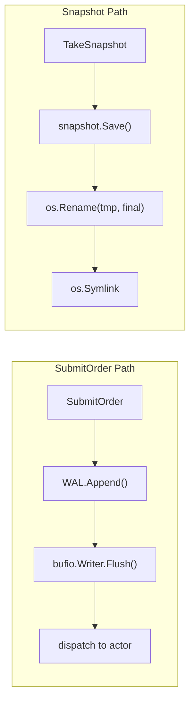

## Context

The matching engine uses Write-Ahead Logging (WAL) and periodic Snapshots for crash recovery. The current WAL implementation flushes writes to the OS page cache via `bufio.Writer.Flush()` but never calls `file.Sync()`, meaning data can be lost on power failure. Snapshot's `os.Rename` similarly lacks directory sync, risking orphaned files.

**Current architecture:**


**Key constraints:**
- WAL `Append` is called synchronously on the hot path (`SubmitOrder`)
- Each symbol has its own WAL with independent `sync.Mutex`
- Snapshot frequency: max 1 per 60s or 1000 trades
- Performance target: P99 < 1ms for order submission

## Goals / Non-Goals

**Goals:**
- Guarantee WAL durability on crash/power failure (zero data loss on fsync)
- Guarantee Snapshot atomicity (parent directory metadata synced)
- Maintain < 1ms P99 latency for order submission with Group Commit
- Add observability for WAL fsync behavior

**Non-Goals:**
- Replace existing WAL/Snapshot logic; extend only
- Support distributed WAL or multi-process coordination
- Implement checkpointing or incremental snapshots
- Clean up dead code methods (`Sync()`, `SnapshotLSN()`, `WriteAtomicSnapshot()`)

## Decisions

### Decision 1: Group Commit as Default SyncMode

**Context:** Every-order fsync would add 50-800µs per call (depending on storage), pushing P99 from ~200µs to ~2ms.

**Choice:** Default to `SyncByDuration` with 1ms window. Entries batch within the window; when timer fires or count threshold hit, single fsync covers all pending entries.

**Alternatives considered:**
| Alternative | Latency | Durability | Decision |
|-------------|---------|------------|----------|
| `SyncAlways` | ~2ms P99 | Max | Reject - too slow |
| `SyncByCount(1)` | ~2ms P99 | Max | Reject - same as always |
| `SyncByDuration(1ms)` | ~1ms P99 | 1ms loss max | Accept - default |
| `SyncNone` | ~50µs | None | Reject - defeats purpose |

### Decision 2: SyncMode Stored in WAL Struct, Passed at Construction

**Context:** Need to inject sync policy without breaking existing callers.

**Choice:** Add `SyncMode` field to `WAL` struct and accept as parameter in `NewWAL(syncMode SyncMode, ...)`. `WALManager.GetWAL` propagates from its own config.

**Implementation pattern:**
```go
// WAL struct extends with:
type WAL struct {
    // ... existing fields ...
    syncMode     SyncMode
    syncEvery    uint64
    syncInterval time.Duration
    pendingSyncs uint64
    lastSyncTime time.Time
}

// NewWAL signature change:
func NewWAL(symbol, dir string, opts ...WALOption) (*WAL, error)

// Or with SyncMode parameter:
func NewWAL(symbol, dir string, syncMode SyncMode, syncEvery uint64, syncInterval time.Duration) (*WAL, error)
```

### Decision 3: Snapshot fsync Before Close and Dir Sync After Rename

**Context:** `os.Rename` on POSIX is atomic for the file content, but directory entry creation requires directory sync to survive crashes.

**Choice:** Two-phase sync:
1. `file.Sync()` before `file.Close()` — ensures snapshot content on disk
2. `dirFile.Sync()` after `os.Rename()` — ensures `.latest` symlink entry committed

**Implementation:**
```go
// In snapshot.Save(), after gob encode:
if err := file.Sync(); err != nil {
    return fmt.Errorf("failed to sync snapshot file: %w", err)
}
if err := file.Close(); err != nil { ... }

// After rename:
parentDir := filepath.Dir(dir)
if dirFile, err := os.Open(parentDir); err == nil {
    _ = dirFile.Sync()
    dirFile.Close()
}
```

### Decision 4: Three New Prometheus Metrics

**Choice:**
- `matching_wal_fsync_seconds{status=success|failure}` — fsync latency histogram
- `matching_wal_pending_entries` — gauge of unflushed entries (for backpressure)
- `matching_wal_group_size` — histogram of entries batched per fsync

**Rationale:** Critical for monitoring Group Commit behavior and detecting sync failures in production.

## Risks / Trade-offs

| Risk | Description | Mitigation |
|------|-------------|------------|
| **Storage I/O overload** | Frequent fsyncs on slow storage saturate disk | Allow tuning: NVMe → shorter window, HDD → longer window |
| **fsync failure handling** | `file.Sync()` returns error; how to proceed? | Log error, increment failure metric, but do NOT block order submission (WAL write failure already handled) |
| **Close vs Sync race** | Concurrent Close() while fsync pending | `Close()` calls `Flush()` + `file.Close()`; Linux guarantees Close() includes pending syncs |
| **Group Commit timer memory leak** | Background goroutine for timer if using time-based trigger | Use channel-based tick; cleanup on WAL close |
| **Snapshot dir sync failure** | dir.Sync() may fail on some filesystems (NFS) | Log warning, continue; snapshot content already synced |

## Migration Plan

1. **Phase 1 (this change):** Add fsync infrastructure with default conservative settings
2. **Phase 2:** Expose SyncMode via config/env for performance tuning
3. **Rollback:** Disable fsync via `SyncMode=SyncNone` if issues arise

**Testing strategy:**
- Unit tests: `wal_test.go` — verify fsync called at correct intervals
- Integration: `recovery_benchmark_test.go` — simulate crash and verify data integrity
- Chaos: Hard-kill container and verify WAL replay correctness
